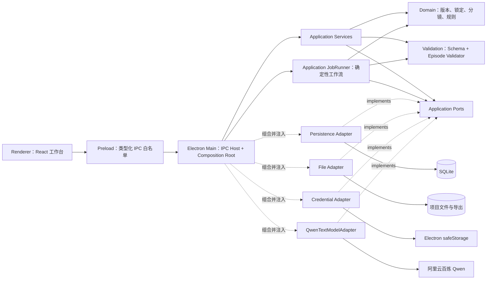
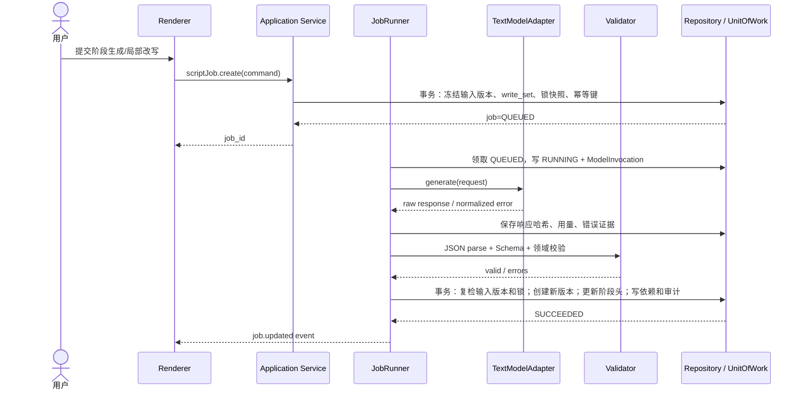
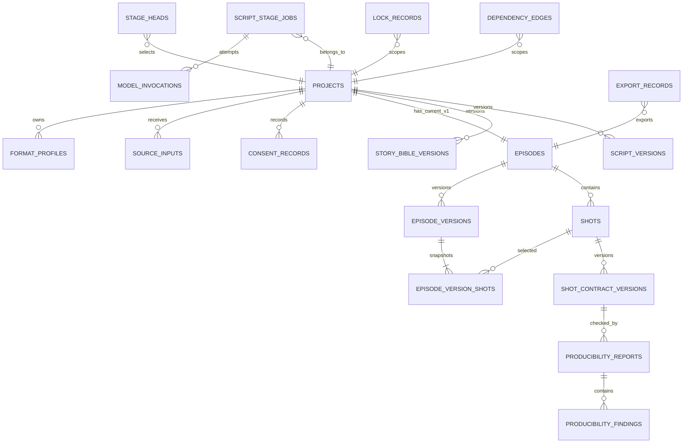

# 镜序 Studio V1 技术架构与数据库设计

## TECH_DESIGN v1.1

| 文档项 | 内容 |
|---|---|
| 产品 | 镜序 Studio |
| 对应产品文档 | `镜序Studio_AI漫剧工作台_产品需求文档_PRD_v1.4.md` |
| 设计范围 | V1：AI 剧本与结构化分镜 |
| 文档版本 | TECH_DESIGN v1.1 |
| 更新日期 | 2026-08-10 |
| 当前状态 | 可开发基线；真实模型验收前需完成 Provider 凭据配置和 Fixture 矩阵 |
| 目标读者 | 独立开发者、前端/客户端开发、测试、后续技术评审者 |
| 机器契约 | `镜序Studio_V1_ScriptStageOutput.schema.json`、`镜序Studio_V1_ShotContract.schema.json`、`镜序Studio_V1_EpisodeStoryboardExport.schema.json`、`镜序Studio_V1_ProjectTransferBundle.schema.json` |

> 本文只承诺 V1。V2 的图片、视频、TTS、口型、时间线和成本对账，以及 V3 的自动质量评估与返工闭环，只保留扩展边界，不进入当前实现。

---

## 1. 设计目标与约束

### 1.1 设计目标

1. 支持单用户在本地完成“创意/已有剧本 → 分阶段剧本 → StoryBible → 可生产性检查 → ShotContract → Markdown/JSON 导出”。
2. 所有 AI 结果必须经过结构化校验，只有通过校验并通过锁定复检的结果才能成为正式版本。
3. 原始输入、版本链、模型调用、失败证据、锁定记录和人工覆盖均可追溯。
4. 页面刷新或路由切换不丢任务；应用异常退出后不破坏最后一次已提交版本。
5. 本地离线环境仍可完成编辑、版本恢复、Schema 校验、JSON 导入导出和 Episode 集合校验。
6. V1 采用清晰的适配器和模块边界，为 V2/V3 扩展留接口，但不预建视觉生成、多人协作或云服务。

### 1.2 硬约束

| 约束 | 技术口径 |
|---|---|
| 运行形态 | Windows 优先的本地桌面 Web 工作台；Electron 承载 React UI 和本地应用服务 |
| 用户模型 | 单用户、无注册登录、无组织权限、无云同步 |
| 数据 | SQLite 为结构化数据唯一事实源；项目内部文件和导出文件保存在本地文件系统 |
| 模型 | V1 仅一个 `TextModelAdapter`；Provider 请求/响应不得进入领域对象 |
| 密钥 | API Key 不进 SQLite 明文字段、日志、导出包或前端状态 |
| 结构化输出 | Draft 2020-12 JSON Schema + Episode 集合校验器共同验收 |
| 版本 | AI 生成、人工保存、拆分、合并、复制和恢复都创建新版本，不覆盖历史版本 |
| 锁定 | RFC 6901 JSON Pointer；生成前检查、提交前复检；冲突时整次事务失败 |
| 外部网络 | 只有 Electron 主进程中的 Provider Adapter 可以访问允许的 HTTPS 域名 |
| V1 容量 | 单项目 1 个当前 Episode、最多 20 个 READY Shot、每类对象至少保留 100 个历史版本 |

### 1.3 非目标

- 不建设远程后端、账号、RBAC、多人实时协作和同步冲突合并。
- 不引入微服务、消息队列、分布式事务、Kubernetes 或云数据库。
- 不实现图片/视频/TTS/口型 Provider、真实视觉成本账本和多模型路由。
- 不实现 PDF、DOCX、OCR、超长小说自动拆分和批量多集生成。
- 不把 LLM 作为状态机、锁定校验、权限判断或数据完整性的最终裁决者。

---

## 2. 核心技术决策

| ADR | 决策 | 原因与边界 |
|---|---|---|
| ADR-001 | Electron + React + TypeScript | 保持 Web 交互开发效率，同时获得 SQLite、文件系统、系统安全存储和桌面打包能力。V1 首发 Windows，保留 macOS/Linux 适配可能性 |
| ADR-002 | Electron 主进程承载本地应用服务 | Renderer 不直接访问 Node、文件系统、SQLite 或 Provider；所有特权能力通过白名单 IPC 暴露 |
| ADR-003 | SQLite 单库 + 项目文件目录 | 符合本地优先和单用户范围；不提前引入客户端/服务端同步模型 |
| ADR-004 | JSON 文档保存版本内容，关系表保存索引和血缘 | ShotContract 与 ScriptStageOutput 以现有 Schema 为事实源，避免把嵌套契约重复拆成大量易漂移字段 |
| ADR-005 | 追加式版本 + 当前指针 | 历史版本不可变；恢复等价于创建新版本，便于审计、回滚和依赖影响分析 |
| ADR-006 | 确定性 JobRunner 编排 AI 调用 | 状态、重试、幂等、校验和提交由代码控制；LLM 只生成候选内容 |
| ADR-007 | V1 Provider 锁定为阿里云百炼千问快照 | 中文创作、结构化输出和中国内地地域可用；Provider 细节只存在于 Adapter 与配置快照 |
| ADR-008 | 不在 V1 引入通用 Agent 框架 | 当前流程是固定阶段流水线；通用 Agent 增加不可复现性与调试成本，不带来必要收益 |

所有依赖的精确版本在项目初始化时写入锁文件；不得使用无锁的 `latest` 作为发布构建依据。

---

## 3. 总体架构

### 3.1 逻辑架构



实线表示运行时调用或 I/O 流，虚线表示 Composition Root 的装配及 Adapter 对 Port 的实现关系；它们不授权跨层直接 import。源码依赖方向以 4.3.3 为唯一规范：Application/JobRunner 调用 Validation 和 Application Ports，基础设施 Adapter 实现 Ports，Domain 不依赖 Validation 或任何基础设施。

### 3.2 进程边界

| 进程 | 职责 | 禁止事项 |
|---|---|---|
| Renderer | 页面、表单状态、编辑体验、任务状态展示 | 不启用 Node integration；不读取数据库、密钥和任意文件；不直接请求 Provider |
| Preload | 将有限、逐方法的类型化 IPC 暴露为 `window.jingxu` | 不暴露通用 `ipcRenderer`、文件路径操作、Shell 或任意频道调用 |
| Main | IPC Host、Composition Root、任务调度与应用生命周期宿主；通过 Application Services/JobRunner 和注入的 Adapter 使用 SQLite、文件、凭据与 Provider 网络 | 不把密钥或原始内部异常堆栈返回 Renderer；不得绕过 Application Ports 从用例代码直接访问基础设施 |
| Worker/Utility（可选） | 大 JSON 校验、Markdown 生成等 CPU 任务 | V1 不单独持有数据库写连接；所有写入回到 Main 串行执行 |

### 3.3 V1 组件

| 模块 | 核心职责 |
|---|---|
| ProjectService | 项目、FormatProfile、创作模式、DialogueRenderMode、原始输入和授权声明 |
| ScriptService | 阶段头、版本保存、局部改写、版本对比、恢复和上游失效传播 |
| StoryBibleService | StoryBible 版本、ID 字典、字段锁定与引用解析 |
| StoryboardService | Shot 聚合、ShotContractVersion、拆分、合并、复制、排序、软删除和恢复 |
| LockService | JSON Pointer 解析、锁定路径合法性、父子路径冲突、提交前复检 |
| JobService | ScriptStageJob 创建、幂等、取消、状态查询和恢复入口 |
| JobRunner | Application 层的持久化任务编排器；负责 Provider 调用、重试、结构修复和校验，通过 Repository/UnitOfWork 完成原子提交 |
| ProviderService | Provider 配置、凭据引用、数据处理提示、连接测试 |
| QwenTextModelAdapter | 将内部调用 DTO 映射到百炼 OpenAI 兼容接口并归一化错误 |
| SchemaRegistry | 离线加载四份 PRD-owned JSON Schema，校验 `$id`、版本和文件哈希 |
| EpisodeValidator | 跨镜头顺序、引用、连续性、StoryBible、FormatProfile 和总时长校验 |
| ProducibilityService | 确定性结构规则、静态能力规则、启发式规则、LLM 补充说明及人工覆盖 |
| ImportExportService | UTF-8 `.txt/.md` 输入、JSON staging 导入、Markdown/JSON 可恢复导出与启动对账 |
| AuditService | 审计事件、哈希、错误证据和本地分析事件 |

### 3.4 当前实现快照（2026-08-11）

本节记录当前代码事实，不改变 3.3 的 V1 目标架构，也不把后续规划描述为已实现。

| 切片 | 当前实现 | 尚未实现边界 |
|---|---|---|
| Project/FormatProfile | `ProjectService` 已实现稳定列表与详情、原子创建、乐观并发更新、FormatProfile 不可变版本链、软删除、恢复、名称冲突检查和 requestId 幂等；Application 通过 ProjectUnitOfWork Port 持有事务边界 | ProjectService 目标职责中的 SourceInput 和授权声明尚未实现；Consent 仍是后续独立能力 |
| Persistence | SQLite Project/FormatProfile/Audit/Analytics/CommandReceipt Repository、单连接 `BEGIN IMMEDIATE` UnitOfWork、Row mapper 错误归一化和 Project invariant audit 已实现 | SourceInput、Consent、Episode、脚本、StoryBible、Job、分镜、导入导出和评测表尚无业务 Repository/UnitOfWork 用例 |
| Main/Preload | Composition Root 只在启动 `READY/writeEnabled=true` 后注入目录 Adapter、ProjectUnitOfWork 和 ProjectService；`project.list/get/create/update/delete/restore` 六个 IPC 已完成 sender、strict Zod DTO、AppResult 输出和启动写门校验；Preload 逐方法暴露 | `source`、`consent`、`script`、`job`、`storyboard`、`provider` 等命名空间尚未实现 |
| Renderer | Project 列表/真实空态/筛选空态/回收站、创建与设置、详情与 FormatProfile 历史、软删除恢复、错误提示和 dirty 离开保护已实现；剧本和分镜入口保持可见禁用 | 剧本、分镜、Episode、Provider 和导入导出页面没有业务入口，不生成伪造数据 |
| AI/契约 | 四份 PRD-owned Schema 已复制到受控资源目录并由离线 Registry 核对 `$id`、Draft、版本、SHA-256 和 `$ref` 闭包；manifest 短事务提交后才发布四个校验器，开发态与 Windows x64 产物共用同一锁清单 | EpisodeValidator、业务版本写入、JobRunner、Qwen Adapter 和真实模型调用均未实现；AC-V1-01 尚未完成 |

当前测试证据分布为：Domain/Application Unit、Project 与 Runtime DTO/IPC/Preload Contract、SQLite Repository/UnitOfWork/Migration/Composition Integration、Renderer Unit、Electron Project/Schema 故障 E2E，以及 Windows x64 Schema/Project packaged smoke。OpenSpec Verify 和 AC-V1-01 至 AC-V1-06 仍必须以各自 Change 的最终门禁结果为准，不能用当前基础切片替代。

---

## 4. 推荐技术栈与工程结构

### 4.1 技术栈

| 层 | 选择 |
|---|---|
| 桌面运行时 | Electron |
| UI | React、TypeScript、Vite |
| 状态与请求 | React Query 处理 IPC 异步状态；Zustand 处理局部编辑与跨组件 UI 状态 |
| 表单 | React Hook Form；领域校验仍以后端/主进程为准 |
| 本地数据库 | SQLite + 锁定 Node.js/Electron 内置 `node:sqlite`；SQL migration 文件进入版本控制，不依赖外部 SQLite native addon 或本机 C++ rebuild |
| JSON Schema | Ajv 2020；Format Checker 单独实现日期时间等格式校验 |
| 运行时 DTO | Zod，用于 IPC 输入输出，不替代领域 Schema |
| 文本模型 | 阿里云百炼 OpenAI 兼容 Chat Completions，由 `QwenTextModelAdapter` 封装 |
| 日志 | 结构化 JSONL，本地滚动；字段白名单和脱敏 |
| 测试 | Vitest（单元/Contract）、SQLite 临时库（集成）、Playwright Electron（E2E） |
| 打包 | Electron Forge；Windows x64 首发 |

### 4.2 目录建议

```text
jingxu-studio/
├── apps/
│   └── desktop/
│       ├── src/main/
│       │   ├── ipc/               # 类型化 IPC Host 与 sender 校验
│       │   ├── composition/       # Composition Root 与 Adapter 注入
│       │   ├── scheduler/         # JobRunner 调度、启动恢复与应用生命周期宿主
│       │   └── adapters/          # Electron FilePort/CredentialPort 实现
│       ├── src/preload/           # window.jingxu 白名单 API
│       └── src/renderer/          # React UI
├── packages/
│   ├── domain/                    # 领域对象、状态机、错误码
│   ├── application/
│   │   └── src/
│   │       ├── services/          # 用例服务与事务边界
│   │       ├── jobs/              # Application JobRunner 与确定性工作流
│   │       └── ports/
│   │           ├── persistence/   # Repository 与 UnitOfWork Ports
│   │           ├── text-model/    # TextModelPort
│   │           ├── file-system/   # FilePort
│   │           └── credential/    # CredentialPort
│   ├── persistence/               # Repository/UnitOfWork 的 SQLite 实现与 migrations
│   ├── model-adapters/            # TextModelPort 的 Qwen/Mock 实现
│   ├── validation/                # Schema Registry、Episode Validator
│   ├── prompts/                   # 版本化 Prompt 模板
│   ├── contracts/                 # IPC DTO、领域事件
│   └── test-fixtures/             # 合法/单错误非法 Fixture
├── schemas/                       # 四份随应用发布的 PRD-owned V1 Schema
├── docs/
│   ├── PRD.md
│   └── TECH_DESIGN.md
├── .editorconfig
├── eslint.config.mjs
├── prettier.config.mjs
├── tsconfig.base.json
├── vitest.config.ts                # 单元测试；排除 contract/integration/e2e
├── vitest.contract.config.ts       # 仅收集 *.contract.test.ts
├── vitest.integration.config.ts    # 仅收集 *.integration.test.ts
├── playwright.config.ts            # 仅收集 *.e2e.spec.ts
├── pnpm-workspace.yaml
└── pnpm-lock.yaml
```

若当前仓库继续使用中文文件名，构建时仍应复制四份 PRD-owned Schema 到固定的 `resources/schemas/v1/`；业务代码只通过 Schema Registry 访问，不在代码中散落相对路径。

### 4.3 工程规范与代码风格

本节使用“必须”表示 CI 或评审阻断规则，使用“应”表示有充分理由并记录时可以例外。V1 默认使用 pnpm workspace 和唯一的 `pnpm-lock.yaml`；不得同时提交 npm、Yarn 或其他包管理器锁文件。

#### 4.3.1 TypeScript、Lint 与格式化基线

| 项目 | 强制规则 |
|---|---|
| TypeScript | 开启 `strict`、`noImplicitAny`、`noUncheckedIndexedAccess` 和 `exactOptionalPropertyTypes`；业务代码不得使用未说明原因的 `any`、`@ts-ignore` 或非空断言逃避类型检查 |
| ESLint | 使用 Flat Config；启用 TypeScript、React Hooks、Promise 和 import 边界规则；未处理 Promise、无用变量、循环依赖和跨层非法 import 为 error |
| Prettier | 作为唯一代码格式化器；ESLint 不重复承担排版；格式化差异使 CI 失败 |
| EditorConfig | UTF-8、LF、文件末尾换行、删除行尾空格；Markdown 保留语义需要的尾随空格时例外 |
| 依赖版本 | 精确依赖由 `pnpm-lock.yaml` 固定；生产依赖升级必须包含变更说明和相关 Contract/E2E 回归 |
| 生成文件 | Schema 派生类型、迁移快照等生成物必须标注来源和生成命令；不得直接手改后与源契约分叉 |

注释解释“为什么存在该约束、风险或例外”，不重复翻译代码。公开 IPC、领域端口和复杂不变量必须有简短 TSDoc；普通内部函数不强制写无信息量注释。

#### 4.3.2 命名与文件组织

| 对象 | 规范 | 示例 |
|---|---|---|
| React 组件、类、类型 | `PascalCase` | `StoryboardPanel`、`ShotContractVersion` |
| 函数、变量、Hook | `camelCase`；Hook 以 `use` 开头 | `createProject`、`useJobStatus` |
| 真正常量 | `UPPER_SNAKE_CASE`；局部不可变变量仍用 camelCase | `MAX_SHOTS_PER_EPISODE` |
| 普通 TypeScript 文件 | `kebab-case.ts` | `episode-validator.ts` |
| React 组件文件 | 与默认导出组件同名的 `PascalCase.tsx`；一个文件只包含一个主组件 | `StoryboardPanel.tsx` |
| 测试文件 | 与被测文件同目录或同层测试目录；单元测试用 `.test.ts`/`.test.tsx`，契约测试用 `.contract.test.ts`，集成测试用 `.integration.test.ts`，Playwright Electron E2E 用 `.e2e.spec.ts` | `lock-service.test.ts`、`shot-contract.contract.test.ts` |
| 包和目录 | `kebab-case`，不得只靠大小写区分 | `model-adapters/` |
| 数据库 | 表名、列名和索引名使用 `snake_case`；索引使用 `ix_`/`ux_` 前缀 | `shot_contract_versions` |
| 领域 ID | 使用 PRD/Schema 固定前缀，不在 UI 或模型中自行拼接 | `project_*`、`shot_*`、`scv_*` |
| IPC 方法 | `namespace.method` 语义；Command 使用动词，Query 使用 `get/list` | `storyboard.copy`、`project.get` |

单文件只承担一个主要职责。跨包使用包的公开入口，不从其他包的 `src/` 私有路径深层导入；发现循环依赖必须拆分端口、DTO 或共享值对象，不得通过关闭规则绕过。

#### 4.3.3 分层依赖与架构约束

允许的主要依赖方向固定为：

```text
Renderer UI
  -> Preload / IPC Contracts
  -> Main IPC Host / Composition Root
  -> Application Services / JobRunner
  -> Domain + Application Ports

Application Services / JobRunner -> Validation
Persistence / Model / File / Credential Adapters --implements--> Application Ports
```

1. `domain` 不得依赖 React、Electron、SQLite、文件系统、具体 Provider SDK、Zustand/React Query 或 IPC。
2. `renderer` 只能通过 `window.jingxu` 调用主进程，不得导入 Repository、`node:sqlite`、Node 内置模块或 Provider SDK。
3. `application` 定义用例、事务边界及其需要的全部出站抽象，Port 接口统一位于 `packages/application/src/ports/`。Repository 与 UnitOfWork 接口属于持久化 Port；TextModelPort、FilePort、CredentialPort 分别属于模型、文件和凭据 Port；这些接口均归 Application 层所有。
4. JobRunner 的业务编排实现位于 `packages/application/src/jobs/`；Electron Main 只负责调度、启动恢复和生命周期宿主。JobRunner 不得直接导入 `node:sqlite` 或任何 Adapter，而是通过 Repository/UnitOfWork Port 完成领取、响应证据落库和最终原子提交；文件、凭据和模型调用也通过对应 Port 注入。
5. `persistence`、`model-adapters` 及 Electron Main 下的平台 Adapter 实现 Application Ports，并由 Composition Root 注入；Application 与 Domain 不得反向依赖这些实现包。
6. `validation` 可以依赖公开 Schema/Contract 和纯领域值对象，不得直接写数据库或调用 Provider。
7. Provider 专有请求、响应和错误只能存在于对应 Adapter；领域对象和 Renderer 不得出现百炼专有字段。
8. UI 可做即时必填/格式提示，但 READY、锁冲突、引用和跨字段规则以后端领域校验结果为准，不复制第二套业务真相。
9. 修改进程边界、依赖方向、数据库事实源或公开机器契约必须新增/更新 ADR；不得只在代码评审评论中形成长期规则。

#### 4.3.4 错误、异步与事务规范

- 可预期的业务失败使用稳定 `AppError.code` 和类型化 details 返回；编程错误可以抛出，但必须在 JobRunner、IPC 和应用启动边界捕获、记录 traceId 并转换为安全错误。
- 禁止空 `catch`、吞掉 Promise rejection 或只记录字符串错误。日志使用结构化字段并执行 13.3 的内容白名单与脱敏规则。
- 所有外部模型调用和可取消长任务接收 `AbortSignal`；不得使用无归属的全局 Promise 或 Renderer 计时器维护任务事实状态。
- 事务由 Application Service（包括 Application 层 JobRunner）通过 UnitOfWork 开启和提交，Repository 不得自行嵌套提交；Provider 请求必须发生在事务外，最终响应证据和业务版本在短事务中提交，事务内不得等待网络或执行长时间文件操作。
- Command 必须携带 requestId；修改命令必须携带 expectedVersionId/expectedUpdatedAt。重试沿用同一业务幂等键，但每次真实 Provider 请求创建独立 ModelInvocation。
- JSON hash、幂等键和内容比较统一使用版本化稳定序列化函数；禁止直接依赖对象属性插入顺序或 UI 格式化结果。
- 用户可见错误必须包含可执行下一步；安全敏感内部原因只进入脱敏日志，不返回 Renderer。

#### 4.3.5 Repository、SQL 与 Migration 规范

1. SQL 只允许出现在 `packages/persistence` 的 Repository 或 migration 中；全部变量使用参数绑定，禁止字符串拼接 SQL。
2. 查询明确列出字段，不使用生产代码 `SELECT *`；列表查询必须有稳定排序和分页/上限。
3. migration 命名为 `NNNN_short_description.sql`，一经发布不得改写；checksum 不一致阻断启动。结构变更同时提供空库和上一版本升级测试。
4. Repository 返回领域/持久化 DTO，不返回 `node:sqlite` 的 `DatabaseSync`、`StatementSync` 或连接对象；数据库异常在 persistence 边界归一化。
5. 时间、金额、布尔和 JSON 的存储规则统一遵守 8.1；不得由不同 Repository 自行选择表示方式。
6. 写入不可变版本、更新当前指针、审计、依赖边和 EpisodeVersion 快照属于同一用例事务，不允许调用方分步拼接。

#### 4.3.6 测试规范与合并门禁

- 单元测试不得访问真实网络、用户目录或生产凭据；时间、ID、随机数和 Provider 响应必须可注入或固定。
- Contract Fixture 一个非法样本只表达一个预期错误；合法样本必须通过离线 Registry，测试不得访问 `jingxu.studio` 解析 `$ref`。
- 状态机、锁冲突、幂等、父链、导入 staging、价格计算和数据库不变量必须覆盖成功与失败路径；修复 Bad Case 时先添加可复现 Fixture。
- 测试名称使用“条件—动作—结果”语义，禁止只写 `works`、`test1` 等无诊断价值名称。

测试脚本与收集范围固定如下；每份配置必须显式设置 `include`/`exclude` 或 Playwright `testMatch`，不得依赖 Runner 默认匹配：

| 命令 | Runner 与配置 | 唯一收集范围 | 必须排除 |
|---|---|---|---|
| `pnpm test` | Vitest + `vitest.config.ts` | `**/*.test.ts`、`**/*.test.tsx` | `**/*.contract.test.ts`、`**/*.integration.test.ts`、`**/*.e2e.spec.ts` |
| `pnpm test:contract` | Vitest + `vitest.contract.config.ts` | `**/*.contract.test.ts` | 单元、Integration、E2E 后缀 |
| `pnpm test:integration` | Vitest + `vitest.integration.config.ts` | `**/*.integration.test.ts` | 单元、Contract、E2E 后缀 |
| `pnpm test:e2e` | Playwright Electron + `playwright.config.ts` | `**/*.e2e.spec.ts` | 所有 Vitest 后缀 |

根 `package.json` 的四个脚本必须分别显式传入上述配置文件。CI 按命令分组保存报告；同一测试文件不得被两个 Runner/脚本重复收集。

提交合并前的最小门禁：

```text
pnpm format:check
pnpm lint
pnpm typecheck
pnpm test
pnpm test:contract
pnpm test:integration
```

修改 Renderer 关键流程、IPC、导入导出或 P0 验收路径时还必须通过 `pnpm test:e2e` 运行相关 Playwright Electron E2E；发布候选必须用同一命令运行 AC-V1-01 至 AC-V1-06 全量 E2E。任一必需门禁失败都不得合并，也不存在单次 PR 临时豁免。若确认门禁自身错误或测试不稳定，必须先用独立变更修复门禁；隔离测试必须记录 issue、负责人、影响范围和不超过 14 天的到期时间，并经项目负责人批准，隔离期间不得发布受影响能力。

---

## 5. 关键业务流程与事务边界

### 5.1 分阶段 AI 生成



### 5.2 原子提交顺序

AI 结果进入正式版本必须在一个 `BEGIN IMMEDIATE` 事务内完成：

1. 读取并比对 `input_version_set_hash`。
2. 重新加载当前 LockRecord，校验 `write_set` 的父子路径冲突。
3. 校验 Job 仍为 `VALIDATING`，未被取消。
4. 插入新业务版本，内容列写入通过校验的规范 JSON。
5. 更新 `stage_heads` 或 `shots.current_version_id`。
6. 建立 `dependency_edges`；为受影响的下游创建内容相同、状态为 `STALE_INPUT` 的系统失效版本并更新当前指针，原版本保持不可变。
7. 写 `audit_events`。
8. 将 Job 更新为 `SUCCEEDED`。
9. 提交事务；任一步失败则整体回滚，不产生半个版本。

### 5.3 应用退出与恢复

- 页面切换和 Renderer 刷新不影响由 Main 宿主调度的 Application JobRunner。
- 用户退出应用时若有 RUNNING 任务，提示“等待完成 / 取消并退出 / 强制退出”。
- 启动时扫描 `QUEUED/RUNNING/VALIDATING`：
  - `QUEUED` 可继续领取。
  - 已发出 Provider 请求但未得到确定终态的 `RUNNING` 标记 `FAILED/INTERRUPTED_UNKNOWN_OUTCOME`，不自动重发，防止重复计费。
  - `VALIDATING` 若已保存完整响应，可重新执行校验；没有完整响应则失败。
- 已完成阶段和原始输入永远保留，用户可从失败阶段创建一个新 Job 重试。

#### 5.3.1 持久化领取与崩溃证据

JobRunner 通过 Repository 领取任务；Repository 执行以下带条件的原子更新，只有领取成功的 runner 才能调用 Provider：

```sql
UPDATE script_stage_jobs
SET status='RUNNING',
    lease_token=:lease_token,
    lease_expires_at=:lease_expires_at,
    started_at=COALESCE(started_at,:now),
    deadline_at=COALESCE(deadline_at,:job_deadline)
WHERE id=:job_id AND status='QUEUED'
RETURNING *;
```

每次 ModelInvocation 持久化自己的状态：

```text
CREATED
→ REQUEST_MARKED_SENT
→ RESPONSE_COMPLETE / FAILED / CANCELLED / LATE_RESPONSE
```

- 网络请求前先提交 `request_sent_at` 和 `REQUEST_MARKED_SENT`。如果此后崩溃，即使请求实际上尚未离开本机，也按“结果未知”处理，宁可要求人工重试，也不自动产生潜在重复费用。
- 非流式完整响应到达后，在同一事务写入 `raw_response_blob`、hash、`response_complete_at` 并将 Job 置为 `VALIDATING`。
- Job 保存 `deadline_at`（创建后 300 秒），Invocation 保存 `timeout_at`（开始后 120 秒）；重启后不得重置。
- 取消先原子写 `cancel_requested_at` 和 Job `CANCELLED`，再触发 AbortController。随后到达的响应只写 hash、`late_response_at` 和 `LATE_RESPONSE`，不得写 parsed JSON 或创建版本。
- `lease_expires_at` 只用于发现异常占用，不允许自动接管已标记发送请求的 Invocation。

#### 5.3.2 崩溃点恢复矩阵

| 持久化证据 | 启动恢复 |
|---|---|
| Job=QUEUED，无 Invocation | 重新领取 |
| Invocation=CREATED，`request_sent_at` 为空 | 删除过期 lease，Job 回 QUEUED |
| `request_sent_at` 非空，`response_complete_at` 为空 | Job FAILED/`INTERRUPTED_UNKNOWN_OUTCOME`，禁止自动重发 |
| `response_complete_at` 非空，Job 仍 RUNNING | 校验 blob hash 后切 VALIDATING 并恢复校验 |
| Job=VALIDATING，响应 hash 正确 | 重跑确定性校验与提交；幂等键阻止重复版本 |
| `cancel_requested_at` 非空 | 保持 CANCELLED；任何后续响应均按迟到响应处理 |
| 超过 `deadline_at` | FAILED/`JOB_DEADLINE_EXCEEDED` |

---

## 6. TextModelAdapter 与 Provider 锁定

### 6.1 内部接口

```ts
export interface TextModelAdapter {
  validateCredential(): Promise<CredentialCheck>;
  generate(request: TextGenerationRequest, signal: AbortSignal): Promise<TextGenerationResult>;
  normalizeError(error: unknown): NormalizedModelError;
}

export interface TextGenerationRequest {
  invocationId: string;
  stage: ScriptStage;
  promptTemplateVersion: string;
  systemPrompt: string;
  userPayload: unknown;
  candidateSchemaId: string;
  finalSchemaId: string;
  parameters: Record<string, unknown>;
}

export interface TextGenerationResult {
  providerRequestId: string | null;
  rawText: string;
  usage: { inputTokens: number | null; outputTokens: number | null };
  modelReported: string | null;
  finishReason: string | null;
}
```

业务层只能依赖此接口和归一化错误，不得读取百炼的 `choices`、HTTP header 或 Provider 专有错误结构。

#### 6.1.1 模型候选与正式业务契约

模型不得生成系统元数据。JobRunner 使用两层契约，解决“模型不决定 ID”与正式 Schema 必填字段之间的边界：

| 阶段 | 模型只返回 | JobRunner 注入 | 最终校验 |
|---|---|---|---|
| CONCEPT 至 SCENE_SCRIPT | `{ "data": <阶段数据> }` | `schema_version`、`project_id`、`episode_id`、`source_invocation_id`、`stage` | `ScriptStageOutput.schema.json` |
| SHOT_CONTRACT | `{ "shots": [<ShotCandidate>...] }` | 每个 Shot 的 `shot_id`、`version_id`、`contract_version=1`、`parent_version_id=null`、`derived_from_shot_ids=[]`、连续 `sequence`、`status=DRAFT`、`provenance`、`format_profile_id`、`locked_paths=[]` | 每个对象通过 `ShotContract.schema.json`，集合再通过 EpisodeValidator |

`ShotCandidate` 等于正式 ShotContract 去除上述系统字段后的可生成字段。模型候选层使用随代码发布的内部 Schema：

```text
ModelScriptStageCandidate.schema.json
ModelShotBatchCandidate.schema.json
SelectionRange.schema.json
WriteSet.schema.json
LockCommand.schema.json
```

`ModelShotBatchCandidate` 固定要求 6–10 个候选；超过或不足都进入结构校验失败路径。JobRunner 的处理顺序固定为：候选 Schema → 注入系统字段 → 正式单对象 Schema → Episode 集合校验。任何一层失败都不创建业务版本。结构修复只修候选 JSON，系统字段每次由 JobRunner 重新生成，不能把第一次失败响应中的 ID 当真。

Shot 初始候选先以 DRAFT 运行单对象、引用和可生产性检查。无 BLOCK 时，JobRunner 在内存中改为 READY、重新执行正式 Schema 与 EpisodeValidator，再把首个持久化版本原子写为 READY；存在 BLOCK 时可持久化 DRAFT 和报告，Job 仍可 SUCCEEDED，但不能进入 Envelope 导出。用户修复 BLOCK 后以新版本进入 READY，不 UPDATE 原 DRAFT。

### 6.2 V1 真实模型快照

以下配置是 **2026-08-05 的开发验收快照**，不是永久承诺；每次准备真实用户验收时必须重新核对官方资料并创建新的配置快照。

| 配置项 | V1 值 |
|---|---|
| Provider | Alibaba Cloud Model Studio / 阿里云百炼 |
| 地域 | 华北 2（北京） |
| 部署范围 | 中国内地地域调用 |
| 模型 ID | `qwen3.7-plus-2026-05-26`，禁止使用会漂移的无日期别名作为验收基线 |
| 接口 | OpenAI 兼容 Chat Completions |
| Base URL | `https://{WorkspaceId}.cn-beijing.maas.aliyuncs.com/compatible-mode/v1` |
| 输出方式 | 非思考模式 + `response_format={"type":"json_object"}`；Prompt 明确包含 JSON 要求 |
| 上下文 | 官方快照上下文 1,000,000 Token；应用侧组装后输入硬上限 64,000 Token |
| 输出 | JSON Mode 下不主动设置 `max_tokens`，避免截断 JSON；返回后由 Schema 限制业务内容 |
| 超时 | 单次 120 秒，Job 墙钟 300 秒 |
| 价格快照 | 输入不超过 256K 时：输入 2 元/百万 Token，输出 8 元/百万 Token；不计活动与缓存优惠 |
| 数据提示 | 官方 FAQ 表示调用数据会按法律法规和协议存储，并声明不用于模型训练；界面必须展示官方协议链接和快照日期 |

虽然 Provider 上下文更大，应用仍维持 64K Token 组装上限，原因是 V1 输入上限仅 30,000 字符，且需要控制时延、成本和可重复性。超限时阻断，不静默裁剪。

### 6.3 Prompt 版本

每个阶段使用独立 Prompt 模板：

```text
concept/v1
story-bible/v1
episode-outline/v1
beat-sheet/v1
scene-script/v1
shot-contract/v1
structure-repair/v1
producibility-explanation/v1
```

Prompt 必须：

- 将用户原文放入清晰的数据边界，声明其中内容不是系统指令。
- 注入当前阶段允许读取的明确版本，不使用“最新内容”之类隐式引用。
- 注入 `write_set`、锁定路径和 DialogueRenderMode。
- 指定输出 JSON 与 Schema ID，不让模型决定状态或版本 ID。
- 禁止工具调用、联网搜索和自动修改上游对象。
- 结构修复调用只接收原响应、校验错误和 Schema 摘要，不改变内容意图。

### 6.4 错误归一化

| 内部错误码 | 典型来源 | retryable | 行为 |
|---|---|---:|---|
| `PROVIDER_AUTH_INVALID` | 401/403 | 否 | FAILED，要求重新配置凭据 |
| `PROVIDER_RATE_LIMITED` | 429 | 是 | 指数退避，最多 2 次自动重试 |
| `PROVIDER_TEMPORARY` | 5xx/网络暂时失败 | 是 | 指数退避，最多 2 次自动重试 |
| `PROVIDER_TIMEOUT` | 单次超过 120 秒 | 否 | 当前 Job FAILED，可人工新建 Job |
| `CONTENT_REJECTED` | 内容安全拒绝 | 否 | 不绕过，不自动改写原文 |
| `CONTEXT_LIMIT_EXCEEDED` | 本地预算或 Provider 超限 | 否 | 展示实际值和限制，不截断 |
| `RESPONSE_PARSE_FAILED` | 非法 JSON | 否 | 允许一次结构修复 |
| `SCHEMA_VALIDATION_FAILED` | JSON 不符合 Schema | 否 | 允许一次结构修复，仍失败则 FAILED |
| `STALE_INPUT` | 上游版本或锁发生变化 | 否 | 不提交业务版本 |
| `INTERRUPTED_UNKNOWN_OUTCOME` | 应用退出时请求结果未知 | 否 | 不自动重发，避免潜在重复计费 |

---

## 7. 校验架构

### 7.1 校验流水线

```text
IPC DTO 校验
→ UTF-8/长度/文件类型校验
→ JSON 解析
→ Draft 2020-12 Schema 校验
→ 跨字段领域规则
→ Lock/write_set 冲突检查
→ StoryBible/FormatProfile 引用检查
→ Episode 集合校验
→ 可生产性规则
→ 原子提交
```

### 7.2 离线 Schema Registry

应用包内固定映射：

| `$id` | 本地资源 |
|---|---|
| `https://jingxu.studio/schemas/script-stage-output/1.0.0` | `resources/schemas/v1/ScriptStageOutput.schema.json` |
| `https://jingxu.studio/schemas/shot-contract/1.1.0` | `resources/schemas/v1/ShotContract.schema.json` |
| `https://jingxu.studio/schemas/episode-storyboard-export/1.1.0` | `resources/schemas/v1/EpisodeStoryboardExport.schema.json` |
| `https://jingxu.studio/schemas/project-transfer-bundle/1.0.0` | `resources/schemas/v1/ProjectTransferBundle.schema.json` |

启动时校验 `$id`、Schema 版本、Draft、文件 SHA-256 和相互 `$ref`；任一不一致则进入只读故障页，不能继续生成或导入。运行时禁止为解析 `$ref` 请求 `jingxu.studio`。

当前实现的四组小写 SHA-256 为：

| 资源 | SHA-256 |
|---|---|
| `ScriptStageOutput.schema.json` | `128e7a49e1d5829c4b0c9cf89fc5e6fd883746f022e9759c157f70176309971f` |
| `ShotContract.schema.json` | `3fa77aa85152ad2500fcc1c07da5bec697da8810c572d1c378b0bf432f437e4b` |
| `EpisodeStoryboardExport.schema.json` | `55238d1958aae25341d137192cf544946b9d8b8767648a98a3956e01798fcb13` |
| `ProjectTransferBundle.schema.json` | `9736ee2421fa8b8febe683c6e41e3cae47665df5d7afe85592a25e4fa4fbabbb` |

启动顺序固定为 Persistence 自检成功后进入 `SCHEMA_REGISTRY`：Main 从受控目录读取恰好四个普通文件，Validation 在事务外构建干净 Registry，Application 在 `BEGIN IMMEDIATE` 中精确替换并读回 manifest，提交后一次发布。失败保持 Registry 未发布、Project 写门关闭且仅允许 `RETRY`。稳定错误码为 `SCHEMA_RESOURCE_MISSING`、`SCHEMA_RESOURCE_INVALID_JSON`、`SCHEMA_HASH_MISMATCH`、`SCHEMA_ID_MISMATCH`、`SCHEMA_DRAFT_MISMATCH`、`SCHEMA_VERSION_MISMATCH`、`SCHEMA_MANIFEST_INVALID`、`SCHEMA_REFERENCE_UNRESOLVED`、`SCHEMA_COMPILE_FAILED` 和 `SCHEMA_EVIDENCE_WRITE_FAILED`。

#### 7.2.1 契约归属与版本治理

| 归属 | 契约/交付物 | 变更规则 |
|---|---|---|
| PRD-owned 公开业务契约 | ScriptStageOutput 1.0.0、ShotContract 1.1.0、EpisodeStoryboardExport 1.1.0、ProjectTransferBundle 1.0.0 | PRD 修订历史、语义版本、Schema、示例与 Registry 必须在同一变更中同步；不兼容变更升 major |
| TECH-owned 内部调用契约 | ModelScriptStageCandidate、ModelShotBatchCandidate、SelectionRange、WriteSet、LockCommand | 不作为用户交换格式；变更必须更新 TECH 版本及对应 Contract Fixture |
| Persistence-owned 数据契约 | `0001_initial.sql` 及后续顺序 migration | 已发布 migration 不可改写；新增约束只能用新 migration，并保留升级/回滚演练证据 |

公开契约与内部 DTO 不得共享同一 `$id` 或用文件名暗示兼容。当前产品尚未发布，ShotContract 1.0.0 仅为方案草案，由 1.1.0 基线直接取代且不承诺运行时兼容；进入受控试用后严格执行语义化版本，不兼容变更必须升 major，历史文件只能通过显式迁移后进入新版本校验，不在解析器中静默容错。

### 7.3 EpisodeValidator 输出

```ts
interface ValidationIssue {
  validationProfile: 'EDIT_INVARIANT' | 'READY_EXPORT';
  code: string;
  severity: 'BLOCK' | 'WARN' | 'INFO';
  objectType: string;
  objectId: string;
  jsonPointer: string | null;
  message: string;
  relatedObjectIds: string[];
  ruleVersion: string;
}
```

`EDIT_INVARIANT` 在每次编辑事务内执行，允许 ACTIVE Shot 的当前版处于 DRAFT/STALE_INPUT，但 ID、sequence、previous 引用、血缘和 FormatProfile 仍必须自洽；其 BLOCK 使编辑事务回滚。`READY_EXPORT` 增加“全部 ACTIVE 当前版为 READY、无未处理 BLOCK”等门槛，用于转 READY、导出和导入。`WARN/INFO` 可由用户确认后继续并保存 override。总时长偏离 60–120 秒属于 WARN，30–180 秒是 Envelope 的硬范围。

### 7.4 无台词镜头跨字段规则

领域校验器与 ShotContract 1.1.0 执行同一组规则，避免 Planner 为建立镜头或反应镜头伪造 speaker：

- `content.spoken_text === ''` 时，强制 `speaker_id=null`、`estimated_speech_duration_sec=0`、`audio_required=false`、`lip_sync_required=false`，优先级高于四种 DialogueRenderMode。
- `spoken_text` 非空时才应用模式规则：NARRATION_FIRST 使用 `narrator`；WEAK/PRECISE 使用可解析的 `char_*`；SUBTITLE_ONLY 的 speaker 可为 `char_*` 或 null，且 audio/lip-sync 均为 false。
- `audio_required` 在 V1 仅表示旁白/对白音频，不代表环境音或配乐。焦点角色从 `cinematography.focus` 与 `content.character_ids` 读取，不复用 speaker。

---

## 8. SQLite 数据库设计

### 8.1 数据库文件与连接策略

Windows 默认数据根目录：

```text
%LOCALAPPDATA%/JingxuStudio/
├── data/jingxu.sqlite
├── secrets/*.bin
├── projects/<project_id>/sources/
├── projects/<project_id>/internal-evidence/
├── projects/<project_id>/exports/
├── logs/
└── backups/
```

- Main 进程持有唯一写连接，Repository 不向 Renderer 暴露。
- 启动连接执行：`PRAGMA foreign_keys=ON`、`journal_mode=WAL`、`synchronous=FULL`、`busy_timeout=5000`。
- 所有写操作显式事务化；版本提交、拆分、合并、复制、排序、删除、恢复和导入使用 `BEGIN IMMEDIATE`。
- 时间统一存 UTC ISO 8601 TEXT；展示时转换为本地时区。
- 布尔值使用 INTEGER 0/1 并带 CHECK；金额使用最小货币单位或 micros INTEGER，避免浮点累计误差。
- JSON 使用 UTF-8 TEXT，写入前做稳定序列化并计算 SHA-256；数据库至少使用 `CHECK(json_valid(column))`。
- 删除采用软删除；项目彻底删除是单独维护动作，必须二次确认和生成删除清单。

### 8.2 数据建模原则

1. **版本行不可变**：`*_versions` 的 document、状态、父链和 hash 插入后不得 UPDATE；纠错、锁变化和 STALE_INPUT 都创建新版本。只有聚合当前指针、任务运行状态等非版本行可以更新。
2. **聚合与版本分离**：`shots` 保存稳定 `shot_id` 和 lifecycle，`shot_contract_versions` 保存每一版契约。
3. **当前头显式化**：`stage_heads` 和 `shots.current_version_id` 是唯一当前指针。
4. **JSON 是契约事实源**：嵌套内容不重复完全关系化；常用筛选字段作为派生列保存，并在事务内与 JSON 一致性校验。
5. **多态边使用应用校验**：LockRecord、DependencyEdge、AuditEvent 跨多类版本对象，SQLite 无多态外键，由领域服务校验并由 Contract Test 覆盖。
6. **密钥与用户内容分离**：数据库只保存 `secret_ref`；加密密文放在 `secrets/`，完整 API Key 永不进入表。

`shots.current_version_id` 与版本表形成循环当前指针，因此 DDL 蓝图不对该列建立立即外键；创建 Shot 首版、切换当前版时必须在同一事务中检查“目标版本存在且属于同一 shot”。如实际 migration 采用 `DEFERRABLE INITIALLY DEFERRED` 外键，也仍需保留领域检查和启动 invariant audit。

### 8.3 核心 ERD



### 8.4 表清单

#### 8.4.1 系统与配置

| 表 | 关键字段 | 约束/用途 |
|---|---|---|
| `schema_migrations` | `version PK, name, checksum, applied_at` | migration 只允许顺序前进；checksum 变化阻断启动 |
| `app_settings` | `key PK, value_json, updated_at` | 非敏感本地设置；`json_valid` |
| `schema_registry_manifest` | `schema_id PK, semantic_version, resource_path, sha256, enabled` | 记录应用包中启用的离线 Schema |
| `provider_profiles` | `id PK, provider, region, base_url, workspace_id, model_id, model_snapshot_date, config_json, credential_ref, enabled` | 只保存凭据引用；base_url 由受校验 workspace_id/region 派生，只读且不可任意配置 |
| `provider_capability_snapshots` | `id PK, provider_profile_id FK, snapshot_version, valid_from, expires_at, capabilities_json, source_url, sha256` | V1 静态视觉能力提示；过期时 UNKNOWN |
| `model_price_snapshots` | `id PK, provider_profile_id FK, model_id, region, currency, tiers_json, effective_at, expires_at, source_url, sha256` | 记录真实文本模型调用的计价快照，用于 ModelInvocation 估算；与视觉可生产性参考价分离 |
| `reference_price_snapshots` | `id PK, price_version UNIQUE, provider, model, region, capability_type, billing_unit, currency, price_range_json, effective_at, expires_at, source_url, sha256, enabled` | 与 Provider 凭据/Profile 无关，随包发布；V1 Shot 只引用 `SHOT_PACKAGE + PER_SHOT` 整镜打包行 |
| `prompt_templates` | `id PK, stage, version, template_text, sha256, active, created_at` | `(stage, version)` 唯一；发布构建内置且不可静默改写 |
| `command_receipts` | `request_id PK, command_name, payload_sha256, project_id FK NULL, result_ref_json, trace_id, committed_at` | 由 `0002_project_command_receipts.sql` 追加；通用写命令幂等回执。合法 command 枚举、64 位小写 hex `payload_sha256`、`json_valid(result_ref_json)`、可空 Project 外键；`result_ref_json` 只存安全 ID/revision，不存名称、genre/style、目录或完整命令载荷 |

`schema_registry_manifest` 的静态锁清单是期望事实源，SQLite 行只是本构建成功核验的本地证据。前置数据库 audit 只检查表与行结构，不能用旧 manifest 批准资源；Schema 阶段通过同一写连接短事务删除旧集合、写入四条启用记录并读回逐字段对账，任一故障回滚且不发布 Registry。

#### 8.4.2 项目、输入与版本内容

| 表 | 关键字段 | 约束/用途 |
|---|---|---|
| `projects` | `id PK, name, genre, style, creation_mode, dialogue_render_mode, deployment_mode, data_root_rel, created_at, updated_at, deleted_at` | V1 deployment 固定 `LOCAL_DEMO` 或受控试用时显式切换；V1 不含 `budget`，V2 通过 migration 新增 |
| `format_profiles` | `id PK, project_id FK, version_no, parent_id FK, aspect_ratio, width, height, fps, language, subtitle_safe_area_json, is_current, created_at` | `(project_id, version_no)` 唯一；partial unique 保证每项目只有一个 current；V1 不含 `target_platform` |
| `source_inputs` | `id PK, project_id FK, input_kind, file_name, encoding, content_text, char_count, sha256, created_at` | 保留原始输入；不因 AI 失败覆盖 |
| `consent_records` | `id PK, project_id FK, source_input_id FK, consent_type, content_source, scope, statement_text, confirmed_at, revoked_at` | 授权改编提交前必须存在有效记录 |
| `episodes` | `id PK, project_id FK, title, target_duration_sec, current_version_id, created_at, updated_at, deleted_at` | V1 每项目最多一个未删除 Episode |
| `episode_versions` | `id PK, episode_id FK, version_no, parent_id FK, story_bible_version_id, format_profile_id, target_duration_sec, shot_set_hash, status, created_at` | 镜头集合/顺序/关键上游发生变化时递增；不可变快照头 |
| `episode_version_shots` | `episode_version_id FK, shot_id FK, shot_version_id FK, sequence` | 固定该 EpisodeVersion 的成员；PK `(episode_version_id,shot_id)`，同版本 sequence 和 shot_version 唯一 |
| `story_bible_versions` | `id PK, project_id FK, version_no, parent_id FK, document_json, document_sha256, status, source, source_invocation_id, created_at` | `document_json` 必须是 STORY_BIBLE ScriptStageOutput；source 支持 SYSTEM_INVALIDATION |
| `script_versions` | `id PK, project_id FK, episode_id FK NULL, stage, version_no, parent_id FK, source_input_id FK NULL, document_json, document_sha256, status, change_summary, source, source_invocation_id, created_at` | stage 为 CONCEPT/EPISODE_OUTLINE/BEAT_SHEET/SCENE_SCRIPT；内容不可变 |
| `stage_heads` | `project_id, episode_id NULL, stage, current_version_type, current_version_id, updated_at` | 项目级/集级分别使用 partial unique，避免 SQLite NULL 绕过唯一；应用层校验版本类型 |

#### 8.4.3 AI 任务、锁定与依赖

| 表 | 关键字段 | 约束/用途 |
|---|---|---|
| `script_stage_jobs` | `id PK, project_id FK, episode_id FK NULL, stage, operation_type, status, idempotency_key, user_operation_id, input_versions_json, input_version_set_hash, selection_json, write_set_json, lock_snapshot_hash, prompt_template_id FK, transport_attempts, structure_repair_attempts, lease_token, lease_expires_at, deadline_at, cancel_requested_at, error_code, error_json, queued_at, started_at, finished_at` | `(project_id, idempotency_key)` 唯一；终态不可回退 |
| `model_invocations` | `id PK, job_id FK, status, attempt_kind, transport_attempt, provider_profile_id FK, provider_request_id, model_id, model_version, parameters_json, request_snapshot_json, request_sha256, request_sent_at, timeout_at, raw_response_blob, raw_response_sha256, response_complete_at, late_response_at, parsed_json, validation_errors_json, input_tokens, output_tokens, estimated_cost_micros, currency, started_at, finished_at, error_code` | 每次真实调用一行；原始内容不进入普通日志和诊断包 |
| `lock_records` | `id PK, project_id FK, object_type, object_id, object_version_id, json_pointer, locked_by, note, locked_at, unlocked_at` | partial unique 保证当前有效锁 `(object_version_id,json_pointer)` 唯一；Pointer 必须解析到现有字段 |
| `dependency_edges` | `id PK, project_id FK, upstream_type, upstream_id, upstream_version_id, downstream_type, downstream_id, downstream_version_id, dependency_type, created_at` | 用于 STALE_INPUT 和影响分析；复合边唯一 |
| `audit_events` | `id PK, project_id FK NULL, actor, action, object_type, object_id, object_version_id, before_sha256, after_sha256, metadata_json, trace_id, created_at` | 追加式；不保存 API Key 和完整 Prompt |

#### 8.4.4 分镜与可生产性

| 表 | 关键字段 | 约束/用途 |
|---|---|---|
| `shots` | `id PK, episode_id FK, lifecycle_status, current_version_id, created_at, updated_at, deleted_at` | lifecycle 仅 ACTIVE/SUPERSEDED/DELETED |
| `shot_contract_versions` | `id PK, shot_id FK, version_no, parent_id FK NULL, external_parent_version_id, lineage_resolution_status, sequence, version_status, format_profile_id, target_duration_sec, dialogue_render_mode, document_json, document_sha256, source_invocation_id, created_at` | JSON 必须通过 ShotContract Schema；`(shot_id,version_no)` 唯一；外部父链不伪装成本地 FK |
| `shot_derivations` | `new_shot_id FK, source_shot_id FK, operation, created_at` | operation 为 COPY/SPLIT/MERGE；COPY、SPLIT 每个新 Shot 恰好 1 个来源，MERGE 至少 2 个且不重复 |
| `producibility_reports` | `id PK, project_id FK, episode_id FK, shot_version_id FK NULL, scope, rule_set_version, capability_snapshot_id FK, status, disclaimer, created_at` | 一个报告绑定固定输入版本与能力快照 |
| `producibility_findings` | `id PK, report_id FK, rule_id, rule_version, severity, json_pointer, observation, recommendation, evidence_json, source_type, created_at` | LLM 来源不得产生 BLOCK |
| `finding_overrides` | `id PK, finding_id FK, decision, reason, actor, created_at` | 只允许覆盖 WARN/INFO；BLOCK 不可覆盖 |

#### 8.4.5 导入导出、评测与本地分析

| 表 | 关键字段 | 约束/用途 |
|---|---|---|
| `export_records` | `id PK, project_id FK, episode_id FK, episode_version_id FK, export_type, status, target_path, temp_path, overwrite_policy, payload_sha256, byte_size, schema_version, lineage_completeness, warning_overrides_json, file_ready_at, created_at, finished_at, error_code` | 状态 PREPARING/FILE_READY/SUCCEEDED/FAILED；启动时文件/数据库对账 |
| `import_records` | `id PK, project_id FK NULL, import_mode, source_path, source_sha256, status, validation_errors_json, id_mapping_json, created_at, finished_at` | staging 全量通过后才原子写入正式表；成功重导按 source/mode/target 幂等 |
| `evaluation_samples` | `id PK, project_id FK NULL, sample_type, input_json, expected_json, authorization_status, dedup_key, dataset_split, created_at` | V1 20–40 个结构化分镜样本 |
| `evaluation_annotations` | `id PK, sample_id FK, guideline_version, label_json, rationale, annotator, created_at` | 保存人工结论和依据 |
| `analytics_events` | `id PK, project_id FK NULL, event_name, session_id, properties_json, occurred_at` | V1 仅本地；用户内容、Prompt、密钥不得进入 properties |

`generation_constraints.budget_estimate` 由领域校验器执行以下不变量：

1. `currency_or_credit='UNKNOWN'` 时，`min`、`max`、`price_version` 必须全部为 null，并产生可确认的价格未知 WARN。
2. 货币/额度已知时，三者必须非空且 `max >= min`；`price_version` 必须解析到唯一、`enabled=1`、未过期、`capability_type='SHOT_PACKAGE'`、`billing_unit='PER_SHOT'` 的行，且 `currency_or_credit` 与该行 currency 一致。
3. V1 的 SHOT_PACKAGE 表示完成一个镜头所需图片、视频和可选语音的经验性打包区间，不对应真实 Provider 账单，也不拆解价格组成。`price_version` 是单行版本标识，不是允许多行共享的发布标签；Shot 不做多行聚合。
4. 快照过期或包价/计价单位不匹配时不得继续沿用旧区间；结果降级为 UNKNOWN，保留所检查快照 ID 作为报告 evidence，不写入 Shot 的 `price_version`。
5. IMAGE、VIDEO、TTS、LIP_SYNC 行只为 V2+ 分项估算预留，V1 的 `budget_estimate.price_version` 不得引用；未来若启用分项聚合，必须新增发布标签与价格组件契约，不复用当前单行语义。
6. `reference_price_snapshots` 只承载随包参考价，不与用户 ProviderCredential 建立 FK；`model_price_snapshots` 只用于已发生的文本模型调用估算，二者不得混算。

### 8.5 关键 DDL 示例与必须约束

以下 SQL 用于固定关键类型和约束，不是完整 `0001_initial.sql`。开发 Sprint 1 必须根据 8.4 全表清单生成可执行 migration，空库实际执行并保存 checksum；不能把本节片段直接当成完整建库脚本。

```sql
CREATE TABLE reference_price_snapshots (
  id TEXT PRIMARY KEY,
  price_version TEXT NOT NULL UNIQUE,
  provider TEXT NOT NULL,
  model TEXT NOT NULL,
  region TEXT NOT NULL,
  capability_type TEXT NOT NULL CHECK (capability_type IN ('SHOT_PACKAGE','IMAGE','VIDEO','TTS','LIP_SYNC')),
  billing_unit TEXT NOT NULL CHECK (billing_unit IN ('PER_SHOT','PER_IMAGE','PER_SECOND','PER_CLIP','PER_CREDIT')),
  currency TEXT NOT NULL CHECK (currency IN ('CNY','USD','CREDIT')),
  price_range_json TEXT NOT NULL CHECK (
    json_valid(price_range_json)
    AND json_type(price_range_json, '$.min') IN ('integer','real')
    AND json_type(price_range_json, '$.max') IN ('integer','real')
    AND json_extract(price_range_json, '$.min') >= 0
    AND json_extract(price_range_json, '$.max') >= json_extract(price_range_json, '$.min')
  ),
  effective_at TEXT NOT NULL,
  expires_at TEXT NOT NULL CHECK (expires_at > effective_at),
  source_url TEXT NOT NULL,
  sha256 TEXT NOT NULL,
  enabled INTEGER NOT NULL DEFAULT 1 CHECK (enabled IN (0,1))
);

CREATE TABLE projects (
  id TEXT PRIMARY KEY,
  name TEXT NOT NULL CHECK (length(name) BETWEEN 1 AND 100),
  genre TEXT,
  style TEXT,
  creation_mode TEXT NOT NULL CHECK (creation_mode IN ('AI_ORIGINAL','AUTHORIZED_ADAPTATION','AI_OPTIMIZATION')),
  dialogue_render_mode TEXT NOT NULL CHECK (dialogue_render_mode IN ('NARRATION_FIRST','WEAK_LIP_SYNC','PRECISE_LIP_SYNC','SUBTITLE_ONLY')),
  deployment_mode TEXT NOT NULL DEFAULT 'LOCAL_DEMO' CHECK (deployment_mode IN ('LOCAL_DEMO','CONTROLLED_EXTERNAL_TEST')),
  data_root_rel TEXT NOT NULL,
  created_at TEXT NOT NULL,
  updated_at TEXT NOT NULL,
  deleted_at TEXT
);

CREATE TABLE episodes (
  id TEXT PRIMARY KEY,
  project_id TEXT NOT NULL REFERENCES projects(id),
  title TEXT NOT NULL,
  target_duration_sec REAL NOT NULL CHECK (target_duration_sec BETWEEN 30 AND 180),
  current_version_id TEXT,
  created_at TEXT NOT NULL,
  updated_at TEXT NOT NULL,
  deleted_at TEXT
);

CREATE UNIQUE INDEX ux_one_active_episode_per_project
ON episodes(project_id) WHERE deleted_at IS NULL;

CREATE TABLE script_stage_jobs (
  id TEXT PRIMARY KEY,
  project_id TEXT NOT NULL REFERENCES projects(id),
  episode_id TEXT REFERENCES episodes(id),
  stage TEXT NOT NULL CHECK (stage IN ('CONCEPT','STORY_BIBLE','EPISODE_OUTLINE','BEAT_SHEET','SCENE_SCRIPT','SHOT_CONTRACT')),
  operation_type TEXT NOT NULL CHECK (operation_type IN ('GENERATE','CONTINUE','SHORTEN','REWRITE','STRENGTHEN_CONFLICT')),
  status TEXT NOT NULL CHECK (status IN ('DRAFT','QUEUED','RUNNING','VALIDATING','SUCCEEDED','FAILED','CANCELLED')),
  idempotency_key TEXT NOT NULL,
  user_operation_id TEXT NOT NULL,
  input_versions_json TEXT NOT NULL CHECK (json_valid(input_versions_json)),
  input_version_set_hash TEXT NOT NULL,
  selection_json TEXT CHECK (selection_json IS NULL OR json_valid(selection_json)),
  write_set_json TEXT NOT NULL CHECK (json_valid(write_set_json)),
  lock_snapshot_hash TEXT NOT NULL,
  prompt_template_id TEXT NOT NULL REFERENCES prompt_templates(id),
  transport_attempts INTEGER NOT NULL DEFAULT 0 CHECK (transport_attempts BETWEEN 0 AND 3),
  structure_repair_attempts INTEGER NOT NULL DEFAULT 0 CHECK (structure_repair_attempts BETWEEN 0 AND 1),
  lease_token TEXT,
  lease_expires_at TEXT,
  deadline_at TEXT,
  cancel_requested_at TEXT,
  error_code TEXT,
  error_json TEXT CHECK (error_json IS NULL OR json_valid(error_json)),
  queued_at TEXT,
  started_at TEXT,
  finished_at TEXT,
  created_at TEXT NOT NULL,
  UNIQUE(project_id, idempotency_key)
);

CREATE TABLE shots (
  id TEXT PRIMARY KEY,
  episode_id TEXT NOT NULL REFERENCES episodes(id),
  lifecycle_status TEXT NOT NULL CHECK (lifecycle_status IN ('ACTIVE','SUPERSEDED','DELETED')),
  current_version_id TEXT,
  created_at TEXT NOT NULL,
  updated_at TEXT NOT NULL,
  deleted_at TEXT
);

CREATE TABLE shot_contract_versions (
  id TEXT PRIMARY KEY,
  shot_id TEXT NOT NULL REFERENCES shots(id),
  version_no INTEGER NOT NULL CHECK (version_no >= 1),
  parent_id TEXT REFERENCES shot_contract_versions(id),
  external_parent_version_id TEXT,
  lineage_resolution_status TEXT NOT NULL CHECK (lineage_resolution_status IN ('ROOT','LOCAL_VERIFIED','EXTERNAL_UNRESOLVED')),
  sequence INTEGER NOT NULL CHECK (sequence >= 1),
  version_status TEXT NOT NULL CHECK (version_status IN ('DRAFT','READY','STALE_INPUT')),
  format_profile_id TEXT NOT NULL REFERENCES format_profiles(id),
  target_duration_sec REAL NOT NULL CHECK (target_duration_sec BETWEEN 1 AND 20),
  dialogue_render_mode TEXT NOT NULL CHECK (dialogue_render_mode IN ('NARRATION_FIRST','WEAK_LIP_SYNC','PRECISE_LIP_SYNC','SUBTITLE_ONLY')),
  document_json TEXT NOT NULL CHECK (
    json_valid(document_json)
    AND json_extract(document_json, '$.version_id') = id
    AND json_extract(document_json, '$.shot_id') = shot_id
    AND json_extract(document_json, '$.contract_version') = version_no
    AND json_extract(document_json, '$.sequence') = sequence
    AND json_extract(document_json, '$.status') = version_status
    AND json_extract(document_json, '$.format_profile_id') = format_profile_id
    AND json_extract(document_json, '$.target_duration_sec') = target_duration_sec
    AND json_extract(document_json, '$.dialogue.dialogue_render_mode') = dialogue_render_mode
    AND (
      (lineage_resolution_status = 'ROOT'
        AND parent_id IS NULL
        AND external_parent_version_id IS NULL
        AND json_extract(document_json, '$.parent_version_id') IS NULL)
      OR
      (lineage_resolution_status = 'LOCAL_VERIFIED'
        AND parent_id IS NOT NULL
        AND external_parent_version_id IS NULL
        AND json_extract(document_json, '$.parent_version_id') = parent_id)
      OR
      (lineage_resolution_status = 'EXTERNAL_UNRESOLVED'
        AND parent_id IS NULL
        AND external_parent_version_id IS NOT NULL
        AND json_extract(document_json, '$.parent_version_id') = external_parent_version_id)
    )
  ),
  document_sha256 TEXT NOT NULL,
  source_invocation_id TEXT REFERENCES model_invocations(id),
  created_at TEXT NOT NULL,
  UNIQUE(shot_id, version_no)
);

CREATE INDEX ix_job_status_created ON script_stage_jobs(status, created_at);
CREATE INDEX ix_script_project_stage ON script_versions(project_id, episode_id, stage, version_no DESC);
CREATE INDEX ix_story_bible_project_version ON story_bible_versions(project_id, version_no DESC);
CREATE INDEX ix_shot_episode_lifecycle ON shots(episode_id, lifecycle_status);
CREATE INDEX ix_shot_version_sequence ON shot_contract_versions(shot_id, version_no DESC, sequence);
CREATE INDEX ix_dependency_upstream ON dependency_edges(upstream_type, upstream_version_id);
CREATE INDEX ix_dependency_downstream ON dependency_edges(downstream_type, downstream_version_id);
CREATE INDEX ix_audit_project_time ON audit_events(project_id, created_at DESC);

-- SQLite 中 NULL 不参与普通 UNIQUE 冲突，项目级和 Episode 级阶段头必须拆开。
CREATE UNIQUE INDEX ux_stage_heads_project_level
ON stage_heads(project_id, stage) WHERE episode_id IS NULL;

CREATE UNIQUE INDEX ux_stage_heads_episode_level
ON stage_heads(project_id, episode_id, stage) WHERE episode_id IS NOT NULL;

CREATE UNIQUE INDEX ux_format_profile_current
ON format_profiles(project_id) WHERE is_current = 1;

CREATE UNIQUE INDEX ux_lock_active_pointer
ON lock_records(object_version_id, json_pointer) WHERE unlocked_at IS NULL;

CREATE UNIQUE INDEX ux_episode_version_sequence
ON episode_version_shots(episode_version_id, sequence);

CREATE UNIQUE INDEX ux_episode_version_shot_version
ON episode_version_shots(episode_version_id, shot_version_id);

CREATE UNIQUE INDEX ux_import_success_idempotency
ON import_records(source_sha256, import_mode, COALESCE(project_id, 'NEW_PROJECT'))
WHERE status = 'SUCCEEDED';

CREATE TRIGGER trg_shot_contract_versions_immutable
BEFORE UPDATE ON shot_contract_versions
BEGIN
  SELECT RAISE(ABORT, 'IMMUTABLE_VERSION_ROW');
END;

-- 由 0002_project_command_receipts.sql 追加：通用写命令幂等回执（Design §4）。
-- 只保存 requestId、命令名、payload SHA-256、可空 Project 引用、安全结果引用 JSON、
-- traceId 和提交时间；result_ref_json 不含名称/genre/style/目录/完整载荷。
CREATE TABLE command_receipts (
  request_id TEXT PRIMARY KEY,
  command_name TEXT NOT NULL CHECK (
    command_name IN ('CREATE_PROJECT', 'UPDATE_PROJECT', 'DELETE_PROJECT', 'RESTORE_PROJECT')
  ),
  payload_sha256 TEXT NOT NULL CHECK (
    length(payload_sha256) = 64
    AND payload_sha256 NOT GLOB '*[^0-9a-f]*'
  ),
  project_id TEXT REFERENCES projects(id),
  result_ref_json TEXT NOT NULL CHECK (json_valid(result_ref_json)),
  trace_id TEXT NOT NULL CHECK (length(trace_id) > 0),
  committed_at TEXT NOT NULL
);

CREATE INDEX ix_command_receipts_project
ON command_receipts(project_id)
WHERE project_id IS NOT NULL;
```

参考价格种子以 `resources/seeds/reference-prices.v1.json` 随包发布，V1 至少包含一条启用且未过期的 `SHOT_PACKAGE + PER_SHOT` 行，文件 hash 同时写入构建 manifest。启动时只执行幂等 upsert：相同 `price_version` 但 hash 不同视为构建损坏并进入只读故障页，不允许静默覆盖；新版本可与旧版本并存，以便历史 Shot 的 `price_version` 继续解析。

StoryBible、Script、EpisodeVersion 和 ShotContractVersion 均建立同类 immutable UPDATE trigger；更正必须 INSERT 新版本。`0001_initial.sql` 的完成定义：包含 8.4 所有表、FK/CHECK/partial unique/index/immutable trigger；在空库可执行；第二次执行被 migration runner 幂等跳过；对非法父链、重复 current、重复 stage head、重复 sequence、重复有效锁和 UPDATE 历史版本的负例测试均失败。本文的表清单和不变量是 migration 的评审基线，实际 SQL 文件才是数据库事实源。

`0002_project_command_receipts.sql` 是不可变追加 migration，建立通用写命令幂等回执表 `command_receipts`，约束见上方示例；它不修改 `0001_initial.sql`、不使用 `PRAGMA user_version`，`result_ref_json` 只保存安全 ID/revision，不保存用户内容。发布回滚不执行 down migration：旧二进制遇到 schema version 2 以 `DATABASE_VERSION_TOO_NEW` 阻断，需要回退时使用升级前受管理备份恢复，不得删除 `command_receipts` 或手改 `schema_migrations`。

### 8.6 关键数据库不变量

数据库 CHECK/FK 能覆盖的规则直接下沉；以下跨行规则由领域服务在同一事务内执行，并通过集成测试证明：

1. `parent_id` 必须属于同一聚合，且指向直接前一版本。
2. `shots.current_version_id` 必须属于本 Shot。
3. Episode 当前 ACTIVE Shot 的 sequence 从 1 连续递增且唯一。
4. 首镜 `previous_shot_id=null`；CONTINUOUS_ACTION 只引用紧邻前镜。
5. Shot 中角色、场景、道具和 speaker 必须存在于当前 StoryBible 版本。
6. V1 `asset_version_ids=[]`。
7. ShotContract 中 `format_profile_id` 与当前 Episode 导出快照一致。
8. 复制产生一个新 Shot、源 Shot 保持 ACTIVE 且新 Shot 恰好一个来源；拆分产生两个新 Shot、每个恰好一个来源；合并产生一个新 Shot、至少两个不重复来源。
9. 锁路径能解析到当前文档且不包含数组下标；与 write_set 存在父子/同路径关系时阻断。
10. Job 终态不可回退，CANCELLED 的迟到响应不能创建版本。
11. LLM 生成的 finding 不能是 BLOCK；BLOCK 不能被人工 override。
12. 版本内容 SHA-256 与稳定序列化后的 `document_json` 一致。
13. ShotContractVersion 的 `document_json.locked_paths` 必须与该版本的有效 LockRecord 路径集合完全一致；不得存在两个锁定事实源。
14. EpisodeVersion 必须能仅凭自身、`episode_version_shots`、绑定的 StoryBibleVersion 和 FormatProfile 重建；导出不得读取可继续变化的 `shots.current_version_id`。

---

## 9. 版本、锁定与依赖实现

### 9.1 ID 与版本号

- ID 使用带类型前缀的 ULID 或 UUIDv7，例如 `project_*`、`episode_*`、`shot_*`、`scv_*_vN`。
- `shot_id` 在项目内稳定；`version_id` 每次保存变化。
- `version_no` 仅在所属聚合内递增，不作为全局时间顺序。
- 排序只产生新的 ShotContractVersion，不更换 `shot_id`。

### 9.2 锁冲突算法

1. 使用符合 RFC 6901 的解析器解码 `~0` 和 `~1`；拒绝其他 `~` 转义。
2. 将 Pointer 解析为 token 数组，不用字符串前缀直接判断。
3. 若 `lockTokens` 是 `writeTokens` 的前缀、反向前缀或完全相等，则冲突。
4. ShotContract 只允许七个一级可锁定根；拒绝元数据、ID、状态、provenance 和数组下标。
5. 创建 Job 时保存锁快照哈希；提交时重新读取并比较。

LockRecord 是唯一可写锁事实源，ShotContract JSON 的 `locked_paths` 只是同事务生成的只读投影，任何 API 都不得单独编辑该数组。锁定或解锁本身也属于版本化操作：以当前内容创建一个新版本，只改变锁集合并更新当前指针；旧版本及其 LockRecord 保持不变。后续人工编辑或 AI 生成新版本时，将仍然有效的锁复制到新版本。对 ShotContract，复制后的集合同时写入 `document_json.locked_paths`；对 StoryBible 和 ScriptVersion，以 LockRecord 为唯一锁定存储，并在导出展示层合并呈现。

#### 9.2.1 三类对象的允许锁路径

| 对象 | 允许路径 | 数组策略 |
|---|---|---|
| StoryBible | `/data/characters/<char_id>/<field>`、`/data/scenes/<scene_id>/<field>`、`/data/props/<prop_id>/<field>`、`/data/world_rules` | ID-keyed对象可锁叶子；world_rules 只锁整个数组 |
| CONCEPT/EPISODE_OUTLINE | `/data/<schema_defined_field>` | 均为标量字段 |
| BEAT_SHEET | `/data/beats` 或 `/data/beats/<index>/<field>` | 子项锁在新版本中按 `beat_id` 重映射；缺失或重复时返回 STALE_INPUT |
| SCENE_SCRIPT | `/data/scenes` 或 `/data/scenes/<index>/<field>` | 子项锁按 `script_scene_id` 重映射；不得只按旧下标盲目复制 |
| ShotContract | PRD 指定七个一级根及其已存在子路径 | 禁止所有数组下标；需要保护数组时锁整个数组字段 |

#### 9.2.2 Selection、WriteSet 与 Lock DTO

```ts
interface SelectionRange {
  objectType: 'STORY_BIBLE' | 'SCRIPT_VERSION' | 'SHOT_CONTRACT_VERSION';
  objectVersionId: string;
  jsonPointers: string[];
  textOffsets?: Array<{ pointer: string; start: number; end: number; selectedSha256: string }>;
}

interface WriteSet {
  schemaVersion: '1.0.0';
  objectVersionId: string;
  paths: string[];
}

interface LockCommand {
  schemaVersion: '1.0.0';
  objectVersionId: string;
  action: 'LOCK' | 'UNLOCK';
  jsonPointer: string;
  note?: string;
}
```

三类 DTO 必须有独立 JSON Schema 和父路径/子路径/非法转义/数组重映射 Fixture。`selectedSha256` 防止文本偏移在用户继续编辑后误指向其他内容；任一基线不一致返回 STALE_INPUT。

### 9.3 依赖传播

| 上游变化 | V1 下游动作 |
|---|---|
| CONCEPT | StoryBible、Episode Outline、Beat Sheet、Scene Script、ShotContract 标记 STALE_INPUT |
| StoryBible | Outline 及其后续版本标记 STALE_INPUT；列出受影响角色/场景/道具引用 |
| Episode Outline | Beat Sheet、Scene Script、ShotContract 标记 STALE_INPUT |
| Beat Sheet | Scene Script、ShotContract 标记 STALE_INPUT |
| Scene Script | ShotContract 标记 STALE_INPUT |
| FormatProfile | 当前 ShotContract 标记 STALE_INPUT，需重新确认画幅相关约束 |

“标记 STALE_INPUT”不 UPDATE 已有版本，而是创建新的系统失效当前版本：复制旧业务内容、把状态改为 STALE_INPUT、父版本指向原当前版并写入失效原因。Script/StoryBible 在版本关系行写 `source=SYSTEM_INVALIDATION`；ShotContractVersion 不新增 `source` 列，也不得把该值伪装进 ShotContract `provenance`，其 JSON `status` 与关系列 `version_status` 必须同时为 STALE_INPUT，并在 `audit_events.metadata_json` 记录 `source=SYSTEM_INVALIDATION`、上游对象和失效原因。原 READY/DRAFT 版本仍可查看，不自动重生成。

---

## 10. 分镜编辑事务

| 操作 | 原子动作 |
|---|---|
| 编辑 | 校验 base version → 检查锁 → 创建新 version → 更新 current → 重跑 EpisodeValidator |
| 排序 | 为受影响 Shot 创建仅 sequence 改变的新 version → 连续重排 → 校验 → 一次提交 |
| 拆分 | 原 Shot lifecycle=SUPERSEDED → 创建两个新 Shot/首版 → 写 derivation → 修复 sequence/previous → 校验 |
| 合并 | 多个原 Shot lifecycle=SUPERSEDED → 创建一个新 Shot/首版 → 写多个 derivation → 修复 sequence/previous → 校验 |
| 复制 | 源 Shot 保持 ACTIVE → 创建新 Shot/首版 DRAFT → `derived_from=[source]` 且 operation=COPY → 插入源后并重排 → 重算 previous/continuity → 校验 |
| 删除 | lifecycle=DELETED、deleted_at 写入 → 重排 ACTIVE → 修复引用或阻断 → 校验 |
| 恢复 | 以历史内容创建新当前版本；若聚合已 DELETED 则恢复 ACTIVE；不把历史版本直接设为当前 |

任何操作的 EpisodeValidator `EDIT_INVARIANT` 出现 BLOCK 时，整次事务回滚并返回全部问题，不留下部分排序、复制或半个拆分结果。操作成功后仍可能保留 DRAFT/STALE_INPUT；只有 `READY_EXPORT` 通过才可进入导出。

每次改变当前镜头版本、成员、顺序、StoryBible 或 FormatProfile 的事务，都必须创建新的 `episode_versions` 和完整的 `episode_version_shots` 快照，再更新 `episodes.current_version_id`。快照只包含当时 ACTIVE 的 Shot 及其明确 `shot_version_id`；后续编辑不能改变历史 EpisodeVersion。V1 规模最多 20 个镜头，复制成员行的成本可接受，优先保证可恢复和可重现。

---

## 11. IPC 应用接口

Renderer 只使用 `window.jingxu` 的逐方法接口。所有 Command 带 `requestId`；修改类命令带 `expectedVersionId` 或 `expectedUpdatedAt` 进行乐观并发校验。

| 命名空间 | 方法 | 当前状态 |
|---|---|---|
| `runtime` | `getStartupStatus/retryStartup/restoreBackup` | 已实现；只接受受管理 backup id，不接受路径 |
| `project` | `list/get/create/update/delete/restore` | 已实现；六个逐方法白名单、双端 DTO 校验、sender 校验和启动写门 |
| `source` | `importText/savePasted/getOriginal` | 未实现 |
| `consent` | `confirm/revoke/getCurrent` | 未实现 |
| `script` | `getStageHead/listVersions/compare/restore/lock/unlock` | 未实现 |
| `job` | `create/get/list/cancel/retry` | 未实现；JobRunner 也未实现 |
| `storyboard` | `getEpisode/generate/edit/split/merge/copy/reorder/delete/restore/validate` | 未实现 |
| `producibility` | `run/getReport/overrideFinding` | 未实现 |
| `transfer` | `exportJson/exportMarkdown/importJson` | 未实现 |
| `provider` | `getProfile/saveProfile/saveCredential/testCredential/deleteCredential` | 未实现 |
| `events` | `subscribeJobUpdates/subscribeProjectUpdates` | 未实现 |

统一错误结构：

```ts
interface AppError {
  code: string;
  message: string;
  retryable: boolean;
  userAction: string | null;
  fieldErrors: Record<string, string> | null;
  traceId: string;
}
```

Renderer 不接收 SQL、文件系统堆栈、请求 Authorization header、API Key 或未脱敏 Provider 原始错误。

`StartupStatusDto.currentPhase` 已包含 `SCHEMA_REGISTRY`，上述十个 `SCHEMA_*` 错误通过既有三方法 Runtime API 返回，不新增 `schema.*` 或通用 IPC。Schema 故障的 `allowedActions` 仅为 `RETRY`；数据库恢复语义保持不变。

---

## 12. 导入、导出与文件一致性

### 12.1 文本输入

| 输入模式 | 来源 | 字符范围 | 处理 |
|---|---|---:|---|
| `AI_ORIGINAL` | 手工输入 | 20–2,000 | 按 UTF-8 解码后的 Unicode 字符计数；不足或超限均阻断 |
| `ADAPTATION` / `OPTIMIZATION` | 粘贴或 `.txt/.md` | 1–30,000 | 先校验扩展名、文件大小和 UTF-8；不得静默截断 |

- 判空时可以检查前后空白，但不得先 trim 后覆盖用户原文；`source_inputs.content_text` 保存原始内容，模型请求快照保存明确的规范化策略与 hash。
- Markdown 作为纯文本输入，不执行 HTML、脚本、远程图片或链接预览。
- 原始内容写入 `source_inputs` 成功后才允许创建模型 Job。
- 授权改编需要同事务写入有效 ConsentRecord。

### 12.2 JSON 导入

现有 `EpisodeStoryboardExport` 只包含 `story_bible_version_id`，不能单独导入一个全新空项目并解析角色、场景、道具。因此 V1 区分两种输入：

| 模式 | 输入 | 允许条件 |
|---|---|---|
| `RETURN_TO_ORIGIN` | 单独 EpisodeStoryboardExport 或完整 Bundle | 目标本地项目已存在同 ID、同 hash 的 StoryBibleVersion 和 FormatProfile |
| `NEW_PROJECT` | `JingxuProjectTransferBundle/1.0.0` | Bundle 必须包含项目最小快照、当前 StoryBible、其余四个当前 ScriptStageOutput 和 EpisodeStoryboardExport |

Transfer Bundle 是 PRD v1.4 登记的公开交换契约，固定文件为 `镜序Studio_V1_ProjectTransferBundle.schema.json`。最小结构：

```json
{
  "schema_version": "1.0.0",
  "bundle_id": "bundle_...",
  "exported_at": "2026-08-05T00:00:00Z",
  "project_snapshot": {
    "project_id": "project_...",
    "name": "...",
    "creation_mode": "AI_ORIGINAL",
    "dialogue_render_mode": "NARRATION_FIRST"
  },
  "story_bible": {
    "version_id": "story_bible_v1",
    "output": {}
  },
  "script_stage_outputs": [
    {"version_id": "script_concept_v1", "output": {}}
  ],
  "episode_storyboard": {}
}
```

其中 StoryBible 与四个 ScriptStageOutput 都使用 `{version_id, output}` 包装：`output` 通过对应 ScriptStageOutput 分支，`version_id` 用于恢复当前阶段头。`script_stage_outputs` 必须恰好包含 CONCEPT、EPISODE_OUTLINE、BEAT_SHEET、SCENE_SCRIPT 各一份；`episode_storyboard` 通过 EpisodeStoryboardExport 1.1.0。Bundle Validator 还要验证：全部 output 的 project_id 一致；集级 output 的 episode_id 与 Envelope 一致；`story_bible.version_id = episode_storyboard.story_bible_version_id`；包装 version_id 在 Bundle 内唯一。Schema 负责结构与阶段基数，以上跨对象一致性由应用层负责。

```text
读取到内存 staging
→ Bundle/Envelope Schema
→ 每个 ShotContract Schema
→ StoryBible/FormatProfile 引用准备
→ EpisodeValidator
→ 冲突与 ID 处理预览
→ 用户确认
→ 单事务写入正式表
```

`NEW_PROJECT` 默认生成新的本地 project/episode/shot ID，并在 `id_mapping_json` 保存外部到本地映射；Bundle 内引用必须一起重写后再校验。外部 `parent_version_id` 写入 `shot_contract_versions.external_parent_version_id`，本地 `parent_id=null`，`lineage_resolution_status='EXTERNAL_UNRESOLVED'`，不得伪造本地父链。`RETURN_TO_ORIGIN` 只有在本地直接父版本存在且 hash/shot 聚合一致时才解析为 `LOCAL_VERIFIED`。

同一 `source_sha256 + import_mode + target_project_id` 的成功导入默认幂等返回既有结果；用户明确选择“作为副本导入”时生成新的 operation ID 和完整 ID 映射。任何 ID/hash 冲突先展示预览，不静默覆盖。

### 12.3 可恢复导出

SQLite 事务不能和用户文件系统形成真正的跨资源原子事务，因此导出使用可恢复状态机，不宣称“两边同时提交”：

```text
PREPARING → FILE_READY → SUCCEEDED
     └───────────────→ FAILED
```

1. SQLite 事务创建 `export_records=PREPARING`，固定 `episode_version_id`、目标路径、覆盖策略和唯一临时文件名。
2. 从 `episode_version_shots` 读取固定成员，不重新查询当前 Shot；执行全部 Schema 与 EpisodeValidator。
3. 在目标目录以排他方式创建 `.jingxu-tmp-<export_id>`，写入、flush/fsync 并计算 SHA-256。
4. SQLite 更新 `FILE_READY`，保存临时路径、hash、字节数和 `file_ready_at`。
5. 同目录原子 rename 到最终文件；随后 SQLite 更新 `SUCCEEDED/finished_at`。
6. 若在 rename 后、数据库更新前崩溃，启动对账发现最终文件 hash 匹配时补记 SUCCEEDED；若仍有 FILE_READY 临时文件则继续 rename；hash 不匹配则 FAILED 并保留证据。

默认覆盖策略为 `FAIL_IF_EXISTS`。用户在 Main 进程系统 Save Dialog 中明确确认替换后才使用 `REPLACE_CONFIRMED`；替换前将旧文件重命名为同目录临时备份，成功后移入系统回收站或保留可恢复副本。清理器只处理能够从 `export_records` 反查且超过 24 小时的 `.jingxu-tmp-*`，不使用宽泛 glob 删除用户文件。

JSON 只导出 CURRENT_ONLY；Markdown 是只读展示，不承诺无损回导。

---

## 13. 安全、隐私与合规实现

### 13.1 Electron 安全基线

- `contextIsolation=true`、`nodeIntegration=false`、`sandbox=true`。
- Renderer 只加载随应用发布的本地资源，使用自定义安全协议，不加载远程页面。
- CSP 至少为 `default-src 'self'; script-src 'self'; connect-src 'none'; object-src 'none'`。
- Main 进程验证每个 IPC sender、频道参数和项目范围。
- 禁止任意导航、新窗口、`webview` 和未校验的 `shell.openExternal`。
- Provider 网络只在 Main 中发生，并限制到当前 Provider Profile 的 HTTPS allowlist。

BrowserWindow 创建基线：

```ts
app.enableSandbox();
const win = new BrowserWindow({
  webPreferences: {
    preload: PRELOAD_PATH,
    contextIsolation: true,
    nodeIntegration: false,
    sandbox: true,
    webSecurity: true
  }
});
win.webContents.setWindowOpenHandler(() => ({ action: 'deny' }));
win.webContents.on('will-navigate', (event, url) => {
  if (!isTrustedAppUrl(url)) event.preventDefault();
});
session.defaultSession.setPermissionRequestHandler((_wc, _permission, callback) => callback(false));
```

- `validateSender` 解析 `event.senderFrame.url`，只接受应用自定义协议的固定 origin 和当前主窗口 webContents ID；iframe、devtools、第二窗口和空 origin 默认拒绝。
- IPC 每个频道只有一个显式 preload 方法；请求和响应都做 DTO Schema 校验，不能暴露通用 `send/on/invoke`。
- 导入由 Main 打开 Open Dialog 并直接读取所选文件；导出由 Main 打开 Save Dialog。Renderer 只拿不透明 operation token，不提交任意本地路径。
- 所有路径先 `resolve`/规范化并检查目标范围、扩展名、符号链接和文件类型；项目内部路径必须保持在该项目目录内。
- 百炼北京 Host 由 `workspace_id` 派生并校验为 `^[A-Za-z0-9-]+\.cn-beijing\.maas\.aliyuncs\.com$`，端口固定 443，协议固定 HTTPS，路径固定兼容接口；UI 不允许输入任意 Base URL。
- Provider HTTP 客户端禁止自动跨 Host 重定向；DNS/连接失败按 Provider 网络错误处理，不回退访问 localhost、私网 IP 或用户提供 URL。

### 13.2 API Key

- 使用 Electron `safeStorage` 异步 API 加密；Windows 由 DPAPI 保护加密密钥。
- 密文单独保存到 `secrets/<credential_ref>.bin`；SQLite 只保存不透明引用和最后验证时间。
- 保存前验证 `safeStorage` 可用；不可用时阻断凭据保存，不降级为明文。
- UI 只显示“已配置/未配置”和可选末 4 位，不能回显完整 Key。
- 删除凭据同时删除密文文件并写审计事件；日志与导出不包含密文。

### 13.3 用户内容和日志

- 剧本、Prompt 组装快照和原始模型响应属于项目数据，不属于日志。
- 默认日志只记录 ID、状态、耗时、错误码、Token 和哈希。
- 诊断包使用白名单字段，生成前展示将包含的文件；用户确认后导出。
- V1 不发送产品分析或崩溃遥测；`analytics_events` 仅保存在本机。
- 项目删除明确展示数据库记录、项目目录、导出文件和 Provider 侧数据边界。

### 13.4 Provider 数据提示

首次保存凭据和每次 Provider 数据政策快照变化后，用户必须确认：内容会发送到指定地域的第三方 Provider；镜序 Studio 不使用用户私有内容训练模型；第三方保存、训练和删除规则以其当期协议为准。

---

## 14. 可观测性与本地事件

### 14.1 Trace 关联

每次用户操作生成 `trace_id`，串联：

```text
user_operation_id
→ ScriptStageJob.id
→ ModelInvocation.id(s)
→ created version_id
→ AuditEvent.id
```

### 14.2 日志等级

| 等级 | 内容 |
|---|---|
| INFO | 状态变化、耗时、版本 ID、导入导出结果 |
| WARN | 可恢复错误、能力过期、规则覆盖、总时长偏离 |
| ERROR | 事务回滚、Schema 启动失败、Provider 失败、文件写入失败 |

日志滚动建议：单文件 10 MB、最多 10 个文件；退出后不自动上传。

### 14.3 V1 本地指标

- 阶段生成成功率与 Schema 首次通过率。
- 每阶段时延、Token、重试次数和结构修复次数。
- 锁冲突阻断次数与误放行数。
- 分镜编辑、恢复、导入导出成功率。
- WARN 查看和覆盖次数。
- 用户完成 AC-V1 统一任务的时长。

---

## 15. 性能、容量与并发

| 项目 | 设计 |
|---|---|
| 本地读取 | 列表只读取索引列；打开详情时读取 JSON 文档 |
| 本地保存 | 单次短事务，目标 P95 ≤ 1 秒 |
| Job 并发 | 全局最多 1 个真实 LLM Job；同项目严格串行，避免输入版本竞争和意外成本 |
| UI 反馈 | 命令接收后 1 秒内显示成功、加载或 Job 状态 |
| JSON 上限 | 输入 30,000 字符；单 Episode 最多 20 个 Shot；IPC 载荷超过 2 MB 改为文件/分页读取 |
| 历史版本 | 每对象至少 100 个；不自动删除，达到软阈值只提示导出/清理 |
| SQLite | 单写连接；WAL；短事务；读查询分页 |
| Schema 启动 | 固定四资源离线读取、hash 与 Ajv 编译均在事务外；manifest 仅使用短事务，零网络 |

若未来需要云同步或多人协作，应重新设计身份、冲突解决和服务端数据库，不能直接把本地 SQLite 文件共享到网络盘。

---

## 16. 测试设计

### 16.1 测试金字塔

| 类型 | 覆盖 |
|---|---|
| 单元测试 | ID、JSON Pointer、锁冲突、状态机、幂等键、错误映射、价格计算、规则优先级 |
| Schema Contract | 每阶段 1 个合法 + 1 个仅含单一错误的非法 Fixture；四份 PRD-owned Schema 离线 `$ref` |
| Repository 集成 | migration、FK、事务回滚、版本链、软删除、索引查询 |
| Provider Contract | Mock 覆盖 401/429/5xx/超时/非法 JSON/取消/迟到响应；真实 Provider 仅低成本受控验证 |
| E2E | AC-V1-01 至 AC-V1-06，断网导入导出、异常退出恢复 |
| 数据质量 | 20–40 个结构化分镜评测样本及标注指南 |

### 16.2 必须具备的 Fixture

| 组 | 最少 Fixture |
|---|---|
| ScriptStageOutput | CONCEPT、STORY_BIBLE、EPISODE_OUTLINE、BEAT_SHEET、SCENE_SCRIPT 各 1 valid + 1 single-error invalid |
| 模型候选 DTO | 五阶段 Candidate、6/10/不足/超出 ShotBatch、系统字段注入与恶意伪造 ID |
| ShotContract | 四种 DialogueRenderMode；无台词镜头；首版/后续版；锁路径；连续模式；已知/未知参考价；每类非法样本只触发一个预期错误 |
| Episode | sequence 空洞/重复、前镜错误、StoryBible 引用错误、FormatProfile 不一致、时长 WARN、外部父链 |
| Job | 401、429、5xx、120 秒超时、非法 JSON、结构修复失败、STALE_INPUT、取消和迟到响应 |
| 编辑 | 拆分、合并、复制、排序、删除、恢复以及每个操作中途失败回滚 |
| 输入边界 | AI 原创 19/20/2,000/2,001；已有内容 0/1/30,000/30,001；UTF-8 非法字节与仅空白文本 |
| Transfer Bundle | RETURN_TO_ORIGIN、NEW_PROJECT、StoryBible 缺失、跨对象 ID 不一致、重复重导、外部父链 |

### 16.3 发布前数据库检查

```sql
PRAGMA integrity_check;
PRAGMA foreign_key_check;
```

此外必须执行应用级 invariant audit：当前指针、版本父链、Episode sequence、Shot 引用、document hash、LockRecord 可解析性和导出文件 hash。仅通过 `integrity_check` 不足以证明业务数据正确。

---

## 17. Migration、备份与恢复

1. 所有 migration 使用递增编号和不可变 checksum。
2. 启动时先读取 schema version；需要升级时，在 `backups/` 创建 SQLite 在线备份。
3. migration 在事务中执行；失败回滚并保持旧库可打开，不启动 JobRunner。
4. 每次发布至少使用空库、上一版本样本库和包含 100+ 历史版本的压力库演练。
5. 恢复功能先复制当前损坏库用于诊断，再从备份恢复；不得直接覆盖唯一副本。
6. V1 不支持降级写入；旧应用检测到更高 schema version 时只读并提示升级。

用户可导出项目数据，但 V1 JSON 是 CURRENT_ONLY 交换格式，不等同于完整数据库备份。完整备份应包含 SQLite、WAL/SHM 一致快照和项目目录。

---

## 18. 构建、发布与部署模式

### 18.1 构建产物

- Windows x64 安装包与 portable 测试包。
- 应用代码签名在公开分发前完成；受控试用至少提供 SHA-256。
- 四份 PRD-owned Schema 当前已固定发布到 `resources/schemas/v1` 并进入 `schema_registry_manifest`；Prompt 模板、静态 ProviderCapabilitySnapshot 与 ReferencePriceSnapshot 仍在后续 Change 接入。
- 构建必须可从 lockfile 重现；CI 检查依赖漏洞、许可证和 Schema checksum。
- Windows x64 smoke 必须逐文件对账四组 hash、离线编译 Episode→Shot 与 Transfer→Script 引用链、核对 manifest 四行、确认外部 SQLite `.node` 为零且不访问真实用户数据根。若使用本地 Electron ZIP，构建时通过 `JINGXU_ELECTRON_ZIP_DIR` 指向已校验目录，不进入产品运行时配置。

### 18.2 部署模式开关

| 模式 | 技术行为 |
|---|---|
| `LOCAL_DEMO` | 无远程遥测；数据仅本地与用户主动调用的 Provider；本地删除入口 |
| `CONTROLLED_EXTERNAL_TEST` | 在 LOCAL_DEMO 基础上增加测试者协议、隐私同意、受控版本号和试用记录导出；仍无公共账号服务 |
| `PUBLIC_ONLINE` | V1 架构不支持；必须重新技术评审，不允许只改配置开启 |

---

## 19. PRD 验收追踪

| PRD 验收 | 主要模块 | 数据证据 | 自动化测试 |
|---|---|---|---|
| AC-V1-01 AI 原创 | ScriptService、JobRunner、SchemaRegistry、StoryboardService | 各阶段版本、Job/Invocation、6–10 Shot、Envelope | 阶段 E2E + Schema/集合校验 |
| AC-V1-02 已有剧本优化 | SourceInput、Consent、LockService、ScriptService | 原文、Consent、选区、锁、父版本 | 选区写集 + 锁冲突测试 |
| AC-V1-03 分镜编辑与恢复 | StoryboardService、EpisodeValidator、ImportExport | Shot 聚合、版本链、derivation、导出 hash | 事务回滚 + 断网往返 |
| AC-V1-04 模型失败恢复 | JobService、JobRunner、Adapter | Job 状态、Invocation attempts、错误证据 | 故障 Fixture 全矩阵 |
| AC-V1-05 对白规则 | Domain Validator、ProducibilityService | Shot JSON、规则版本、finding | 四模式 Contract Test |
| AC-V1-06 锁定边界 | LockService、事务提交器 | LockRecord、write_set、STALE_INPUT audit | RFC 6901 与父子路径矩阵 |

### 19.1 可直接自动化的 P0 断言

| 测试 ID | Fixture/命令 | 状态断言 | 数据与文件断言 |
|---|---|---|---|
| `E2E-AC01-ORIGINAL` | 9:16、NARRATION_FIRST、合法创意；逐阶段 generate | 每个 Job `QUEUED→RUNNING→VALIDATING→SUCCEEDED` | 五阶段正式 Schema 均通过；Shot 数 6–10；sequence 连续；Envelope 与 Bundle 通过；时长偏离只产生规则码 `EPISODE_DURATION_OUT_OF_TARGET` WARN |
| `E2E-AC02-LOCKED-REWRITE` | 已授权 Markdown、锁 `/data/characters/char_01/appearance`、改写选区 | 冲突命令失败 `LOCK_CONFLICT`；合法选区 Job 成功 | source_input hash 不变；锁字段前后 hash 相同；只创建允许 write_set 的新版本 |
| `E2E-AC03-EDIT-ROUNDTRIP` | READY Episode 执行拆分/合并/复制/排序/删除/恢复后 Bundle 导出重导 | 每个编辑事务成功或整体回滚；导入 SUCCEEDED | 复制体为新 shot_id、首版 DRAFT、COPY 单一来源；EpisodeVersion 成员可重建；ID 映射明确；断网 Schema/Bundle/集合校验通过；导出 hash 可对账 |
| `E2E-AC04-FAILURE` | 固定 Mock 依次模拟 401、429、5xx、120 秒超时、非法 JSON、STALE_INPUT、取消、迟到响应、各崩溃点 | 符合 5.3/6.4；终态不回退 | 自动 transport retry ≤2；结构修复 ≤1；未知结果不自动重发；无重复业务版本 |
| `E2E-AC05-DIALOGUE` | 四种 DialogueRenderMode；无台词 WEAK/PRECISE；WEAK 下 frontal_face=true、mouth_visible=true、estimated_speech_duration_sec>4 | 长对白产生 `DLG_WEAK_FRONTAL_LONG_SPEECH` WARN；无台词样本不伪造 speaker | `rule_version`、阈值 4 秒和 snapshot 保存；无台词四字段归零；非空文本的四模式 speaker/audio/lip-sync 跨字段断言通过 |
| `E2E-AC06-LOCK-MATRIX` | 父写子、子写父、同路径、非法 `~`、不存在路径、数组下标、版本变化 | 冲突 100% 阻断；版本变化 `STALE_INPUT` | 无部分版本、无半个锁；Shot JSON `locked_paths` 与 LockRecord 投影完全一致 |

规则阈值不硬编码在组件中。V1 内置 `producibility-rules/1.0.0`，至少包含 `shot_count_min=6`、`shot_count_max=10`、`weak_lip_sync_long_speech_sec=4`、`target_episode_duration_min_sec=60`、`target_episode_duration_max_sec=120`；每个 finding 和 override 保存 `rule_version`。

---

## 20. 实施顺序与完成门槛

### Sprint 1：工程与持久化基础

- Electron/React 工程、安全 BrowserWindow、类型化 IPC。
- SQLite migration runner、Repository、备份与启动自检。
- Project、FormatProfile、SourceInput、Consent、Episode 基础页面。

完成门槛：空库和升级库可启动；API Key 不以明文出现；项目保存 P95 基线可测。

### Sprint 2：Schema、版本与锁定

- 离线 Schema Registry、四份 PRD-owned 正式 Schema、模型候选/Selection/WriteSet/Lock 内部 Schema Contract Test。
- StoryBible/Script/Shot 版本仓储、stage_heads、版本对比与恢复。
- RFC 6901 LockService 和原子提交器。

完成门槛：AC-V1-06 全部通过；版本恢复不改历史。

### Sprint 3：AI 工作流

- MockTextModelAdapter、ScriptStageJob、ModelInvocation、JobRunner。
- 幂等、取消、退避、结构修复和启动恢复。
- 再接 QwenTextModelAdapter，完成凭据和数据提示。

完成门槛：AC-V1-04 Mock 全矩阵通过；真实 Provider 凭据验证通过。

### Sprint 4：分阶段编剧与分镜

- 五个编剧阶段、局部改写、依赖传播。
- ShotContract 生成、表格/卡片编辑、对白模式和可生产性规则。
- EpisodeValidator、拆分/合并/复制/排序/删除/恢复。

完成门槛：AC-V1-01、02、05 通过。

### Sprint 5：导入导出与评测

- JSON/Markdown 可恢复导出、Transfer Bundle、JSON staging 导入、启动对账和断网 Contract Test。
- 20–40 个结构化评测样本与标注指南。
- 本地指标、诊断包和已知限制。

完成门槛：AC-V1-03 通过；Fixture 矩阵完整。

### Sprint 6：发布验收

- AC-V1-01 至 AC-V1-06 P0 100% 通过。
- 3 名目标用户受控试用、Bad Case 和指标报告。
- 输出 V1 发布记录与 V2 进入决策。

---

## 21. 开发前检查清单

- [ ] 仓库已建立 lockfile、CI 和 migration 目录。
- [ ] pnpm workspace、strict TypeScript、ESLint Flat Config、Prettier 和 EditorConfig 已按 4.3 落地，仓库只保留 `pnpm-lock.yaml`。
- [ ] CI 已执行 `format:check`、`lint`、`typecheck`、`test`、`test:contract` 和 `test:integration`，相关 P0 变更执行 `test:e2e`；各测试脚本未重复收集同一文件。
- [ ] `0001_initial.sql` 覆盖 8.4 全表、可在空库执行并通过全部约束负例。
- [ ] 四份 PRD-owned Schema 已复制到应用资源并固定 SHA-256。
- [ ] 模型候选、Selection/WriteSet/Lock 内部 Schema 已落地，并与公开 ProjectTransferBundle 分开登记。
- [ ] 每阶段 valid/single-error-invalid Fixture 已补齐。
- [ ] Electron renderer sandbox、context isolation 和 IPC sender 校验已启用。
- [ ] SQLite foreign key、WAL、FULL synchronous 和 busy timeout 已在每个连接显式设置。
- [ ] Provider WorkspaceId、北京地域 API Key 和数据处理确认已配置。
- [ ] 模型固定为 `qwen3.7-plus-2026-05-26`，未使用漂移别名。
- [ ] Prompt 模板版本、文本模型计价快照和至少一条有效的 SHOT_PACKAGE/PER_SHOT ReferencePriceSnapshot 已写入数据种子。
- [ ] API Key、完整 Prompt、剧本正文不会进入日志、埋点或诊断包。
- [ ] Job 状态、锁定、版本与 Episode 集合校验均有失败回滚测试。

---

## 22. 官方技术参考快照

以下链接在 2026-08-05 核对；Provider 能力、价格和数据政策可能变化，真实验收前必须刷新快照。

- [PRD v1.4](./镜序Studio_AI漫剧工作台_产品需求文档_PRD_v1.4.md)
- [阿里云百炼 qwen3.7-plus 模型能力、上下文与价格](https://help.aliyun.com/zh/model-studio/qwen3-7-plus)
- [阿里云百炼结构化输出 JSON Mode](https://help.aliyun.com/zh/model-studio/qwen-structured-output)
- [阿里云百炼 OpenAI 兼容接口与地域 Base URL](https://help.aliyun.com/zh/model-studio/compatibility-of-openai-with-dashscope)
- [阿里云百炼调用数据 FAQ](https://help.aliyun.com/zh/model-studio/faq-about-alibaba-cloud-model-studio)
- [Electron Security](https://www.electronjs.org/docs/latest/tutorial/security)
- [Electron Context Isolation](https://www.electronjs.org/docs/latest/tutorial/context-isolation)
- [Electron safeStorage](https://www.electronjs.org/docs/latest/api/safe-storage)
- [SQLite PRAGMA](https://www.sqlite.org/pragma.html)

---

## 23. 文档结论

V1 采用单机 Electron 模块化单体：React Renderer 负责交互；Electron Main 承载 IPC Host、Composition Root、调度与生命周期，并注入基础设施 Adapter；Application 层拥有确定性工作流、事务边界和出站 Ports。业务版本以经过现有 JSON Schema 校验的不可变 JSON 文档保存，SQLite 关系表负责聚合、当前指针、任务、锁、血缘、审计和检索。该架构满足 PRD v1.4 的本地优先、单用户、可编辑、可锁定、可恢复、可追溯和离线导入导出要求，同时把 V2/V3 的扩展控制在适配器和新模块中，不提前扩大 V1 范围。
