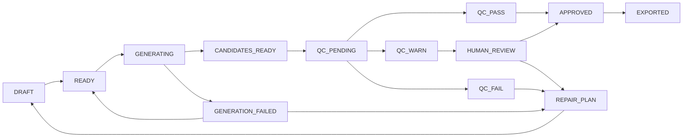

# 镜序 Studio - 个人 AI 漫剧分镜、生产与质量评估工作台

## 产品需求文档 PRD v1.2

| 文档项 | 内容 |
|---|---|
| 产品名称 | 镜序 Studio |
| 产品副标题 | 面向个人创作者的 AI 漫剧分镜、生产与质量评估工作台 |
| 产品口号 | 让每个镜头有序生成、有据验收、精准返工 |
| 文档版本 | PRD v1.2 |
| 更新日期 | 2026-08-05 |
| 当前状态 | 方案阶段，尚未完成开发、上线及用户验证 |
| 当前开发目标 | V1：AI 剧本与结构化分镜 |
| 求职建议交付点 | 完成 V3，并具备真实用户、标注集和测量结果 |
| 命名状态 | 工作名称；商业化前需完成商标、域名和应用商店重名核验 |

---

## 0. 修订历史

### 0.1 v1.2（2026-08-05）

在 v1.1 基础上，把“控制层字段不等于生成层能力”这一原则贯彻到 v1.1 未覆盖的剩余字段，并修正状态机与评测验收的若干缺口：

1. 新增时长实现策略（见 10.3.1）：目标时长为控制层字段，实际由“单次生成 + 续写 + 裁剪”达成，不假设模型输出任意时长。
2. 新增对白音频时长与镜头时长的对齐闭环（见 10.7.1）。
3. 修正镜头状态机（见 12.1）：补充生成失败的出口与重试路径。
4. 补充 SUBTITLE_ONLY 模式的生产说明（见 10.7）。
5. 将剧情和对白连续性明确列为 V3 依赖图的非目标（见 11.5）。
6. 补充 Provider Probe 和本地计价表的维护节奏（见 10.4、10.8），避免无限运维负担。
7. 说明 V3 评测数据量与晋升门槛的关系（见 11.6、11.8）：V3 预期多数检查停留在 ADVISORY。
8. 补充标注者间一致性（IAA）要求（见 9.8、11.8）。

### 0.2 v1.1（2026-08-04）

针对 v1.0 中“用数据结构描述了约束，但没有说明生成端如何实现、评估端如何判断”的结构性缺口进行修订。核心变化：

1. 将系统拆为控制层、生成层、评估层和证据层。
2. 明确镜头契约和资产版本属于控制机制，不能替代模型的一致性能力。
3. 增加一致性生成策略和动态 ProviderCapabilityRegistry。
4. 将质量检查分为确定性检查、指标辅助检查和语义辅助检查。
5. 将“坏镜头医生”改为“镜头问题发现与返工助手”，不承诺未经验证的因果诊断。
6. 统一采用 Observation、Evidence、Cause Hypothesis、Recommended Action 结果模型。
7. 将对白与口型模式前置到 V1 创作设定和分镜约束，并传递至 V2、V3。
8. 增加 Golden Set 冷启动、数据集拆分、评估能力晋升和降级机制。
9. 增加假设失败后的退出、转向和终止动作。
10. 区分成本估算、Provider 用量、积分消耗和账单实扣。
11. 将镜头状态机改为包含质检、人工复核和返工循环的状态图。
12. 将 V4、V5 压缩为能力愿景和进入条件，当前实施 PRD 聚焦 V1 至 V3。

文档边界：本文档由两部分组成——产品愿景与路线图（长期方向、产品原则、版本进入条件）和 V1 至 V3 实施 PRD（当前可开发范围、功能需求、数据结构、验收标准）。V4、V5 不作为当前开发承诺。

---

# 第一部分：产品愿景与路线图

## 1. 产品定义

### 1.1 一句话定义

镜序 Studio 是一款面向个人 AI 漫剧创作者的质量优先生产工作台，支持 AI 剧本创作、可执行分镜、角色与场景资产管理、图片和视频生产、证据化质量检查、人工审片、局部返工和成片合成。

### 1.2 核心定位

> 镜序 Studio 不替创作者判断一切，而是把生产约束前置、把质量问题证据化、把返工影响可计算，并让自动化能力随着真实数据逐步晋升。

### 1.3 产品承诺

产品优先承诺：

- 生产任务可追踪、可恢复、可局部重试。
- 剧本、资产、镜头和候选结果之间有明确版本及依赖关系。
- 可确定检查的问题给出明确结果和证据。
- 不确定问题以辅助提示呈现，并保留人工终审。
- 生成前展示成本估算，生成后记录用量及成本来源。
- 修改剧本或资产时展示可能受影响的镜头和沉没成本。

产品不承诺：

- 一句话稳定生成整部高质量漫剧。
- 自动准确判断所有动作、情绪、畸形和人物漂移。
- 自动质检替代创作者终审。
- 所有模型都支持角色参考、首尾帧、Seed 或精准口型。
- 风险预检等同于版权或平台合规保证。

---

## 2. 目标用户

### 2.1 核心用户

- 独立 AI 漫剧创作者或一人工作室。
- 已使用过至少一种图片或视频生成工具。
- 每周计划生产 1 至 3 集，每集约 60 至 120 秒。
- 同时承担编剧、分镜、画面、配音、剪辑和审核工作。
- 关注成片完成率、一致性、返工范围、时间和成本。

### 2.2 暂不优先服务

- 完全不愿编辑、只期待一键成片的用户。
- 需要企业组织架构、复杂权限和审批流的大型工作室。
- 以真人数字人直播、广告投放或长电影制作为核心的用户。

### 2.3 核心 JTBD

> 当我有一个故事创意或已有剧本时，我希望在一个工作台中把它变成一集角色和场景尽量一致、问题可定位、成本可追踪的 AI 漫剧；镜头失败时，我希望只处理受影响部分，而不是重新制作整集。

---

## 3. 待验证问题假设

以下不是已经证实的用户事实，而是需要在 V1 至 V3 中验证的产品假设。

| ID | 假设 | 验证证据 | 支持条件 | 不支持后的动作 |
|---|---|---|---|---|
| H1 | 一致性是主要返工来源 | 镜头失败原因和返工耗时 | 位列失败原因前两位 | 暂停一致性质检扩展，将 V3 资源转向实际排名第一的问题 |
| H2 | 创作者需要自动质量提示 | 查看率、采用率、修复成功率 | 用户持续查看并采用建议 | 保留确定性检查和人工审片，取消复杂语义评估投入 |
| H3 | 局部返工能显著降本 | 局部返工与整段重做对照 | 合格镜头成本或耗时下降 | 调整依赖粒度；若仍无改善，取消自动返工范围推荐 |
| H4 | 成本不可预测会阻碍完成 | 预算查看、超支和中断行为 | 用户因估算调整生成方案 | 将成本能力降级为记录和对账，不建设复杂路由 |
| H5 | AI 剧本需要可生产性约束 | 警告采用率、后续生成失败率 | 采用建议后失败或重试下降 | 将功能降级为人工检查清单 |
| H6 | 用户需要跨集一致性 | 重复创建角色和场景、跨集创作率 | 多集用户持续复用资产 | V4 不进入跨集研发，优先解决单集效率 |

### 3.1 假设治理规则

每条假设必须记录：

- Owner。
- 数据来源。
- 验证周期。
- 支持条件。
- 否定条件。
- 继续动作。
- 转向动作。
- 终止条件。
- 决策日期和决策记录。

验证结果不支持原假设时，不允许仅修改指标定义来维持原路线。

---

## 4. 四层产品架构


### 4.1 控制层

负责描述“应该生产什么”和“生产过程发生了什么”：

- StoryBible。
- ShotContract。
- Asset 和 AssetVersion。
- DialogueRenderMode。
- 任务状态和依赖关系。
- Prompt、参数、模型版本和成本记录。

控制层不能直接保证模型输出一致。

### 4.2 生成层

负责把控制条件转换为模型可接受的输入：

- 文生图和参考图生图。
- 主体参考、角色参考或 LoRA。
- 首帧、尾帧和图生视频。
- 视频续写和参考生视频。
- TTS、驱动音频和可选口型后处理。
- Provider 能力匹配及失败兜底。

### 4.3 评估层

负责发现问题、展示证据、组织人工复核和返工：

- 确定性检查。
- 指标辅助检查。
- 语义辅助检查。
- 人工终审。
- 问题发现和返工编排。

### 4.4 证据层

负责证明哪些能力可信：

- Golden Set。
- 人工标签。
- 自动判断的 Precision、Recall、F1。
- 误判和漏判。
- 修复前后对照。
- Provider 真实成功率、时延和成本。
- 能力晋升及降级记录。

---

## 5. 产品价值与指标

### 5.1 北极星指标

**每位周活跃创作者每周人工终审通过的成片秒数。**

### 5.2 核心指标

- 单个合格镜头成本 = 全部生成成本 / 人工终审通过镜头数。
- 合格成片秒成本 = 全部生成成本 / 人工终审通过成片秒数。
- 首次通过率 = 首次生成即被人工批准的镜头数 / 首次生成镜头数。
- 返工恢复率 = 返工后通过的镜头数 / 进入返工的镜头数。
- 浪费成本率 = 被废弃候选估算或实扣成本 / 全部生成成本。
- 单集完成时间 = 创建项目至首次导出完整成片的有效操作时间和自然时间。
- 建议采用率 = 被执行的修复建议数 / 被查看的修复建议数。

### 5.3 质量指标

不使用单一“综合准确率”判断评估器是否可用。每个质量维度分别记录：

- 适用镜头范围。
- 正负样本数量。
- Precision。
- Recall。
- F1。
- 混淆矩阵。
- 人工一致情况。
- 平均成本和延迟。

### 5.4 护栏指标

- 严重问题漏检率。
- 自动阻断误杀率。
- 未经用户确认的下游自动重生成次数。
- 超预算后继续生成次数。
- 任务丢失率和重复扣费率。
- 项目无法恢复率。

---

## 6. 版本路线图

本项目不设置独立 M0。用户验证、Golden Set 和 Bad Case 收集嵌入每个开发版本。

| 版本 | 核心价值 | 当前承诺状态 |
|---|---|---|
| V1 | AI 将创意或已有剧本转成可编辑、可生产的分镜 | 当前开发范围 |
| V2 | 用户在一个工作台完成一集 60 至 120 秒漫剧 | 进入条件明确的下一版本 |
| V3 | 用证据化检查和依赖图降低返工成本 | 求职核心交付版本 |
| V4 | 支持跨集生产、批量任务和成本感知路由 | 能力愿景，不进入当前排期 |
| V5 | 发布包、反馈、云端和商业化 | 能力愿景，不进入当前排期 |

### 6.1 V4 进入条件

只有同时满足以下条件才详细立项：

- 至少 5 名创作者重复使用。
- 至少完成 10 集作品和 200 个人工验收镜头。
- H6 获得支持，存在真实跨集资产复用需求。
- 已有至少两家可比较的 Provider 数据。
- V3 质量和返工链路稳定，不再依赖临时人工补数据。

V4 愿景：跨集状态、批量生产、Provider 路由、风格记忆和回归评测。

### 6.2 V5 进入条件

- 存在真实发布行为和重复创作。
- 用户对云同步、发布包或额度管理表现出付费意愿。
- 单集生产链路已经稳定。
- 平台规则、数据授权和账单体系具备实施条件。

V5 愿景：平台发布包、表现反馈、轻协作、云端同步、订阅和额度。

---

# 第二部分：V1 至 V3 实施 PRD

## 7. 优先级与完成定义

### 7.1 优先级

- **P0**：当前版本发布阻断项；缺失时核心用户任务无法完成或存在不可接受风险。
- **P1**：重要能力；可通过明确人工路径完成时，不阻断首次发布。
- **P2**：体验优化或范围扩展；不进入当前版本承诺。
- **P3**：探索项；需要新的用户证据或技术验证后才能立项。

### 7.2 单项需求完成定义

需求必须同时满足：

1. 用户入口和结果可见。
2. 正常路径可以完成。
3. 失败、取消、重试和空状态有处理。
4. 数据持久化并可追踪版本。
5. P0 验收用例通过。
6. 埋点和必要日志可用。
7. 已知限制写入版本说明。

---

## 8. 核心用户流程


系统必须允许从任一阶段返回上游修改，并显示受影响的下游数据、已生成候选和沉没成本。

---

## 9. V1：AI 剧本与结构化分镜

### 9.1 版本目标

用户输入创意或已有剧本后，获得可编辑、可锁定、带生产约束的剧本和 ShotContract 列表。

### 9.2 创作模式

- AI 原创：从题材、角色和冲突开始创作。
- 授权改编：用户确认拥有权利后导入小说、故事或大纲。
- AI 优化：优化已有剧本的节奏、对白和可生产性。

### 9.3 分阶段 AI 编剧

```text
创作要求
-> 故事概念与核心冲突
-> 角色和世界观圣经
-> 多集或单集大纲
-> 单集节拍表
-> 场景化剧本
-> 可生产性检查
-> 结构化镜头契约
```

| ID | 需求 | 优先级 | 验收标准 |
|---|---|---|---|
| V1-SCR-001 | 生成故事概念、角色、世界观、节拍表和场景剧本 | P0 | 各阶段单独保存；失败后从当前阶段重试 |
| V1-SCR-002 | 支持选中段落续写、缩写、改写和加强冲突 | P0 | 只修改选中范围，不覆盖已锁定字段 |
| V1-SCR-003 | 支持角色、世界观和关键剧情锁定 | P0 | AI 修改前检查锁定状态；冲突时停止并提示 |
| V1-SCR-004 | 支持版本对比和恢复 | P0 | 可查看变更来源、时间和影响字段 |
| V1-SCR-005 | 修改影响分析 | P1 | 列出可能失效的分镜、资产、候选和沉没成本 |

### 9.4 项目级对白策略

创建项目时必须选择 DialogueRenderMode：

| 模式 | 说明 | V1 分镜约束 | V2 生产方式 |
|---|---|---|---|
| NARRATION_FIRST | 旁白为主 | 优先环境、动作、反应、背影和侧脸 | TTS 旁白，不要求口型 |
| WEAK_LIP_SYNC | 有对白但不做精准口型 | 避免长正脸近景，使用正反打、侧脸和反应镜头 | TTS + 剪辑规避明显不同步 |
| PRECISE_LIP_SYNC | 允许正脸对白 | 标记嘴部可见、遮挡、时长和驱动音频需求 | 接入驱动音频模型或口型后处理 |
| SUBTITLE_ONLY | 无配音 | 控制字幕长度和安全区 | 只生成字幕轨道 |

#### V1-DLG 验收规则

- Storyboard Planner 必须读取 DialogueRenderMode。
- WEAK_LIP_SYNC 下出现正脸长对白镜头时，输出可生产性 WARN。
- PRECISE_LIP_SYNC 镜头必须在 ShotContract 中标记 `lip_sync_required=true`。
- NARRATION_FIRST 镜头不得因人物嘴部不动被判定为失败。

### 9.5 可生产性检查

V1 的可生产性检查采用**经验启发式规则 + Provider 能力规则 + LLM 推理**，属于风险提示，不是精确失败率预测。

检查项：

- 同镜头可见角色数量。
- 场景切换频率。
- 多人互动和遮挡。
- 大幅动作、群体动作和复杂物理交互。
- 对白长度和预计语速。
- DialogueRenderMode 与镜头构图冲突。
- 所需参考图、首尾帧或驱动音频是否被当前 Provider 支持。
- 预计镜头数量和成本区间。

输出必须包含：

- 观察到的复杂条件。
- 使用的经验规则。
- 风险等级。
- 建议修改。
- “经验性提示，非成功率承诺”说明。
- 忽略提示并继续的人工确认。

从 V2 开始，使用真实失败率、重试次数和合格镜头成本校准规则。

### 9.6 ShotContract

| 字段组 | 字段 |
|---|---|
| 基础 | shot_id、序号、时长、剧情作用、状态 |
| 摄影 | 景别、机位、构图、焦点、镜头运动 |
| 内容 | 角色、服装、场景、道具、动作、情绪、对白 |
| 对白 | dialogue_render_mode、speaker、audio_required、lip_sync_required |
| 连续性 | asset_version、continuity_mode、前置镜头、首帧和尾帧约束 |
| 生成 | Provider 能力要求、图片 Prompt、视频 Prompt、负面约束、预算 |
| 验收 | 必须出现、禁止出现、技术规格、人工终审要求 |

### 9.7 分镜编辑

- 表格和镜头卡片双视图。
- 拆分、合并、复制、删除和拖动排序。
- 局部重生成字段或镜头。
- 已锁定字段不被覆盖。
- 剧本、故事圣经和分镜版本可追踪。
- 导出剧本、分镜表和结构化 JSON。

### 9.8 V1 种子评测集

不新增独立 M0，但 V1 必须同步建立初始 Seed QA Set：

- 20 至 40 个真实或自生成镜头。
- 同时包含可接受和不可接受样本。
- 覆盖黑屏、冻结、角色变化、构图问题、动作问题和音画问题。
- 每个样本记录人工结论、失败类型和判断依据。
- 编写第一版标注指南，并在 V3 扩充标注时引入标注者间一致性（IAA）测量。
- 不要求 V1 自动识别全部问题。

该数据用于确定 V3 哪些维度值得建设，不将目标样本数写成已完成结果。

### 9.9 V1 发布验收

- 至少 3 名目标用户完成从创意或剧本到结构化分镜。
- 用户可局部修改，不需要整份重新生成。
- 已锁定字段不会被 AI 静默修改。
- DialogueRenderMode 能正确影响分镜构图和口型要求。
- 可生产性提示显示依据，用户可以人工覆盖。
- 所有 ShotContract 通过结构校验。
- 完成 20 至 40 个镜头的 Seed QA Set 和第一版标注指南。

---

## 10. V2：单集漫剧生产闭环

### 10.1 版本目标

用户在一个工作台中完成一集 60 至 120 秒、6 至 10 个镜头的 AI 漫剧，并能追踪资产、任务、候选、成本和人工选择。

### 10.2 一致性实现策略

资产绑定只是控制要求，生成一致性由具体生成方式和 Provider 能力共同决定。

| 目标 | 首选机制 | 兜底方式 | 边界 |
|---|---|---|---|
| 角色身份 | 主体参考图、角色参考或参考生视频 | 重做关键帧、局部重绘、人工选候选 | 不承诺完全一致 |
| 服装和道具 | 资产版本 + 参考图生成关键帧 | 局部重绘或重做首帧 | 文本约束本身不保证生效 |
| 单镜头内部稳定 | 关键帧图生视频 | 缩短时长、降低动作、拆镜 | 大动作仍可能漂移 |
| 连续动作 | 尾帧复用、首尾帧或视频续写 | 重做转场或拆分动作 | 仅适用于连续镜头 |
| 同场景切镜 | 同一资产生成新机位关键帧 | 候选比较和人工选帧 | 不应强制复用上一尾帧 |
| 场景切换和蒙太奇 | 独立生成新首帧 | 使用风格和资产约束 | 不要求像素连续 |

### 10.3 镜头连续模式

ShotContract 必须选择 ContinuityMode：

- CONTINUOUS_ACTION：连续动作，允许尾帧复用或视频续写。
- SAME_SCENE_CUT：同场景切镜，使用同一资产生成新机位首帧。
- REVERSE_SHOT：正反打，不复用尾帧，保持角色和空间关系。
- SCENE_CHANGE：场景切换，生成独立首帧。
- MONTAGE：蒙太奇，仅保持叙事、角色或风格一致。

V2 必须支持首帧生成、视频尾帧提取和 CONTINUOUS_ACTION 的尾帧复用。首尾帧双锚定、参考生视频和视频续写按 Provider 能力接入。

### 10.3.1 时长实现策略

ShotContract 的“时长”是控制层目标值，不是生成层承诺值。视频模型输出时长通常被量化（如 5s、10s），或受单次生成上限约束。实际镜头时长由下列方式组合达成：

| 目标时长与模型能力关系 | 实现方式 | 备注 |
|---|---|---|
| 目标 ≤ 单次上限且模型支持该时长 | 单次生成 | 首选 |
| 目标 > 单次上限 | 续写拼接，续写段继承首段尾帧约束 | 续写一致性见 10.2 |
| 模型仅输出固定时长且长于目标 | 生成后裁剪到目标时长 | 保留裁剪点和原始素材 |
| 模型仅输出固定时长且短于目标 | 续写或回分镜层拆分为多镜头 | 拆分需更新 ShotContract |
| 需要精准卡点（如对白结束点） | 按音频或卡点裁剪 | 与 10.7.1 对齐 |

验收以“裁剪后实际时长”为准，ShotContract 时长标注为目标值。每个 Candidate 必须记录单次生成时长、续写段数和裁剪区间，否则无法支撑成本与质检对账。

### 10.4 动态 ProviderCapabilityRegistry

注册表不能是永久静态配置。能力由文档声明、运行探测和真实生产观测共同构成。

#### 核心字段

| 字段 | 说明 |
|---|---|
| provider/model/model_version | Provider 和模型版本 |
| endpoint_version | API 版本 |
| region/account_tier | 地域和账户层级 |
| capability | 首帧、尾帧、主体参考、驱动音频、Seed 等 |
| declared_support | 官方文档是否声明支持 |
| probe_status | 最近 Schema 或 Canary 探测结果 |
| observed_success_rate | 真实任务成功率 |
| verified_at/expires_at | 验证时间和能力有效期 |
| evidence_source | official_doc、schema_probe、canary、production、manual |
| constraints | 时长、分辨率、素材数量、文件格式和地域限制 |

#### 能力状态

- DECLARED：仅有官方文档声明。
- SCHEMA_VERIFIED：接口和参数通过验证。
- CANARY_VERIFIED：低成本测试任务成功。
- PRODUCTION_OBSERVED：已有真实生产数据。
- STALE：超过有效期或模型版本变化。
- UNAVAILABLE：当前地域、账户或版本不可用。

#### 路由证据优先级

```text
生产实测
> Canary 验证
> Schema 验证
> 官方文档声明
> 未验证用户反馈
```

#### Probe 边界

- Schema Probe 只验证接口、参数和返回结构。
- Canary Generation 验证任务能否成功和输入是否被接受。
- Probe 不证明生成质量好。
- 只对当前启用 Provider 在版本变化、连续异常、能力过期或正式发布前执行。
- Probe 有真实调用成本：设单次 Probe 预算上限，能力状态设默认有效期（如 14 天），仅在过期或触发条件命中时重新探测，不做高频轮询。
- 个人项目 V2 仅接入一家图片、一家视频和一家 TTS Provider。

### 10.5 资产与关键帧

- 角色、场景、道具、画风和声音资产。
- 每个资产有唯一 ID 和 AssetVersion。
- 镜头绑定具体资产版本。
- 生成或上传角色标准参考和场景参考。
- 首帧候选生成、比较和人工选择。
- 视频尾帧提取并可用于连续镜头。
- 资产变更后列出受影响镜头，不自动批量重生成。

### 10.6 生成任务

- 图片、视频和 TTS 异步任务。
- Provider 状态映射。
- 幂等 ID、取消、超时、重试和恢复。
- 多候选保留，不覆盖旧结果。
- 应用重启后继续查询未完成任务。
- 输入变更后旧结果标记 STALE_INPUT。

### 10.7 对白与口型生产

#### NARRATION_FIRST

- 生成旁白和字幕。
- 不进入口型任务。
- 人物嘴部不动不构成质量失败。

#### WEAK_LIP_SYNC

- 生成角色配音和字幕。
- 依赖 V1 的侧脸、背影、正反打和反应镜头设计。
- 人工审片检查明显嘴声冲突，但不承诺精准同步。

#### PRECISE_LIP_SYNC

- 需要 Provider 支持驱动音频，或接入可选口型后处理。
- 口型处理是独立任务，保存原视频、驱动音频、模型和结果。
- 处理失败可回退到原视频或弱口型剪辑方案。
- V2 可以将该模式标记为 Beta，不阻断旁白型漫剧完成。

#### SUBTITLE_ONLY

- 不生成任何配音，仅生成字幕轨道。
- 不进入 TTS 或口型任务。
- 字幕停留时长按阅读速度估算，需与镜头实际时长对齐（见 10.7.1）。

### 10.7.1 对白音频时长与镜头时长对齐

TTS 输出时长由文本长度、音色和语速决定，与镜头实际时长（见 10.3.1）几乎必然存在偏差。V2 必须定义显式对齐策略，而不是默认两者刚好匹配：

| 音频时长 vs 镜头时长 | 默认处理 | 人工可覆盖 |
|---|---|---|
| 基本相等 | 直接合成 | — |
| 音频略长于镜头 | 优先延长镜头至音频结束（续写或静帧延展）；其次按语速上限重生成 TTS | 裁剪音频尾部（可能截断对白） |
| 音频远长于镜头 | 回分镜层拆分镜头或缩减对白 | 强制裁剪并标记对白不完整 |
| 音频短于镜头 | 镜头尾部静音或补环境音 | 提前切入下一镜头 |

对齐结果必须记录音频实际时长、镜头实际时长、采用的对齐方式以及是否触发分镜层回退。PRECISE_LIP_SYNC 下，对齐偏差同时影响音画同步检查（见 11.2）。

### 10.8 成本账本

不得将估算成本写成真实实扣。

| 字段 | 含义 |
|---|---|
| estimated_cost | 根据本地计价表计算的调用前估算 |
| provider_reported_usage | Provider 返回的秒数、Token、图片数或积分 |
| provider_reported_cost | Provider 明确返回的金额，若无则为空 |
| credit_estimate | 按积分或额度折算的估算 |
| reconciled_billed_cost | 与账单或发票核对后的实扣 |
| currency_or_credit | CNY、USD、credit 等 |
| unit_price/price_version | 单价和价格表版本 |
| cost_source | provider_reported、rate_card_estimate、invoice、manual |

当 Provider 不返回单次费用时，按本地价格表估算，并显示“估算非实扣”。

本地计价表（unit_price / price_version）需定期与 Provider 官方定价对账（建议月度）。定价变更后旧价格表标记过期但不回改已记录成本；个人项目不追求实时对账，以月度批量对账为准。

### 10.9 时间线和合成

- 镜头排序和时长调整。
- 配音、旁白、字幕和背景音乐轨道。
- 字幕时间轴、安全区和样式。
- FFmpeg 合成、预览和 MP4 导出。
- 合成失败不删除已生成素材。

### 10.10 V2 发布验收

- 至少 3 名真实创作者各完成一集。
- 累计生产不少于 40 个镜头。
- 支持 60 至 120 秒、6 至 10 个镜头的单集。
- 至少跑通 NARRATION_FIRST 和 WEAK_LIP_SYNC。
- CONTINUOUS_ACTION 支持尾帧提取和复用。
- 所有任务保存模型、参数、资产版本、耗时、成本来源和人工选择。
- 单镜头失败不要求重做整集。
- 应用重启、任务失败和文件下载失败均有恢复路径。
- 输出第一版 Provider 能力快照和真实任务统计。

---

## 11. V3：质量评估与返工闭环

### 11.1 版本目标

系统通过确定性检查、指标辅助、语义提示和人工终审发现镜头问题，展示证据和原因假设，并依据依赖图组织局部返工。

V3 不承诺开发通用视频质量模型。

### 11.2 质量能力矩阵

| 层级 | 典型检查 | 实现方式 | 用户结果 | 是否可自动阻断 |
|---|---|---|---|---|
| 确定性 | 文件、时长、分辨率、帧率、编码、音轨、黑屏、冻结 | ffprobe、FFmpeg、规则 | 明确问题和时间点 | 通过测试后可以 |
| 指标辅助 | 角色相似、色调变化、帧间突变、条件性首尾帧连续 | 抽帧、相似度、感知指标 | WARN、证据和人工复核 | 默认不可以 |
| 语义辅助 | 动作完成、情绪、叙事符合、人体异常、运镜符合 | VLM 读取关键帧或短视频 | 疑似问题和原因假设 | 默认不可以 |
| 人工终审 | 创作质量、接受度和最终发布判断 | 创作者审片 | APPROVED/REJECTED | 最终决定 |

#### 适用条件

- 首尾帧连续只对 CONTINUOUS_ACTION 等指定模式检查。
- PRECISE_LIP_SYNC 才进入音画同步检查。
- NARRATION_FIRST 不检查人物嘴部运动。
- 语义检查必须显示“辅助提示，需人工确认”。

### 11.3 质量结果模型

每个问题拆成五部分：

1. **Observation**：观察到的现象。
2. **Evidence**：证据帧、时间点、规则或指标。
3. **Certainty**：确定性问题、指标异常或模型推测。
4. **Cause Hypotheses**：一个或多个可能原因，不表述为已确认根因。
5. **Recommended Actions**：可尝试的修复动作、成本和副作用。

示例：

```json
{
  "observation": "第3.2秒至第4.8秒接近全黑",
  "certainty": "deterministic_finding",
  "evidence": {
    "method": "ffmpeg_blackdetect",
    "start_sec": 3.2,
    "end_sec": 4.8
  },
  "cause_hypotheses": [
    {"cause": "生成结果异常", "confidence_level": "medium"},
    {"cause": "剧本设计渐暗", "confidence_level": "low"}
  ],
  "recommended_actions": [
    "检查镜头契约是否包含渐暗要求",
    "若无渐暗要求，重新生成当前镜头"
  ],
  "human_confirmation_required": true
}
```

不向用户展示未经校准的 `confidence: 0.81`。模型原始分数可以内部保存，但必须标记 score_type 和 calibration_status。

### 11.4 镜头问题发现与返工助手

“坏镜头医生”可保留为对外昵称，内部需求名称为“镜头问题发现与返工助手”。

| ID | 需求 | 优先级 | 验收标准 |
|---|---|---|---|
| V3-QA-001 | 聚合确定性、指标和语义问题 | P0 | 显示层级、严重度、状态和适用范围 |
| V3-QA-002 | 显示证据帧和时间点 | P0 | 点击问题可跳转到视频对应位置 |
| V3-QA-003 | 输出原因假设 | P0 | 不将 VLM 推测写成确认根因；展示判断来源 |
| V3-QA-004 | 输出修复动作 | P0 | 包含操作、依据、预计成本和潜在副作用 |
| V3-QA-005 | 计算返工影响范围 | P0 | 主要由依赖图计算；推测范围必须单独标注 |
| V3-QA-006 | 局部重生成 | P0 | 默认只提交用户选中范围，扩大范围二次确认 |
| V3-QA-007 | 修复前后对比 | P0 | 对比候选、人工结论、成本和耗时 |
| V3-QA-008 | 误判和漏判反馈 | P0 | 人工反馈进入评测数据且不覆盖历史结果 |

### 11.5 依赖图与返工范围

返工范围优先根据确定性依赖计算：


- 修改角色资产：使用该资产的关键帧标记可能失效。
- 修改关键帧：由该关键帧生成的视频标记失效。
- 修改连续镜头尾帧：依赖该帧的下一镜头标记可能失效。
- 用户确认前不自动重新生成下游内容。
- 返工助手不得仅凭语义推测扩大重生成范围。
- 依赖图仅覆盖资产、关键帧和连续镜头的生产依赖；剧情逻辑、对白承接和角色情绪状态的连续性属于 V3 非目标，修改台词不会自动标记下游回应镜头失效。

### 11.6 评估能力生命周期

```text
EXPERIMENTAL
-> ADVISORY
-> AUTO_WARN
-> AUTO_BLOCK
```

任何能力都可以反向降级：

```text
AUTO_BLOCK
-> AUTO_WARN
-> ADVISORY
-> DISABLED
```

#### 晋升规则

- 明确适用的镜头类型、模型版本和数据范围。
- 使用独立验证集，不能只在开发集上达标。
- 达到最小正负样本量。
- 报告 Precision、Recall、F1 和混淆矩阵。
- 连续两个评测版本稳定。
- 成本和延迟满足产品要求。
- AUTO_BLOCK 必须满足更高 Precision，避免误杀正常镜头。

#### 初始建议门槛

以下是项目内部初始门槛，不是行业标准，也不是已达成结果：

- 确定性检查：设计测试用例 100% 通过才可 AUTO_BLOCK。
- 指标或语义检查晋升 AUTO_WARN：适用范围内至少 30 个正样本和 30 个负样本，Precision 不低于 0.80，Recall 不低于 0.70。
- 严重问题告警：Recall 目标不低于 0.85，同时单独报告 Precision。
- 晋升 AUTO_BLOCK：至少 50 个正样本和 50 个负样本，Precision 不低于 0.95，并通过独立 Holdout Set。
- 未达到条件时只能保持 ADVISORY。
- 样本量较小时，P/R/F1 必须同时报告置信区间或最坏情况波动，避免少数样本翻转结论。V3 的 100 个镜头 4 路拆分后，多数维度难以达到上述晋升门槛，预期停留在 ADVISORY（见 11.8）。

#### 降级触发

- Provider 或模型版本变化。
- 新题材或画风误判显著上升。
- 人工反馈显示性能连续下降。
- 输入数据分布发生变化。
- 评估器成本或延迟超过预算。
- 评估数据或标注质量被发现有问题。

### 11.7 评测数据拆分

- Development Set：开发规则、Prompt 和指标。
- Validation Set：选择版本和阈值。
- Holdout Set：能力晋升最终判断，开发期间不得反复查看和调参。
- Regression Set：后续 Provider、模型、Prompt 和评估器回归。

视频生成具有随机性。回归评测不能依赖单次 Seed 复现，应对同一批 ShotContract 重复生成 N 次，比较：

- 人工通过率。
- 失败类型分布。
- 合格镜头成本。
- 时延。
- 质量指标统计量。

Seed 在 Provider 支持时保存，用于控制变量和追踪，不承诺确定性复现。

### 11.8 V3 发布验收

- 累计不少于 100 个带人工标签的镜头。
- 标注集拆分为开发、验证、Holdout 和回归用途。
- 标注质量可证明：至少一个标注子集经双人复核，报告标注者间一致性（如 Cohen's κ）；单标注者样本须在报告中说明限制。
- 确定性 P0 检查的设计测试用例 100% 通过。
- 每项指标或语义检查单独报告适用范围和 P/R/F1。
- 数据量预期声明：100 个镜头 4 路拆分后多数维度样本不足，V3 预期只有确定性检查和 1–2 个数据充足维度可晋升 AUTO_WARN，其余检查停留在 ADVISORY 并报告 P/R/F1，不自动阻断。是否将验收镜头数提升至 200–300 以支撑更多维度晋升，作为 V3 立项时的可选决策。
- 未完成晋升的语义检查不得自动 FAIL 或阻断。
- 所有问题均展示 Observation 和 Evidence。
- Cause Hypothesis 明确标记为假设，不冒充根因。
- 返工范围主要由依赖图产生。
- 至少两类修复动作完成真实前后对照。
- 记录修复前后人工通过、耗时、生成次数和成本。

---

## 12. 状态机与任务治理

镜头生命周期和单次生成任务必须分开。

### 12.1 镜头状态



生成失败（所有候选失败、超时、余额不足或内容被拒）进入 GENERATION_FAILED：保留失败证据，默认回到 READY 等待重试；若失败原因属于镜头设计问题（如反复内容被拒、复杂动作连续失败），可进入 REPAIR_PLAN 修改契约。GENERATION_FAILED 与 QC_FAIL 不混用——前者是没有产出可用候选，后者是产出了候选但不合格。

### 12.2 生成任务状态

```text
QUEUED
-> SUBMITTED
-> RUNNING
-> SUCCEEDED / FAILED / TIMEOUT / CANCELLED / DOWNLOAD_FAILED
```

### 12.3 任务规则

- 每次提交使用幂等键。
- Provider 状态统一映射为内部状态。
- 查询、回调、下载、重试和取消相互独立。
- 重试保留原任务和失败证据。
- 输入变化后旧候选标记 STALE_INPUT。
- 重复扣费和重复下载可检测。
- QC_FAIL 不删除候选，进入 REPAIR_PLAN 后由用户决定修改范围。

---

## 13. 核心数据模型

| 对象 | 关键字段 |
|---|---|
| Project | id、name、genre、style、budget、dialogue_render_mode |
| StoryBible | characters、world_rules、timeline、locked_fields |
| Episode | id、outline、duration、status、version |
| ScriptVersion | content、source、parent_version、change_summary |
| Asset | type、canonical_id、current_version、authorization |
| AssetVersion | file、prompt、model、seed、hash、created_at |
| ShotContract | narrative、camera、content、dialogue、continuity、generation、acceptance |
| ProviderCapability | provider、model、region、capability、state、evidence、expires_at |
| GenerationTask | provider、model、input、status、retry、usage、cost、latency |
| Candidate | file、task_id、asset_versions、quality_status、selected |
| QualityFinding | observation、evidence、certainty、severity、applicability |
| CauseHypothesis | finding_id、cause、source、confidence_level |
| RepairAction | action、expected_effect、cost_estimate、side_effects |
| ReviewIssue | status、human_label、comment、resolved_candidate |
| EvaluatorCapability | dimension、lifecycle_state、scope、metrics、version |
| CostLedger | estimate、usage、reported、reconciled、price_version、source |
| HypothesisLedger | hypothesis、evidence、success_rule、failure_rule、pivot、decision |

### 13.1 生成结果最小追踪字段

- Provider、模型和版本。
- Prompt、负面 Prompt 和结构化输入。
- 参数和 Seed（支持时）。
- 输入资产版本和 ShotContract 版本。
- DialogueRenderMode 和 ContinuityMode。
- 单次生成时长、续写段数、裁剪区间，以及音频实际时长和对齐方式（见 10.3.1、10.7.1）。
- 开始、结束时间和时延。
- 估算成本、用量、积分和成本来源。
- 文件哈希和存储位置。
- 自动检查和人工选择结果。
- 失败、取消、重试和修复记录。

---

## 14. AI 与工作流边界

### 14.1 Agent

#### Script Planner

- 生成故事圣经、节拍表和场景剧本。
- 根据 DialogueRenderMode 和预算调整剧本。
- 输出可生产性风险提示。

#### Storyboard Planner

- 生成 ShotContract。
- 选择 DialogueRenderMode 对应的镜头设计。
- 绑定角色、场景、道具和 Provider 能力要求。

#### Quality Reviewer

- 只在适用范围内生成语义辅助提示。
- 输出 Observation、Evidence、Cause Hypothesis 和 Recommended Action。
- 不改变镜头状态，不自动提交重生成。

### 14.2 确定性工作流

负责：

- 状态转换。
- 任务提交和恢复。
- Provider 能力校验。
- 资产版本和依赖图。
- 成本记录。
- FFmpeg 检查和合成。
- 自动检查执行。
- 人工确认。

Agent 负责理解、规划和建议；工作流负责执行和审计。

---

## 15. 信息架构

```text
工作台
├── 项目列表
├── 创作设定
├── 故事圣经
├── 剧本编辑器
├── 分镜工作台
├── 资产库
├── Provider 能力与 API 设置
├── 生产队列
├── 质量与返工中心
├── 时间线与成片
├── 成本中心
└── 数据与评测
```

分镜工作台优先采用：

- 左侧：剧集和资产。
- 中间：镜头表格或卡片。
- 右侧：ShotContract、Prompt、候选和检查结果。
- 底部：时间线、字幕和音频。

V1 至 V3 不开发复杂无限画布。

---

## 16. 埋点与分析

### 16.1 核心事件

- project_created
- dialogue_mode_selected
- script_generated
- story_field_locked
- producibility_warning_viewed
- producibility_warning_overridden
- shot_contract_generated
- shot_contract_edited
- provider_capability_checked
- generation_submitted
- generation_failed
- candidate_selected
- quality_finding_created
- quality_finding_overridden
- repair_action_viewed
- repair_action_applied
- shot_approved
- episode_exported

### 16.2 核心漏斗

```text
创建项目
-> 完成故事圣经
-> 完成剧本
-> 完成分镜
-> 生成首个镜头
-> 批准首个镜头
-> 完成单集
-> 导出成片
-> 创建下一集
```

---

## 17. 非功能需求

### 17.1 可靠性

- 异步任务状态持久化，不依赖页面持续打开。
- 项目和任务写入成功后才向用户显示提交成功。
- 合成失败不删除素材。
- 项目、素材和日志可以导出。

### 17.2 安全与隐私

- API Key 加密，不写入普通日志和前端埋点。
- 上传文件进行类型和大小校验。
- 用户私有内容默认不用于训练，另行授权除外。
- 删除项目二次确认并说明恢复能力。

### 17.3 版权与内容风险

- 改编模式要求权利或授权确认。
- 真人面孔和声音提供授权提醒。
- 保存素材来源和授权状态。
- 提供 AI 生成内容标识提醒。
- 只提供风险预检，不承诺版权和平台合规。

### 17.4 可观测性

- 记录内部任务 ID、Provider 任务 ID、状态、时延和错误码。
- 记录 Provider 能力来源、验证时间和过期时间。
- 记录成本估算与账单差异。
- 监控任务积压、连续失败、下载失败和重复回调。

---

## 18. 异常与边界场景

1. 剧本生成中断：保留已完成阶段，从失败步骤继续。
2. 用户修改锁定设定：要求解锁并展示影响范围。
3. Provider 文档声明支持但调用失败：能力降为 STALE 或 UNAVAILABLE，停止自动路由。
4. 任务成功但文件下载失败：进入 DOWNLOAD_FAILED，仅重试下载。
5. 生成期间输入变化：结果保留但标记 STALE_INPUT。
6. 预算不足：阻断生成并提供降档或减少候选方案。
7. 自动提示与人工冲突：人工结论优先，记录误判或漏判。
8. 修改角色资产：列出受影响镜头，不自动重做。
9. PRECISE_LIP_SYNC 失败：允许回退原视频或弱口型方案。
10. Provider 模型升级：相关能力和评估器进入待验证状态。
11. 合成失败：保留全部输入，允许修改参数重新合成。
12. 内容安全拒绝：展示归一化原因，不绕过 Provider 安全限制。

---

## 19. 测试与验收

### 19.1 测试类型

- 单元测试：结构校验、状态转换、依赖图和成本计算。
- 集成测试：Provider 提交、查询、回调、取消和下载。
- Contract Test：Provider 参数和返回结构。
- Canary Test：低成本能力可用性验证。
- 端到端测试：创意到成片和局部返工。
- 故障测试：超时、重复回调、余额不足、版本变化和重启恢复。
- 质量评测：Development、Validation、Holdout 和 Regression Set。
- 用户测试：目标用户独立完成任务，产品负责人不代操作。

### 19.2 每版必须交付

- 可运行 Demo。
- 当前版本 PRD 和变更记录。
- 关键流程和数据字段。
- 测试用例及验收结果。
- 用户试用记录。
- 指标报告和 Bad Case 清单。
- 已知限制和下一版本进入条件。

---

## 20. 主要风险

| 风险 | 影响 | 应对 |
|---|---|---|
| 控制层被误认为解决一致性 | 错误产品承诺 | 分离控制、生成、评估和证据层 |
| 语义判断不可靠 | 误诊和错误返工 | 降级为辅助提示，输出原因假设并人工确认 |
| Provider 能力信息腐烂 | 路由失败 | 动态注册表、版本、地域、Probe 和生产观测 |
| 精准口型成本高且不稳定 | 对话镜头成为废片 | V1 前置对白策略，默认旁白或弱口型 |
| 评测集过拟合 | 指标虚高 | 独立 Holdout、回归集和晋升/降级机制 |
| 功能范围过大 | 个人无法交付 | 只详细承诺 V1 至 V3，V4/V5 设进入条件 |
| 成本字段失真 | 无法路由和对账 | 区分估算、用量、积分和账单实扣 |
| 多 Agent 难调试 | 成本高且不可复现 | Agent 只建议，状态和执行交给工作流 |
| 缺少真实用户 | 简历结果无法成立 | 每版嵌入试用和实测验收 |

---

## 21. 当前开发顺序

1. 完成 V1 领域模型：Project、StoryBible、ScriptVersion、ShotContract。
2. 实现 DialogueRenderMode、锁定字段和版本对比。
3. 实现分阶段 AI 编剧和结构化分镜。
4. 实现启发式可生产性检查及人工覆盖。
5. 建立 20 至 40 个镜头的 Seed QA Set 和标注指南。
6. 验证 V1 用户是否能独立完成剧本和分镜。
7. 满足 V1 验收后再进入 V2 Provider 和生成任务开发。

不应在 V1 尚未完成时提前建设模型路由、语义质检、商业账单或多集协作。

---

## 22. 求职表达边界

当前项目仍处于方案和待开发阶段，不应写成已上线或已取得量化结果。

### 22.1 当前表述

> 独立规划面向个人 AI 漫剧创作者的质量优先生产工作台，设计 AI 剧本、结构化镜头契约、生成能力匹配、证据化质量检查及依赖图返工链路，目前进入 V1 原型开发。

### 22.2 完成 V3 后需要的证据

- 可运行 Demo。
- 至少 3 名真实创作者试用。
- 100 个以上人工标注镜头。
- 分维度质量评估报告。
- 至少两项修复动作的真实前后对照。
- 可追溯的成本、时延、通过率和返工数据。

只有真实测量后，才能在简历中写入效率提升、质量提升或成本下降百分比。

---

## 23. 参考资料与有效期说明

以下资料用于产品和技术方向参考，不代表其能力永久不变。具体接口写入 ProviderCapabilityRegistry 前必须重新核对模型版本、地域、账户层级和官方文档更新时间。

### 23.1 竞品与开源项目

- LumenX：https://github.com/alibaba/lumenx
- LocalMiniDrama：https://github.com/xuanyustudio/LocalMiniDrama
- Huobao Drama：https://github.com/chatfire-AI/huobao-drama
- Glowave X：https://x.qyingai.com/

### 23.2 研究资料

- One Sentence, One Drama：https://arxiv.org/abs/2605.22144
- DramaDirector：https://arxiv.org/abs/2606.24107

### 23.3 当前技术资料快照

- FFmpeg Filters：https://ffmpeg.org/ffmpeg-filters.html
- Wan 首尾帧视频：https://help.aliyun.com/en/model-studio/image-to-video-first-and-last-frames-guide
- Wan 参考生视频：https://help.aliyun.com/en/model-studio/wan-video-to-video-api-reference
- Runway API：https://docs.dev.runwayml.com/api/
- MuseTalk：https://github.com/TMElyralab/MuseTalk

技术资料核验快照日期：2026-08-04。Provider 接入时仍需再次核验并通过 Schema/Canary 测试。

---

## 24. 文档结论

镜序 Studio 的核心不再表述为“AI 自动诊断坏镜头”，而是：

> 用 AI 编剧和分镜把生产约束前置，用 Provider 能力治理选择可执行路径，用确定性规则和算法提示提供问题证据，用人工终审确认质量，用依赖图和返工助手缩小修改范围，并通过真实标注和生产数据逐步提升自动化等级。

当前只承诺从 V1 开始开发。V2、V3 必须依据上一版本的真实数据进入；V4、V5 只有满足进入条件后才展开详细需求。
