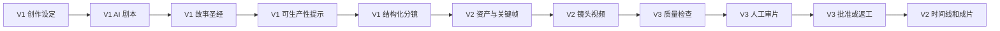
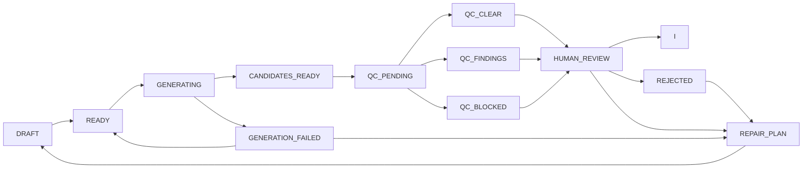

# 镜序 Studio - 个人 AI 漫剧分镜、生产与质量评估工作台

## 产品需求文档 PRD v1.4

| 文档项 | 内容 |
|---|---|
| 产品名称 | 镜序 Studio |
| 产品副标题 | 面向个人创作者的 AI 漫剧分镜、生产与质量评估工作台 |
| 产品口号 | 让每个镜头有序生成、有据验收、精准返工 |
| 文档版本 | PRD v1.4 |
| 更新日期 | 2026-08-05 |
| 当前状态 | 方案阶段，尚未完成开发、上线及用户验证 |
| 当前开发目标 | V1：AI 剧本与结构化分镜 |
| 交付目标 | 完成 V3，并具备真实用户、标注集和测量结果 |
| 命名状态 | 工作名称；商业化前需完成商标、域名和应用商店重名核验 |
| V1 机器契约 | `镜序Studio_V1_ScriptStageOutput.schema.json`、`镜序Studio_V1_ShotContract.schema.json`、`镜序Studio_V1_EpisodeStoryboardExport.schema.json`、`镜序Studio_V1_ProjectTransferBundle.schema.json` |

---

## 0. 修订历史

### 0.1 v1.4（2026-08-05）

在 v1.3 可开发基线上消除产品文档、技术设计和机器契约之间的剩余歧义：

1. 将 ShotContract 字段组命名统一为 Schema 的 `narrative_purpose`、`cinematography`、`generation_constraints`。
2. 定义无台词镜头的对白字段语义，避免用 `speaker_id` 承载焦点角色。
3. 补齐镜头复制的 ID、版本、血缘、顺序和状态规则，并纳入验收用例。
4. 将版本化参考价格快照定义为独立数据对象，明确未知价格和估算区间的机器约束。
5. 将空项目导入统一为 ProjectTransferBundle；独立 EpisodeStoryboardExport 只允许回导兼容的原项目。
6. 明确 `Project.budget` 与 `FormatProfile.target_platform` 为 V2+ 字段，不进入 V1 持久化和验收。
7. 将公开机器契约扩展为四份，并同步 ShotContract、EpisodeStoryboardExport 的兼容性版本。
8. 增加 V1 页面状态矩阵，将加载、空、错误、成功、离开和全局交互状态纳入界面验收。
9. 将启动自检、迁移、Schema Registry 和关键资源失败统一为独立只读故障页状态，禁止绕过故障进入可写模式。

### 0.2 v1.3（2026-08-05）

在 v1.2 的产品治理框架上补齐“可直接开发和验收的 V1”所需契约，并修正 V2、V3 的状态与范围歧义：

1. 新增 V1 范围卡、运行形态、输入规格、明确交付物和不做清单（见 9.1）。
2. 新增 V1 文本模型适配边界、分阶段调用契约、任务状态与异常矩阵（见 9.4）。
3. 明确项目默认对白模式与单镜头覆盖规则（见 9.5）。
4. 为可生产性规则增加静态能力快照、规则优先级和可审计输出（见 9.6）。
5. 明确锁定粒度、版本恢复和分镜拆分/合并语义（见 9.8）。
6. 将 V1 数据准备调整为结构化分镜评测集；视频 Seed QA Set 移入 V2（见 9.9、10.11）。
7. 新增可重复执行的 V1 功能验收、六类 P0 用例和三名用户试用门槛（见 9.10、9.11）。
8. 修正镜头状态机：所有质量结果进入人工终审；导出改为 Episode/ExportJob 状态（见 12）。
9. 补充 V2、V3 进入条件、最小承诺维度、部署模式和生成内容标识要求。
10. 增加 V1 编剧阶段、单镜头和整集导出三类 JSON Schema，并扩展核心数据对象和可追踪字段。

### 0.3 v1.2（2026-08-05）

在 v1.1 基础上，把“控制层字段不等于生成层能力”这一原则贯彻到 v1.1 未覆盖的剩余字段，并修正状态机与评测验收的若干缺口：

1. 新增时长实现策略（见 10.3.1）：目标时长为控制层字段，实际由“单次生成 + 续写 + 裁剪”达成，不假设模型输出任意时长。
2. 新增对白音频时长与镜头时长的对齐闭环（见 10.7.1）。
3. 修正镜头状态机（见 12.1）：补充生成失败的出口与重试路径。
4. 补充 SUBTITLE_ONLY 模式的生产说明（见 10.7）。
5. 将剧情和对白连续性明确列为 V3 依赖图的非目标（见 11.5）。
6. 补充 Provider Probe 和本地计价表的维护节奏（见 10.4、10.8），避免无限运维负担。
7. 说明 V3 评测数据量与晋升门槛的关系（见 11.6、11.8）：V3 预期多数检查停留在 ADVISORY。
8. 补充标注者间一致性（IAA）要求（见 10.11、11.8）。

### 0.4 v1.1（2026-08-04）

针对 v1.0 中“用数据结构描述了约束，但没有说明生成端如何实现、评估端如何判断”的结构性缺口进行修订。核心变化：

1. 将系统拆为控制层、生成层、评估层和证据层。
2. 明确镜头契约和资产版本属于控制机制，不能替代模型的一致性能力。
3. 增加一致性生成策略和动态 ProviderCapabilityRegistry。
4. 将质量检查分为确定性检查、指标辅助检查和语义辅助检查。
5. 将“坏镜头医生”改为“镜头问题发现与返工助手”，不承诺未经验证的因果诊断。
6. 统一采用 Observation、Evidence、Cause Hypothesis、Recommended Action 结果模型。
7. 将对白与口型模式前置到 V1 创作设定和分镜约束，并传递至 V2、V3。
8. 增加 Golden Set 冷启动、数据集拆分、评估能力晋升和降级机制。
9. 增加假设失败后的退出、转向和终止动作。
10. 区分成本估算、Provider 用量、积分消耗和账单实扣。
11. 将镜头状态机改为包含质检、人工复核和返工循环的状态图。
12. 将 V4、V5 压缩为能力愿景和进入条件，当前实施 PRD 聚焦 V1 至 V3。

文档边界：本文档由两部分组成——产品愿景与路线图（长期方向、产品原则、版本进入条件）和 V1 至 V3 实施 PRD（当前可开发范围、功能需求、数据结构、验收标准）。V4、V5 不作为当前开发承诺。

---

# 第一部分：产品愿景与路线图

## 1. 产品定义

### 1.1 一句话定义

镜序 Studio 是一款面向个人 AI 漫剧创作者的质量优先生产工作台，支持 AI 剧本创作、可执行分镜、角色与场景资产管理、图片和视频生产、证据化质量检查、人工审片、局部返工和成片合成。

### 1.2 核心定位

> 镜序 Studio 不替创作者判断一切，而是把生产约束前置、把质量问题证据化、把返工影响可计算，并让自动化能力随着真实数据逐步晋升。

### 1.3 产品承诺

产品优先承诺：

- 生产任务可追踪、可恢复、可局部重试。
- 剧本、资产、镜头和候选结果之间有明确版本及依赖关系。
- 可确定检查的问题给出明确结果和证据。
- 不确定问题以辅助提示呈现，并保留人工终审。
- 生成前展示成本估算，生成后记录用量及成本来源。
- 修改剧本或资产时展示可能受影响的镜头和沉没成本。

产品不承诺：

- 一句话稳定生成整部高质量漫剧。
- 自动准确判断所有动作、情绪、畸形和人物漂移。
- 自动质检替代创作者终审。
- 所有模型都支持角色参考、首尾帧、Seed 或精准口型。
- 风险预检等同于版权或平台合规保证。

---

## 2. 目标用户

### 2.1 核心用户

- 独立 AI 漫剧创作者或一人工作室。
- 已使用过至少一种图片或视频生成工具。
- 每周计划生产 1 至 3 集，每集约 60 至 120 秒。
- 同时承担编剧、分镜、画面、配音、剪辑和审核工作。
- 关注成片完成率、一致性、返工范围、时间和成本。

### 2.2 暂不优先服务

- 完全不愿编辑、只期待一键成片的用户。
- 需要企业组织架构、复杂权限和审批流的大型工作室。
- 以真人数字人直播、广告投放或长电影制作为核心的用户。

### 2.3 核心 JTBD

> 当我有一个故事创意或已有剧本时，我希望在一个工作台中把它变成一集角色和场景尽量一致、问题可定位、成本可追踪的 AI 漫剧；镜头失败时，我希望只处理受影响部分，而不是重新制作整集。

---

## 3. 待验证问题假设

以下不是已经证实的用户事实，而是需要在 V1 至 V3 中验证的产品假设。

以下支持条件是项目内部初始决策门槛，不是行业标准；达到门槛也只代表“小样本支持继续验证”。

| ID | 假设 | Owner / 验证版本 | 验证证据 | 初始支持条件 | 不支持后的动作 |
|---|---|---|---|---|---|
| H1 | 一致性是主要返工来源 | 产品负责人 / V2 | 至少 40 个人工审片镜头的失败原因和返工耗时 | 一致性位列失败原因前两位，且占返工有效操作时间至少 20% | 暂停一致性质检扩展，将 V3 资源转向实际排名第一的问题 |
| H2 | 创作者需要自动质量提示 | 产品负责人 / V3 | 查看率、采用率、误判率、修复成功率和访谈 | 至少 3 名用户重复查看提示；被查看建议采用率不低于 30%，且没有不可接受误导 | 保留确定性检查和人工审片，取消复杂语义评估投入 |
| H3 | 局部返工能显著降本 | 产品负责人 / V3 | 至少 20 个可比较的局部返工与整段重做案例 | 合格镜头成本或有效操作时间中位数下降至少 20%，人工通过率不下降 | 调整依赖粒度；若仍无改善，取消自动返工范围推荐 |
| H4 | 成本不可预测会阻碍完成 | 产品负责人 / V2 | 预算查看、调整、超支和中断行为 | 至少 2 名用户因估算主动调整候选数、时长或 Provider | 将成本能力降级为记录和对账，不建设复杂路由 |
| H5 | AI 剧本需要可生产性约束 | 产品负责人 / V1 代理验证、V2 结果验证 | V1 看提示与采纳；V2 比较后续失败、重试和成本 | V1 至少 2 名用户采纳提示；V2 采用后失败或重试出现方向性下降 | 将功能降级为人工检查清单，不宣称能降低失败率 |
| H6 | 用户需要跨集一致性 | 产品负责人 / V3 后 | 重复创建角色和场景、跨集创作率 | 至少 3 名用户创建第二集并主动复用资产 | V4 不进入跨集研发，优先解决单集效率 |

### 3.1 假设治理规则

每条假设必须记录：

- Owner。
- 数据来源。
- 验证周期。
- 支持条件。
- 否定条件。
- 继续动作。
- 转向动作。
- 终止条件。
- 决策日期和决策记录。

验证结果不支持原假设时，不允许仅修改指标定义来维持原路线。

---

## 4. 四层产品架构


### 4.1 控制层

负责描述“应该生产什么”和“生产过程发生了什么”：

- StoryBible。
- ShotContract。
- Asset 和 AssetVersion。
- DialogueRenderMode。
- 任务状态和依赖关系。
- Prompt、参数、模型版本和成本记录。

控制层不能直接保证模型输出一致。

### 4.2 生成层

负责把控制条件转换为模型可接受的输入：

- 文生图和参考图生图。
- 主体参考、角色参考或 LoRA。
- 首帧、尾帧和图生视频。
- 视频续写和参考生视频。
- TTS、驱动音频和可选口型后处理。
- Provider 能力匹配及失败兜底。

### 4.3 评估层

负责发现问题、展示证据、组织人工复核和返工：

- 确定性检查。
- 指标辅助检查。
- 语义辅助检查。
- 人工终审。
- 问题发现和返工编排。

### 4.4 证据层

负责证明哪些能力可信：

- Golden Set。
- 人工标签。
- 自动判断的 Precision、Recall、F1。
- 误判和漏判。
- 修复前后对照。
- Provider 真实成功率、时延和成本。
- 能力晋升及降级记录。

---

## 5. 产品价值与指标

### 5.1 北极星指标

**每位周活跃创作者每周人工终审通过的成片秒数。**

### 5.2 核心指标

- 单个合格镜头成本 = 全部生成成本 / 人工终审通过镜头数。
- 合格成片秒成本 = 全部生成成本 / 人工终审通过成片秒数。
- 首次通过率 = 首次生成即被人工批准的镜头数 / 首次生成镜头数。
- 返工恢复率 = 返工后通过的镜头数 / 进入返工的镜头数。
- 浪费实扣成本率 = 被废弃候选的 reconciled_billed_cost / 全部 reconciled_billed_cost；无实扣数据时单独报告“估算浪费率”，不得混算。
- 单集有效操作时间 = 用户前台编辑、选择、审片和返工的累计时间。
- 单集自然完成时间 = 创建项目至首次导出完整成片的墙钟时间。
- 建议采用率 = 被执行的修复建议数 / 被查看的修复建议数。

### 5.2.1 分版本主指标

| 版本 | 主指标 | 口径 |
|---|---|---|
| V1 | 结构化分镜独立完成率 | 在统一任务和 90 分钟内，无代操作完成并导出 Schema 合法 ShotContract 的用户数 / 参与用户数 |
| V1 | 锁定保护成功率 | AI 写入范围与锁定路径冲突时被正确阻止的次数 / 全部锁定冲突测试次数；目标 100% |
| V2 | 人工终审通过成片秒数 | 人工 APPROVED 且进入成功导出的去重镜头秒数 |
| V2 | 单个合格镜头成本 | 全部生成实扣成本 / 人工 APPROVED 镜头数；估算口径单列 |
| V3 | 返工恢复率 | 进入 REPAIR_PLAN 后最终 APPROVED 的镜头数 / 进入返工镜头数 |
| V3 | 修复净收益 | 与对照路径相比节省的成本或有效操作时间，同时报告人工通过率变化 |

### 5.3 质量指标

不使用单一“综合准确率”判断评估器是否可用。每个质量维度分别记录：

- 适用镜头范围。
- 正负样本数量。
- Precision。
- Recall。
- F1。
- 混淆矩阵。
- 人工一致情况。
- 平均成本和延迟。

### 5.4 护栏指标

- 严重问题漏检率。
- 自动阻断误杀率。
- 未经用户确认的下游自动重生成次数。
- 超预算后继续生成次数。
- 任务丢失率和重复扣费率。
- 项目无法恢复率。

严重问题漏检率只能在经过人工完整复核的审计样本上计算；未审片的生产数据不得默认视为“无漏检”。

---

## 6. 版本路线图

本项目不设置独立 M0。用户验证、Golden Set 和 Bad Case 收集嵌入每个开发版本。

| 版本 | 核心价值 | 当前承诺状态 |
|---|---|---|
| V1 | AI 将创意或已有剧本转成可编辑、可生产的分镜 | 当前开发范围 |
| V2 | 用户在一个工作台完成一集 60 至 120 秒漫剧 | 进入条件明确的下一版本 |
| V3 | 用证据化检查和依赖图降低返工成本 | 求职核心交付版本 |
| V4 | 支持跨集生产、批量任务和成本感知路由 | 能力愿景，不进入当前排期 |
| V5 | 发布包、反馈、云端和商业化 | 能力愿景，不进入当前排期 |

### 6.1 V4 进入条件

只有同时满足以下条件才详细立项：

- 至少 5 名创作者重复使用。
- 至少完成 10 集作品和 200 个人工验收镜头。
- H6 获得支持，存在真实跨集资产复用需求。
- 已有至少两家可比较的 Provider 数据。
- V3 质量和返工链路稳定，不再依赖临时人工补数据。

V4 愿景：跨集状态、批量生产、Provider 路由、风格记忆和回归评测。

### 6.2 V5 进入条件

- 存在真实发布行为和重复创作。
- 用户对云同步、发布包或额度管理表现出付费意愿。
- 单集生产链路已经稳定。
- 平台规则、数据授权和账单体系具备实施条件。

V5 愿景：平台发布包、表现反馈、轻协作、云端同步、订阅和额度。

---

# 第二部分：V1 至 V3 实施 PRD

## 7. 优先级与完成定义

### 7.1 优先级

- **P0**：当前版本发布阻断项；缺失时核心用户任务无法完成或存在不可接受风险。
- **P1**：重要能力；可通过明确人工路径完成时，不阻断首次发布。
- **P2**：体验优化或范围扩展；不进入当前版本承诺。
- **P3**：探索项；需要新的用户证据或技术验证后才能立项。

### 7.2 单项需求完成定义

需求必须同时满足：

1. 用户入口和结果可见。
2. 正常路径可以完成。
3. 失败、取消、重试和空状态有处理。
4. 数据持久化并可追踪版本。
5. P0 验收用例通过。
6. 埋点和必要日志可用。
7. 已知限制写入版本说明。

---

## 8. 核心用户流程



该图表达长期完整流程，不代表 V1 已具备图片、视频、质检和成片能力。系统必须允许从已实现阶段返回上游修改；V1 显示受影响的剧本和 ShotContract，V2 起再显示资产、候选和沉没成本。

---

## 9. V1：AI 剧本与结构化分镜

### 9.1 V1 范围卡与版本目标

用户输入创意或已有剧本后，获得可编辑、可锁定、可恢复、带生产约束的单集剧本和 ShotContract 列表。V1 的目标是证明“AI 能否帮助创作者形成可继续生产的分镜”，不证明图片或视频生成质量。

| 范围项 | V1 唯一实现口径 |
|---|---|
| 运行形态 | 单用户、本地优先 Web 工作台；不建设注册、登录、组织、权限和云同步 |
| 模型接入 | 用户自备 API Key；只接入一家文本 LLM Provider，通过 `TextModelAdapter` 调用 |
| 创作语言 | P0 支持简体中文；其他语言可以输入但不进入发布验收 |
| 创意输入 | 手工输入 20 至 2,000 个字符 |
| 已有内容输入 | 粘贴文本或导入 UTF-8 `.txt`、`.md`；单次不超过 30,000 个字符 |
| 超限处理 | 不静默截断；阻断提交并提示用户拆分，保留原始输入 |
| 单集规模 | 目标 60 至 120 秒、6 至 10 个 ShotContract；允许人工覆盖，但必须显示偏离提示 |
| 画面规格 | 创建项目时选择 1080×1920（9:16）或 1920×1080（16:9），默认前者；V1 帧率固定 30fps。画幅、分辨率、帧率和字幕安全区作为 `FormatProfile` 保存 |
| V1 交付物 | Project、FormatProfile、StoryBible、ScriptVersion、单集节拍表、场景剧本、ShotContract、可生产性报告、Markdown 和 JSON 导出 |
| 数据位置 | 结构化数据保存在本地 SQLite，素材与导出保存在项目文件目录；导出位置由用户选择 |
| 发布对象 | 本地 Demo 和小范围受控试用，不作为公开在线生成服务上线 |

V1 明确不做：

- 图片、视频、TTS、口型和成片合成。
- 实时 Provider Probe、多模型路由和真实视频成本对账。
- PDF、DOCX、OCR、超长小说自动拆书和批量多集生成。
- 云端账号、跨设备同步、协作、订阅、积分和商业账单。
- 自动判断剧本或分镜一定能被模型成功生成。

输入长度按 UTF-8 解码后的 Unicode 字符计数：AI 原创必须为 20 至 2,000 个字符；已有内容改编/优化必须为 1 至 30,000 个字符。前后空白可以用于判空提示，但系统不得先静默裁剪再保存；原始输入与用于模型调用的规范化输入必须分别留存并可追溯。

### 9.2 创作模式

- AI 原创：从题材、角色和冲突开始创作。
- 授权改编：用户确认拥有权利后粘贴或导入小说节选、故事、大纲或剧本；V1 不接收 PDF、DOCX 和 OCR 文件。
- AI 优化：优化已有剧本的节奏、对白和可生产性。

| ID | 需求 | 优先级 | 验收标准 |
|---|---|---|---|
| V1-IN-001 | 校验输入类型、编码和长度 | P0 | 不支持的文件、非 UTF-8 内容或超限内容不进入模型调用；错误原因可见 |
| V1-IN-002 | 保存原始输入 | P0 | AI 生成或改写失败不影响原文；可从原始输入重新开始 |
| V1-IN-003 | 记录改编授权确认 | P0 | 授权改编模式提交前必须确认；保存确认时间、内容来源和用户声明 |
| V1-IN-004 | 显示模型处理边界 | P0 | 提交前说明内容将发送给所选模型 Provider，不承诺其保密或训练政策 |

### 9.3 分阶段 AI 编剧

```text
创作要求
-> 故事概念与核心冲突
-> 角色和世界观圣经
-> 当前单集大纲
-> 单集节拍表
-> 场景化剧本
-> 可生产性检查
-> 结构化镜头契约
```

| ID | 需求 | 优先级 | 验收标准 |
|---|---|---|---|
| V1-SCR-001 | 生成故事概念、角色、世界观、节拍表和场景剧本 | P0 | 各阶段通过 ScriptStageOutput Schema 后单独保存；失败后从当前阶段重试 |
| V1-SCR-002 | 支持选中段落续写、缩写、改写和加强冲突 | P0 | 只修改选中范围，不覆盖已锁定字段 |
| V1-SCR-003 | 支持角色、世界观和关键剧情锁定 | P0 | AI 修改前检查锁定状态；冲突时停止并提示 |
| V1-SCR-004 | 支持版本对比和恢复 | P0 | 可查看变更来源、时间和影响字段 |
| V1-SCR-005 | 修改影响分析 | P1 | V1 列出可能失效的下游剧本阶段和 ShotContract；V2 再扩展至资产、候选和沉没成本 |

V1 的 `V1-SCR-005` 只计算 StoryBible、剧本阶段和 ShotContract 之间的文本依赖；资产、候选和实际沉没成本从 V2 起纳入。

### 9.4 文本模型适配与分阶段调用契约

V1 只实现一个 `TextModelAdapter`，但不得把具体 Provider 的请求和返回结构直接写入业务对象。每次 AI 生成、续写或改写都创建 `ScriptStageJob` 和 `ModelInvocation`。

#### 9.4.1 阶段枚举与输入输出

| 阶段 | 必需输入 | 结构化输出 | 保存边界 |
|---|---|---|---|
| CONCEPT | 创作要求、题材、目标时长 | 核心冲突、主题、受众、故事梗概 | 独立 `ScriptVersion` |
| STORY_BIBLE | 已确认概念、用户设定 | 角色、世界规则、场景、道具、禁改项 | 独立 `StoryBible` 版本 |
| EPISODE_OUTLINE | 概念、StoryBible、目标时长 | 当前单集目标、转折、结尾钩子 | 独立 `ScriptVersion` |
| BEAT_SHEET | 单集大纲、StoryBible | 有顺序的节拍、预计时长、出场角色 | 独立 `ScriptVersion` |
| SCENE_SCRIPT | 节拍表、对白模式 | 场景、动作、对白、旁白、预计时长 | 独立 `ScriptVersion` |
| SHOT_CONTRACT | 场景剧本、FormatProfile、能力快照 | 6 至 10 个结构化 ShotContract | 独立 `ShotContractVersion` 集合和 EpisodeStoryboardExport |

CONCEPT 至 SCENE_SCRIPT 的机器校验基线为 `镜序Studio_V1_ScriptStageOutput.schema.json`；SHOT_CONTRACT 单对象使用 `镜序Studio_V1_ShotContract.schema.json`，整集集合及 FormatProfile 快照使用 `镜序Studio_V1_EpisodeStoryboardExport.schema.json`。每个阶段发布前至少提供一个合法 Fixture 和一个只包含单一错误的非法 Fixture。

每次调用必须记录：

- `project_id`、`stage`、输入对象 ID 及版本。
- 用户选区、锁定字段路径和允许修改范围。
- Provider、模型、模型版本、Prompt 模板版本和参数。
- 请求开始/结束时间、Token 或 Provider 用量、错误码和重试次数。
- 原始响应哈希、结构化解析结果、校验错误和人工采用结果。

上游对象版本变化后，旧下游结果保留但标记 `STALE_INPUT`。系统不得静默拼接未声明的旧版本，也不得为适配上下文长度静默删除用户输入。

#### 9.4.2 ScriptStageJob 状态

```text
DRAFT
-> QUEUED
-> RUNNING
-> VALIDATING
-> SUCCEEDED / FAILED / CANCELLED
```

- `SUCCEEDED`：结构化输出通过当前阶段 Schema，创建新版本。
- `FAILED`：不创建可发布版本；原始输入和失败证据保留。
- `CANCELLED`：保留已接收的原始响应片段，但不得作为正式版本。
- 相同输入版本、Prompt 版本和用户操作 ID 使用同一幂等键，防止重复提交。
- 自动重试最多 2 次，仅适用于网络错误、429 和 5xx；401、内容拒绝、上下文超限和结构校验失败不盲目重试。

状态转换与副作用：

| 当前状态 | 事件 | 新状态 | 持久化副作用 |
|---|---|---|---|
| DRAFT | submit | QUEUED | 冻结 input_versions、write_set、幂等键和 Prompt 版本 |
| QUEUED | adapter_start | RUNNING | 创建第一个 ModelInvocation 和 transport_attempt=1 |
| RUNNING | response_received | VALIDATING | 保存原始响应哈希，不创建业务版本 |
| RUNNING | retryable_error 且 transport_attempt < 3 | RUNNING | 新建 ModelInvocation；transport_attempt + 1；指数退避 |
| RUNNING | timeout / non_retryable_error | FAILED | 保存归一化错误和最后一次 Invocation |
| VALIDATING | schema_valid 且锁定复检通过 | SUCCEEDED | 原子创建业务新版本和审计事件 |
| VALIDATING | schema_invalid 且未执行结构修复 | RUNNING | 新建一次 `STRUCTURE_REPAIR` ModelInvocation；不占 transport_attempt |
| VALIDATING | schema_invalid 且已执行结构修复 | FAILED | 保存全部校验错误，不创建业务版本 |
| QUEUED / RUNNING / VALIDATING | user_cancel | CANCELLED | 记录取消时间；终态不可回退 |
| CANCELLED | late_response | CANCELLED | 只记录迟到响应哈希并丢弃，不创建版本、不触发重试 |
| 任意非终态 | input_version_changed | FAILED | 错误码 `STALE_INPUT`；已返回内容仅供人工查看 |

120 秒超时按单次 ModelInvocation 计算；一个 Job 包含退避和结构修复在内的墙钟时间上限为 300 秒。每次真实 Provider 调用都创建独立 ModelInvocation，便于成本和错误对账。

#### 9.4.3 V1 异常矩阵

| 异常 | 用户结果 | 系统动作 |
|---|---|---|
| API Key 无效或无权限 | 提示重新配置，不显示 Key 明文 | 任务 FAILED，不自动重试 |
| 429 或临时 5xx | 显示等待和重试次数 | 指数退避，最多自动重试 2 次 |
| 单次调用 120 秒未完成或 Job 超过 300 秒 | 提示超时，可人工重试 | 任务 FAILED；保留所有 Provider 任务 ID（若有） |
| 内容被 Provider 拒绝 | 显示归一化原因和可修改范围 | 不绕过安全限制，不自动改写用户原文 |
| 返回无法解析或 Schema 不合法 | 展示缺失字段和校验错误 | 允许一次“只修复结构”调用；仍失败则人工编辑 |
| 上下文超过模型限制 | 显示实际长度和限制 | 不截断；要求用户缩短或拆分输入 |
| 生成期间上游被修改 | 新结果标记 `STALE_INPUT` | 不覆盖最新版本，由用户选择保留或废弃 |

#### 9.4.4 V1 Provider 能力边界

- 文本生成使用真实 `TextModelAdapter`。
- PRD 保持 Provider 中立，但进入 AC-V1-01 前，TECH_DESIGN 必须锁定一个具体 Provider、模型版本、地域、上下文上限、结构化输出方式、价格快照和数据处理说明；未锁定时只能使用 Mock，不能开始真实用户验收。
- 图片、视频、TTS 和口型能力在 V1 只读取带版本和有效期的静态 `ProviderCapabilitySnapshot`，用于生成经验性可生产性提示。
- V1 不执行收费 Canary、不计算真实视频成功率，也不进行自动模型路由。
- 能力未知时输出 `UNKNOWN`，不得推断为支持。

### 9.5 项目级对白策略

创建项目时必须选择 DialogueRenderMode，默认 `NARRATION_FIRST`。Project 保存项目默认值；ShotContract 可以逐镜覆盖，但必须记录 `override_reason`。未覆盖时继承项目默认值。

| 模式 | 说明 | V1 分镜约束 | V2 生产方式 |
|---|---|---|---|
| NARRATION_FIRST | 旁白为主 | 优先环境、动作、反应、背影和侧脸 | TTS 旁白，不要求口型 |
| WEAK_LIP_SYNC | 有对白但不做精准口型 | 避免长正脸近景，使用正反打、侧脸和反应镜头 | TTS + 剪辑规避明显不同步 |
| PRECISE_LIP_SYNC | 允许正脸对白 | 标记嘴部可见、遮挡、时长和驱动音频需求 | 接入驱动音频模型或口型后处理 |
| SUBTITLE_ONLY | 无配音 | 控制字幕长度和安全区 | 只生成字幕轨道 |

#### V1-DLG 验收规则

- Storyboard Planner 必须读取 DialogueRenderMode。
- WEAK_LIP_SYNC 下出现正脸长对白镜头时，输出可生产性 WARN。V1 初始判定为 `frontal_face=true`、`mouth_visible=true` 且预计对白时长大于 4 秒；阈值必须配置化并记录规则版本。
- PRECISE_LIP_SYNC 镜头必须在 ShotContract 中标记 `lip_sync_required=true`。
- NARRATION_FIRST 镜头不得因人物嘴部不动被判定为失败。
- SUBTITLE_ONLY 镜头必须 `audio_required=false` 且 `lip_sync_required=false`。
- 单镜头覆盖项目默认值时，分镜卡必须显示覆盖标识和原因。
- 当 `spoken_text` 为空字符串时，不论项目或镜头采用何种 DialogueRenderMode，必须满足 `speaker_id=null`、`estimated_speech_duration_sec=0`、`audio_required=false`、`lip_sync_required=false`。
- 当 `spoken_text` 非空时，NARRATION_FIRST 的 speaker_id 固定为 `narrator`；WEAK_LIP_SYNC 和 PRECISE_LIP_SYNC 必须引用当前 StoryBible 中的 `char_*`；SUBTITLE_ONLY 可以引用 `char_*` 或为空。`audio_required` 在 V1 仅表示该镜头是否需要承载旁白/对白音频，不表示环境音或配乐需求。
- 焦点角色由 `cinematography.focus` 与 `content.character_ids` 表达，不得为无台词镜头伪造 speaker；若后续需要机器可解析的焦点角色，应新增独立 `focus_character_id`，不得复用 `speaker_id`。

### 9.6 可生产性检查

V1 的可生产性检查采用**经验启发式规则 + Provider 能力规则 + LLM 推理**，属于风险提示，不是精确失败率预测。

检查顺序和冲突优先级固定为：

```text
结构与跨字段校验
> 静态 ProviderCapabilitySnapshot
> 经验启发式规则
> LLM 补充说明
```

- 结构、枚举或跨字段约束不满足时输出 `BLOCK`，修正前不得标记 READY。
- 静态能力快照明确不支持必需能力时输出 `BLOCK`；能力未知时输出 `WARN`，不得推断为支持。
- 启发式规则只输出 `WARN` 或 `INFO`。
- LLM 只能补充 Observation 和 Recommended Action，不得覆盖确定性结果、伪造 Provider 能力或独立输出 `BLOCK`。

检查项：

- 同镜头可见角色数量。
- 场景切换频率。
- 多人互动和遮挡。
- 大幅动作、群体动作和复杂物理交互。
- 对白长度和预计语速。
- DialogueRenderMode 与镜头构图冲突。
- 所需参考图、首尾帧或驱动音频是否被当前静态 ProviderCapabilitySnapshot 支持、明确不支持或未知。
- 预计镜头数量和成本区间。

输出必须包含：

- `rule_id`、`rule_version` 和适用字段。
- 观察到的复杂条件。
- 使用的规则及能力快照版本。
- 风险等级：`BLOCK`、`WARN` 或 `INFO`。
- 建议修改。
- “经验性提示，非成功率承诺”说明。
- 忽略提示并继续的人工确认。

人工可以覆盖 `WARN` 和 `INFO`，但必须保存覆盖时间和可选原因；结构错误与已确认的能力硬冲突不能直接覆盖。预计成本使用随应用发布、与凭据无关的本地版本化 `ReferencePriceSnapshot`，只显示区间并标注“参考估算，非真实实扣”。V1 采用单一整镜打包估算：`price_version` 必须解析到唯一、启用、未过期的 `SHOT_PACKAGE + PER_SHOT` 行，该行覆盖图片、视频和可选语音的经验性区间，不对应真实 Provider 账单，也不进行 IMAGE/VIDEO/TTS 多行聚合。当参考价未知或过期且无可用替代快照时，`currency_or_credit=UNKNOWN`，`min`、`max`、`price_version` 均为空并输出 WARN；当价格已知时必须满足 `max >= min` 且币种与快照一致。V1 不把该估算作为用户预算上限或真实扣费事实。

从 V2 开始，使用真实失败率、重试次数和合格镜头成本校准规则。

### 9.7 ShotContract

V1 ShotContract 的唯一机器校验基线为附件 `镜序Studio_V1_ShotContract.schema.json`。PRD 中的字段表用于解释产品语义，Schema 用于开发、导入、导出和测试；二者冲突时阻断发布并修正文档，不允许各端自行解释。

| 字段组 | P0 字段 | 主要规则 |
|---|---|---|
| 元数据 | schema_version、shot_id、contract_version、parent_version_id、sequence、status、provenance | `shot_id` 在项目内稳定唯一；恢复和编辑创建新 contract_version；AI 来源通过 ModelInvocation 追溯 |
| 目标 | target_duration_sec、narrative_purpose | 时长 1 至 20 秒；全片目标默认 60 至 120 秒 |
| 摄影 | shot_size、camera_angle、composition、focus、camera_motion、frontal_face、mouth_visible | 采用枚举与受控文本组合，不接受空摄影对象 |
| 内容 | character_ids、scene_id、prop_ids、action、emotion、spoken_text | `spoken_text` 同时承载旁白、对白或字幕文本；ID 必须引用当前项目对象；动作不能为空 |
| 对白 | dialogue_render_mode、dialogue_mode_source、override_reason、speaker_id、audio_required、lip_sync_required | 项目继承或镜头覆盖必须可追踪；四种模式通过跨字段校验 |
| 连续性 | continuity_mode、previous_shot_id、asset_version_ids、first_frame_requirement、last_frame_requirement | 首镜 previous_shot_id 为空；连续动作镜头必须引用前镜；V1 的 asset_version_ids 固定为空数组，V2 起绑定真实资产版本 |
| 生成约束 | capability_requirements、image_prompt、video_prompt、negative_constraints、budget_estimate | V1 为生产提示，不代表已调用视觉模型 |
| 验收 | must_include、must_not_include、human_review_required | 画幅、分辨率和帧率只来自 EpisodeStoryboardExport 的 FormatProfile 快照，避免两个真相源；human_review_required 固定为 true |
| 锁定 | locked_paths | 使用 JSON Pointer，指向当前 ShotContract 中可锁定字段 |

V1 镜头状态只使用：

```text
DRAFT -> READY
DRAFT / READY -> STALE_INPUT
STALE_INPUT -> DRAFT
```

`READY` 表示结构校验通过且无未处理 BLOCK，不表示生成质量合格。V2 才进入生成、质检和人工审片状态。

#### 9.7.1 Episode 级集合校验

单个 JSON Schema 不能证明跨镜头引用、顺序和项目对象真实存在。Episode 级校验器提供两个固定 Profile：`EDIT_INVARIANT` 在每次分镜编辑事务内运行，允许当前 ACTIVE 镜头为 DRAFT/STALE_INPUT，但必须保证 ID、顺序、引用和血缘结构自洽；`READY_EXPORT` 在整集进入可导出状态、导出或重新导入时运行，并额外要求全部当前 ACTIVE 镜头为 READY 且无未处理 BLOCK。

1. ExportEnvelope 的 project_id、episode_id、episode_version 和 FormatProfile 快照存在且唯一。
2. `EDIT_INVARIANT` 校验当前全部 ACTIVE Shot；`READY_EXPORT` 只接受 version status=READY 的 ACTIVE Shot。两个 Profile 都要求 shot_id、version_id 和 sequence 在整集内唯一。
3. ACTIVE 镜头的 sequence 必须从 1 连续递增，不允许空洞或重复。
4. 每个 ShotContract 的 format_profile_id 必须等于 Envelope 中的 format_profile.id；画幅、分辨率和 fps 只读取该快照。
5. 首镜 previous_shot_id 必须为空；CONTINUOUS_ACTION 必须引用同一 Episode 中、紧邻前一 sequence、ACTIVE 的镜头。
6. 其他非空 previous_shot_id 也必须引用同一 Episode 的 ACTIVE 镜头，不能引用自身、已删除或被替代镜头。
7. character_ids、scene_id、prop_ids 和非空的 `char_*` speaker_id 必须能在当前 StoryBible 版本中解析；`narrator` 是系统保留值；无台词镜头的 speaker_id 必须为空；V1 asset_version_ids 必须为空。
8. target_duration_sec 总和偏离项目 60 至 120 秒目标时输出 WARN；用户确认后可以导出，但记录偏离原因。
9. 拆分、合并、复制、排序、删除和恢复完成后立即运行 `EDIT_INVARIANT`；失败则整次编辑事务回滚。转 READY、导出和导入必须再运行 `READY_EXPORT`。

V1 EpisodeStoryboardExport 只导出当前 ACTIVE 镜头版本，`lineage_completeness=CURRENT_ONLY`，不包含完整历史版本。独立 EpisodeStoryboardExport 只允许以 `RETURN_TO_ORIGIN` 方式导回具有兼容 project_id、StoryBible 与 FormatProfile 的本地项目；空项目导入必须使用 `ProjectTransferBundle/1.0.0`，由 Bundle 同时携带项目最小快照、当前 StoryBible、其余四个当前 ScriptStageOutput 和 EpisodeStoryboardExport。新项目导入时镜头聚合默认创建为 ACTIVE；`parent_version_id` 作为外部血缘元数据保留并标记 `EXTERNAL_UNRESOLVED`，不得伪装为已验证本地父链。只有导回原本地项目且父版本仍存在时，才验证“同 shot 的直接前一版本”。完整历史备份和跨项目分支导入不属于 V1。

应用必须提供内置离线 Schema Registry，将四份 PRD-owned 机器契约的 `$id` 映射到随应用发布的本地 Schema 文件；校验过程不得依赖访问 `jingxu.studio` 域名。离线断网环境下通过四份 Schema、EpisodeStoryboardExport 与 ProjectTransferBundle 引用解析是 P0 Contract Test。

### 9.8 分镜编辑

- 表格和镜头卡片双视图。
- 拆分、合并、复制、删除和拖动排序。
- 局部重生成字段或镜头。
- 已锁定字段不被覆盖。
- 剧本、故事圣经和分镜版本可追踪。
- 导出剧本、分镜表和结构化 JSON。

#### 9.8.1 锁定规则

- StoryBible、ScriptVersion 和 ShotContract 的锁定均使用 JSON Pointer 路径，例如 `/characters/char_01/appearance`。
- JSON Pointer 按 RFC 6901 解析；`~0` 表示 `~`、`~1` 表示 `/`，其他非法转义直接拒绝。
- ShotContract 只允许锁定 `/narrative_purpose`、`/cinematography`、`/content`、`/dialogue`、`/continuity`、`/generation_constraints` 和 `/acceptance` 及其已存在子路径；不得锁定 ID、版本、状态、provenance 和数组下标。
- 锁定记录包含对象版本、字段路径、锁定时间、锁定来源和可选说明。
- 锁定路径必须能在当前对象版本解析；不存在路径、数组越界和空 token 均不保存。
- AI 生成前冻结 input_version 和 write_set；锁路径是写路径的父路径、写路径是锁路径的父路径，或两者相等时均视为冲突。
- 进入原子提交前再次检查对象版本、write_set 和锁定记录；任一变化则返回 STALE_INPUT，不做部分写入。
- 用户可以主动解锁；系统不得为了完成生成而自动解锁。
- V1 为单用户模式，不处理多人并发；一次编辑事务必须原子提交，失败时不得留下半个版本。

#### 9.8.2 版本与恢复规则

- AI 生成、人工保存、拆分、合并、复制和恢复都创建新版本，不覆盖历史版本。
- 每个版本必须有 `version_id`；首版 contract_version=1 且 parent_version_id=null，后续版本的 parent_version_id 必须指向同一 shot_id 的直接前一版本。
- 恢复历史版本等价于“以历史内容创建新的当前版本”，保留完整父子链。
- 拖动排序只修改 `sequence`，不修改 `shot_id`。
- 拆分镜头时创建两个新 `shot_id`，原 Shot 聚合记录的 `lifecycle_status` 标记为 `SUPERSEDED`，并记录 `derived_from_shot_ids`；ShotContractVersion 内的 status 枚举不增加 SUPERSEDED。
- 合并镜头时创建一个新 `shot_id`，原 Shot 聚合记录均标记 `lifecycle_status=SUPERSEDED`；系统提示重新确认时长、对白和连续性字段。
- 复制镜头时创建一个新 `shot_id`，源 Shot 保持 ACTIVE；复制体首版 `contract_version=1`、`parent_version_id=null`、`derived_from_shot_ids=[源 shot_id]`，并在 `shot_derivations.operation=COPY` 记录血缘。复制体默认插入源镜头之后，后续 ACTIVE 镜头顺延重排；其 status 为 DRAFT，必须重新计算 `previous_shot_id` 和连续性字段并通过集合校验后才能转为 READY。
- 删除为软删除，将 Shot 聚合记录标记 `lifecycle_status=DELETED`，可从版本历史恢复；导出默认只包含 `lifecycle_status=ACTIVE` 的镜头。
- 上游版本变化后，下游版本标记 `STALE_INPUT`，由用户选择重生成、人工修订或继续沿用。
- 普通新建镜头的 derived_from_shot_ids 为空；复制体与拆分后的每个新镜头必须有且只有 1 个来源 shot_id，但分别通过 `COPY`、`SPLIT` 区分；合并后的新镜头必须至少有 2 个来源且不得重复。血缘只记录 Shot 聚合 ID，不代替版本 parent 链。

### 9.9 V1 结构化分镜评测集

不新增独立 M0。V1 同步建立 20 至 40 个**结构化分镜样本**，只验证 V1 自身的结构化输出和可生产性规则，不把黑屏、冻结或音画问题作为 V1 发布门槛。

- 至少 10 个可接受样本和 10 个包含明确问题的样本。
- 覆盖缺失必填字段、枚举错误、时长偏离、角色过多、复杂动作、DialogueRenderMode 冲突、连续模式错误、能力 UNKNOWN/UNAVAILABLE 和锁定冲突。
- 每个样本保存输入、期望 ShotContract、规则命中、人工结论和判断依据。
- 编写 V1 标注指南：字段定义、问题类型、严重度、正反例和争议处理。
- 数据来源、授权状态和去重方式可追踪；目标数量不写成已完成结果。

视频黑屏、冻结、人物漂移、动作和音画样本从 V2 的真实或授权候选中建设，见 10.11。

### 9.10 V1 功能验收用例

| 用例 | Given | When | Then |
|---|---|---|---|
| AC-V1-01 AI 原创 | 新建 9:16、NARRATION_FIRST 项目，输入合规创意 | 依次完成概念、StoryBible、单集大纲、节拍表、场景剧本和分镜 | 五个编剧阶段均通过 ScriptStageOutput Schema；生成 6 至 10 个合法 ShotContract 和 Envelope；阶段可恢复；全片目标时长有偏离提示 |
| AC-V1-02 已有剧本优化 | 导入 UTF-8 Markdown 剧本并完成授权确认 | 锁定角色外观和关键剧情后改写指定场景 | 原文保留；只创建选区新版本；锁定字段未变化；冲突时停止并列出路径 |
| AC-V1-03 分镜编辑与恢复 | 已有一组 READY ShotContract | 拆分、合并、复制、排序、删除、恢复并在断网环境导出/导入 | ID、sequence、parent_version、derived_from_shot_ids 和 Shot lifecycle_status 符合 9.7.1、9.8；离线 Registry、EpisodeStoryboardExport、ProjectTransferBundle 和集合校验通过 |
| AC-V1-04 模型失败恢复 | 使用固定 Fixture 模拟 401、429、超时、非法 JSON、STALE_INPUT、取消及取消后的迟到响应 | 提交阶段生成并执行允许的重试 | 行为符合 9.4.2、9.4.3；不重复创建版本；终态不回退；原始输入不丢失 |
| AC-V1-05 对白规则 | 分别选择四种 DialogueRenderMode | 生成含旁白、弱口型、精准口型和纯字幕的分镜 | 必填/禁止字段符合 Schema；正脸长对白触发带 rule_version 的 WARN |
| AC-V1-06 锁定边界 | 准备父路径锁、子路径锁、非法转义、不存在路径、数组下标和提交前版本变化 Fixture | 执行父写子、子写父、同路径写入和原子提交 | 合法父子冲突 100% 阻断；非法 Pointer 不保存；版本变化返回 STALE_INPUT；无部分写入 |

### 9.11 V1 发布验收

以下是项目内部首版门槛，不是行业标准或已达成结果：

- AC-V1-01 至 AC-V1-06 的 P0 用例 100% 通过。
- 至少 3 名符合 2.1 的目标用户各独立完成一个统一任务；只允许不超过 5 分钟的产品说明，不允许产品负责人代操作。
- 每名用户在 90 分钟内完成从创意或已有剧本到可导出的结构化分镜；超时、放弃或需要代操作均记为未完成。
- 三名用户中至少两名将输出评价为“少量修改后可继续进入图片/视频生产”或更高；同步记录反对理由，不将 2/3 包装为统计显著结论。
- 用户可局部修改和恢复，不需要整份重新生成；所有锁定字段零静默修改。
- 所有编剧阶段通过 ScriptStageOutput Schema；JSON 导出同时通过 EpisodeStoryboardExport、ShotContract 和 9.7.1 集合校验；非法输入、失败、取消和重试均有可重复证据。
- DialogueRenderMode、FormatProfile 和静态能力快照能正确影响分镜及提示，并保存规则版本和人工覆盖。
- 完成 20 至 40 个结构化分镜评测样本和第一版标注指南。
- 输出 V1 用户试用记录、指标报告、Bad Case 清单、已知限制和 V2 进入决策。

---

## 10. V2：单集漫剧生产闭环

### 10.1 版本目标

用户在一个工作台中完成一集 60 至 120 秒、6 至 10 个镜头的 AI 漫剧，并能追踪资产、任务、候选、成本和人工选择。

#### 10.1.1 V2 进入条件

只有同时满足以下条件才进入 V2 开发：

- V1 的 AC-V1-01 至 AC-V1-06 通过，且完成 3 名目标用户的受控试用。
- ShotContract Schema、版本恢复和锁定规则在试用期间未出现发布阻断级歧义。
- 至少两名试用者明确愿意继续尝试图片或视频生产闭环；记录不愿继续的原因。
- 已为一家图片、一家视频和一家 TTS Provider 完成候选选型、官方能力核对、预算上限和数据处理边界评审。
- 已确定本地素材目录、预计磁盘占用、失败恢复和 API Key 保存方案。
- 产品负责人形成 V2 立项记录；不满足时继续修正 V1，而不是提前堆叠生成能力。

### 10.2 一致性实现策略

资产绑定只是控制要求，生成一致性由具体生成方式和 Provider 能力共同决定。

| 目标 | 首选机制 | 兜底方式 | 边界 |
|---|---|---|---|
| 角色身份 | 主体参考图、角色参考或参考生视频 | 重做关键帧、局部重绘、人工选候选 | 不承诺完全一致 |
| 服装和道具 | 资产版本 + 参考图生成关键帧 | 局部重绘或重做首帧 | 文本约束本身不保证生效 |
| 单镜头内部稳定 | 关键帧图生视频 | 缩短时长、降低动作、拆镜 | 大动作仍可能漂移 |
| 连续动作 | 尾帧复用、首尾帧或视频续写 | 重做转场或拆分动作 | 仅适用于连续镜头 |
| 同场景切镜 | 同一资产生成新机位关键帧 | 候选比较和人工选帧 | 不应强制复用上一尾帧 |
| 场景切换和蒙太奇 | 独立生成新首帧 | 使用风格和资产约束 | 不要求像素连续 |

### 10.3 镜头连续模式

ShotContract 必须选择 ContinuityMode：

- CONTINUOUS_ACTION：连续动作，允许尾帧复用或视频续写。
- SAME_SCENE_CUT：同场景切镜，使用同一资产生成新机位首帧。
- REVERSE_SHOT：正反打，不复用尾帧，保持角色和空间关系。
- SCENE_CHANGE：场景切换，生成独立首帧。
- MONTAGE：蒙太奇，仅保持叙事、角色或风格一致。

V2 必须支持首帧生成、视频尾帧提取和 CONTINUOUS_ACTION 的尾帧复用。首尾帧双锚定、参考生视频和视频续写按 Provider 能力接入。

### 10.3.1 时长实现策略

ShotContract 的“时长”是控制层目标值，不是生成层承诺值。视频模型输出时长通常被量化（如 5s、10s），或受单次生成上限约束。实际镜头时长由下列方式组合达成：

| 目标时长与模型能力关系 | 实现方式 | 备注 |
|---|---|---|
| 目标 ≤ 单次上限且模型支持该时长 | 单次生成 | 首选 |
| 目标 > 单次上限 | 续写拼接，续写段继承首段尾帧约束 | 续写一致性见 10.2 |
| 模型仅输出固定时长且长于目标 | 生成后裁剪到目标时长 | 保留裁剪点和原始素材 |
| 模型仅输出固定时长且短于目标 | 续写或回分镜层拆分为多镜头 | 拆分需更新 ShotContract |
| 需要精准卡点（如对白结束点） | 按音频或卡点裁剪 | 与 10.7.1 对齐 |

验收以“裁剪后实际时长”为准，ShotContract 时长标注为目标值。每个 Candidate 必须记录单次生成时长、续写段数和裁剪区间，否则无法支撑成本与质检对账。

### 10.4 动态 ProviderCapabilityRegistry

注册表不能是永久静态配置。能力由文档声明、运行探测和真实生产观测共同构成。

#### 核心字段

| 字段 | 说明 |
|---|---|
| provider/model/model_version | Provider 和模型版本 |
| endpoint_version | API 版本 |
| region/account_tier | 地域和账户层级 |
| capability | 首帧、尾帧、主体参考、驱动音频、Seed 等 |
| declared_support | 官方文档是否声明支持 |
| probe_status | 最近 Schema 或 Canary 探测结果 |
| observed_success_rate | 真实任务成功率 |
| verified_at/expires_at | 验证时间和能力有效期 |
| evidence_source | official_doc、schema_probe、canary、production、manual |
| constraints | 时长、分辨率、素材数量、文件格式和地域限制 |

#### 能力状态

- DECLARED：仅有官方文档声明。
- SCHEMA_VERIFIED：接口和参数通过验证。
- CANARY_VERIFIED：低成本测试任务成功。
- PRODUCTION_OBSERVED：已有真实生产数据。
- STALE：超过有效期或模型版本变化。
- UNAVAILABLE：当前地域、账户或版本不可用。

#### 路由证据优先级

```text
生产实测
> Canary 验证
> Schema 验证
> 官方文档声明
> 未验证用户反馈
```

#### Probe 边界

- Schema Probe 只验证接口、参数和返回结构。
- Canary Generation 验证任务能否成功和输入是否被接受。
- Probe 不证明生成质量好。
- 只对当前启用 Provider 在版本变化、连续异常、能力过期或正式发布前执行。
- Probe 有真实调用成本：设单次 Probe 预算上限，能力状态设默认有效期（如 14 天），仅在过期或触发条件命中时重新探测，不做高频轮询。
- 个人项目 V2 仅接入一家图片、一家视频和一家 TTS Provider。

### 10.5 资产与关键帧

- 角色、场景、道具、画风和声音资产。
- 每个资产有唯一 ID 和 AssetVersion。
- 镜头绑定具体资产版本。
- 生成或上传角色标准参考和场景参考。
- 首帧候选生成、比较和人工选择。
- 视频尾帧提取并可用于连续镜头。
- 资产变更后列出受影响镜头，不自动批量重生成。

### 10.6 生成任务

- 图片、视频和 TTS 异步任务。
- Provider 状态映射。
- 幂等 ID、取消、超时、重试和恢复。
- 多候选保留，不覆盖旧结果。
- 应用重启后继续查询未完成任务。
- 输入变更后旧结果标记 STALE_INPUT。

### 10.7 对白与口型生产

#### NARRATION_FIRST

- 生成旁白和字幕。
- 不进入口型任务。
- 人物嘴部不动不构成质量失败。

#### WEAK_LIP_SYNC

- 生成角色配音和字幕。
- 依赖 V1 的侧脸、背影、正反打和反应镜头设计。
- 人工审片检查明显嘴声冲突，但不承诺精准同步。

#### PRECISE_LIP_SYNC

- 需要 Provider 支持驱动音频，或接入可选口型后处理。
- 口型处理是独立任务，保存原视频、驱动音频、模型和结果。
- 处理失败可回退到原视频或弱口型剪辑方案。
- V2 可以将该模式标记为 Beta，不阻断旁白型漫剧完成。

#### SUBTITLE_ONLY

- 不生成任何配音，仅生成字幕轨道。
- 不进入 TTS 或口型任务。
- 字幕停留时长按阅读速度估算，需与镜头实际时长对齐（见 10.7.1）。

### 10.7.1 对白音频时长与镜头时长对齐

TTS 输出时长由文本长度、音色和语速决定，与镜头实际时长（见 10.3.1）几乎必然存在偏差。V2 必须定义显式对齐策略，而不是默认两者刚好匹配：

| 音频时长 vs 镜头时长 | 默认处理 | 人工可覆盖 |
|---|---|---|
| 基本相等 | 直接合成 | — |
| 音频略长于镜头 | 优先延长镜头至音频结束（续写或静帧延展）；其次按语速上限重生成 TTS | 裁剪音频尾部（可能截断对白） |
| 音频远长于镜头 | 回分镜层拆分镜头或缩减对白 | 强制裁剪并标记对白不完整 |
| 音频短于镜头 | 镜头尾部静音或补环境音 | 提前切入下一镜头 |

对齐结果必须记录音频实际时长、镜头实际时长、采用的对齐方式以及是否触发分镜层回退。PRECISE_LIP_SYNC 下，对齐偏差同时影响音画同步检查（见 11.2）。

### 10.8 成本账本

不得将估算成本写成真实实扣。

| 字段 | 含义 |
|---|---|
| estimated_cost | 根据本地计价表计算的调用前估算 |
| provider_reported_usage | Provider 返回的秒数、Token、图片数或积分 |
| provider_reported_cost | Provider 明确返回的金额，若无则为空 |
| credit_estimate | 按积分或额度折算的估算 |
| reconciled_billed_cost | 与账单或发票核对后的实扣 |
| currency_or_credit | CNY、USD、credit 等 |
| unit_price/price_version | 单价和价格表版本 |
| cost_source | provider_reported、rate_card_estimate、invoice、manual |

当 Provider 不返回单次费用时，按本地价格表估算，并显示“估算非实扣”。

本地计价表（unit_price / price_version）需定期与 Provider 官方定价对账（建议月度）。定价变更后旧价格表标记过期但不回改已记录成本；个人项目不追求实时对账，以月度批量对账为准。

### 10.9 时间线和合成

- 镜头排序和时长调整。
- 配音、旁白、字幕和背景音乐轨道。
- 字幕时间轴、安全区和样式。
- FFmpeg 合成、预览和 MP4 导出。
- 合成失败不删除已生成素材。

### 10.10 V2 发布验收

- 至少 3 名真实创作者各完成一集。
- 累计生产不少于 40 个镜头。
- 支持 60 至 120 秒、6 至 10 个镜头的单集。
- 至少跑通 NARRATION_FIRST 和 WEAK_LIP_SYNC。
- CONTINUOUS_ACTION 支持尾帧提取和复用。
- 所有任务保存模型、参数、资产版本、耗时、成本来源和人工选择。
- 单镜头失败不要求重做整集。
- 应用重启、任务失败和文件下载失败均有恢复路径。
- 输出第一版 Provider 能力快照和真实任务统计。
- 完成 10.11 的 20 至 40 个视频 Seed QA 样本、来源授权记录和问题分布报告。

### 10.11 V2 视频 Seed QA Set

V2 从真实生成候选、用户授权素材或明确可用于评测的公开样本中建立 20 至 40 个视频样本，为 V3 选择质量维度，不要求 V2 已具备完整自动识别能力。

- 同时包含人工可接受和不可接受样本。
- 覆盖解码失败、黑屏、冻结、角色变化、构图问题、动作问题、首尾帧衔接和音画问题。
- 每个样本保存来源、授权状态、Provider/模型、ShotContract、人工结论、问题类型、证据时间点和判断依据。
- 对争议样本执行二人复核；无法形成一致结论时标记 `DISPUTED`，不得放入自动晋升集。
- V2 发布时输出问题分布，用于选择 V3 首批 1 至 2 个辅助评估维度。

---

## 11. V3：质量评估与返工闭环

### 11.1 版本目标

系统通过确定性检查、指标辅助、语义提示和人工终审发现镜头问题，展示证据和原因假设，并依据依赖图组织局部返工。

V3 不承诺开发通用视频质量模型。

#### 11.1.1 V3 进入条件与最小承诺

- V2 发布验收通过，累计不少于 40 个真实生成镜头。
- 已完成 10.11 的视频 Seed QA Set，并形成带数量的失败类型分布。
- 已明确选择 1 至 2 个样本相对充足、用户确实关心的辅助评估维度；其他语义维度不自动成为 P0。
- 任务、候选、成本、人工选择和失败证据字段完整，可追溯至 ShotContract 和资产版本。
- 至少 2 名 V2 试用者发生过真实返工，并愿意试用问题证据和局部返工流程。

V3 的固定 P0 是：文件可读取、解码、时长、分辨率、帧率、编码、音轨存在性、依赖图影响计算、证据展示、人工终审和局部返工。黑屏、冻结、角色相似、动作、情绪等是否进入 P0，必须依据 V2 数据单独立项；未立项维度只能处于 EXPERIMENTAL 或 ADVISORY。

### 11.2 质量能力矩阵

| 层级 | 典型检查 | 实现方式 | 用户结果 | 是否可自动阻断 |
|---|---|---|---|---|
| 确定性硬错误 | 文件不可读、解码失败、零时长、必要音轨缺失、不支持的编码 | ffprobe、FFmpeg、规则 | 明确错误和证据 | 通过设计测试后可以 |
| 确定性内容异常 | 时长偏离、黑屏、冻结、静音区间 | ffprobe、FFmpeg、规则 | Finding、时间点和人工复核 | 默认不可以；需结合 ShotContract 和适用条件 |
| 指标辅助 | 角色相似、色调变化、帧间突变、条件性首尾帧连续 | 抽帧、相似度、感知指标 | WARN、证据和人工复核 | 默认不可以 |
| 语义辅助 | 动作完成、情绪、叙事符合、人体异常、运镜符合 | VLM 读取关键帧或短视频 | 疑似问题和原因假设 | 默认不可以 |
| 人工终审 | 创作质量、接受度和最终发布判断 | 创作者审片 | APPROVED/REJECTED | 最终决定 |

#### 适用条件

- 首尾帧连续只对 CONTINUOUS_ACTION 等指定模式检查。
- PRECISE_LIP_SYNC 才进入音画同步检查。
- NARRATION_FIRST 不检查人物嘴部运动。
- 语义检查必须显示“辅助提示，需人工确认”。

### 11.3 质量结果模型

每个问题拆成五部分：

1. **Observation**：观察到的现象。
2. **Evidence**：证据帧、时间点、规则或指标。
3. **Certainty**：确定性问题、指标异常或模型推测。
4. **Cause Hypotheses**：一个或多个可能原因，不表述为已确认根因。
5. **Recommended Actions**：可尝试的修复动作、成本和副作用。

示例：

```json
{
  "observation": "第3.2秒至第4.8秒接近全黑",
  "certainty": "deterministic_finding",
  "evidence": {
    "method": "ffmpeg_blackdetect",
    "start_sec": 3.2,
    "end_sec": 4.8
  },
  "cause_hypotheses": [
    {"cause": "生成结果异常", "confidence_level": "medium"},
    {"cause": "剧本设计渐暗", "confidence_level": "low"}
  ],
  "recommended_actions": [
    "检查镜头契约是否包含渐暗要求",
    "若无渐暗要求，重新生成当前镜头"
  ],
  "human_confirmation_required": true
}
```

不向用户展示未经校准的 `confidence: 0.81`。模型原始分数可以内部保存，但必须标记 score_type 和 calibration_status。

### 11.4 镜头问题发现与返工助手

“坏镜头医生”可保留为对外昵称，内部需求名称为“镜头问题发现与返工助手”。

| ID | 需求 | 优先级 | 验收标准 |
|---|---|---|---|
| V3-QA-001 | 聚合确定性、指标和语义问题 | P0 | 显示层级、严重度、状态和适用范围 |
| V3-QA-002 | 显示证据帧和时间点 | P0 | 点击问题可跳转到视频对应位置 |
| V3-QA-003 | 输出原因假设 | P0 | 不将 VLM 推测写成确认根因；展示判断来源 |
| V3-QA-004 | 输出修复动作 | P0 | 包含操作、依据、预计成本和潜在副作用 |
| V3-QA-005 | 计算返工影响范围 | P0 | 主要由依赖图计算；推测范围必须单独标注 |
| V3-QA-006 | 局部重生成 | P0 | 默认只提交用户选中范围，扩大范围二次确认 |
| V3-QA-007 | 修复前后对比 | P0 | 对比候选、人工结论、成本和耗时 |
| V3-QA-008 | 误判和漏判反馈 | P0 | 人工反馈进入评测数据且不覆盖历史结果 |

### 11.5 依赖图与返工范围

返工范围优先根据确定性依赖计算：


- 修改角色资产：使用该资产的关键帧标记可能失效。
- 修改关键帧：由该关键帧生成的视频标记失效。
- 修改连续镜头尾帧：依赖该帧的下一镜头标记可能失效。
- 用户确认前不自动重新生成下游内容。
- 返工助手不得仅凭语义推测扩大重生成范围。
- 依赖图仅覆盖资产、关键帧和连续镜头的生产依赖；剧情逻辑、对白承接和角色情绪状态的连续性属于 V3 非目标，修改台词不会自动标记下游回应镜头失效。

### 11.6 评估能力生命周期

```text
EXPERIMENTAL
-> ADVISORY
-> AUTO_WARN
-> AUTO_BLOCK
```

任何能力都可以反向降级：

```text
AUTO_BLOCK
-> AUTO_WARN
-> ADVISORY
-> DISABLED
```

#### 晋升规则

- 明确适用的镜头类型、模型版本和数据范围。
- 使用独立验证集，不能只在开发集上达标。
- 达到最小正负样本量。
- 报告 Precision、Recall、F1 和混淆矩阵。
- 连续两个评测版本稳定。
- 成本和延迟满足产品要求。
- AUTO_BLOCK 必须满足更高 Precision，避免误杀正常镜头。

#### 初始建议门槛

以下是项目内部初始门槛，不是行业标准，也不是已达成结果：

- 确定性检查：设计测试用例 100% 通过才可 AUTO_BLOCK。
- 指标或语义检查晋升 AUTO_WARN：适用范围内至少 30 个正样本和 30 个负样本，Precision 不低于 0.80，Recall 不低于 0.70。
- 严重问题告警：Recall 目标不低于 0.85，同时单独报告 Precision。
- 晋升 AUTO_BLOCK：至少 50 个正样本和 50 个负样本，Precision 不低于 0.95，并通过独立 Holdout Set。
- 未达到条件时只能保持 ADVISORY。
- 样本量较小时，P/R/F1 必须同时报告置信区间或最坏情况波动，避免少数样本翻转结论。V3 的 100 个镜头 4 路拆分后，多数维度难以达到上述晋升门槛，预期停留在 ADVISORY（见 11.8）。

#### 降级触发

- Provider 或模型版本变化。
- 新题材或画风误判显著上升。
- 人工反馈显示性能连续下降。
- 输入数据分布发生变化。
- 评估器成本或延迟超过预算。
- 评估数据或标注质量被发现有问题。

### 11.7 评测数据拆分

- Development Set：开发规则、Prompt 和指标。
- Validation Set：选择版本和阈值。
- Holdout Set：能力晋升最终判断，开发期间不得反复查看和调参。
- Regression Set：后续 Provider、模型、Prompt 和评估器回归。

视频生成具有随机性。回归评测不能依赖单次 Seed 复现，应对同一批 ShotContract 重复生成 N 次，比较：

- 人工通过率。
- 失败类型分布。
- 合格镜头成本。
- 时延。
- 质量指标统计量。

Seed 在 Provider 支持时保存，用于控制变量和追踪，不承诺确定性复现。

### 11.8 V3 发布验收

- 累计不少于 100 个带人工标签的镜头。
- 标注集拆分为开发、验证、Holdout 和回归用途。
- 标注质量可证明：至少一个标注子集经双人复核，报告标注者间一致性（如 Cohen's κ）；单标注者样本须在报告中说明限制。
- 确定性 P0 检查的设计测试用例 100% 通过。
- 每项指标或语义检查单独报告适用范围和 P/R/F1。
- 数据量预期声明：100 个镜头 4 路拆分后多数维度样本不足，V3 预期只有确定性检查和 1–2 个数据充足维度可晋升 AUTO_WARN，其余检查停留在 ADVISORY 并报告 P/R/F1，不自动阻断。是否将验收镜头数提升至 200–300 以支撑更多维度晋升，作为 V3 立项时的可选决策。
- 未完成晋升的语义检查不得自动 FAIL 或阻断。
- 所有问题均展示 Observation 和 Evidence。
- Cause Hypothesis 明确标记为假设，不冒充根因。
- 返工范围主要由依赖图产生。
- 至少两类修复动作完成真实前后对照。
- 记录修复前后人工通过、耗时、生成次数和成本。

---

## 12. 状态机与任务治理

镜头生命周期和单次生成任务必须分开。

### 12.1 镜头状态



生成失败（所有候选失败、超时、余额不足或内容被拒）进入 GENERATION_FAILED：保留失败证据，默认回到 READY 等待重试；若失败原因属于镜头设计问题（如反复内容被拒、复杂动作连续失败），可进入 REPAIR_PLAN 修改契约。

- `QC_CLEAR` 表示未发现当前检查范围内的问题，不等于镜头自动合格。
- `QC_FINDINGS` 聚合 WARN 和 ADVISORY，必须由人工判断是否接受。
- `QC_BLOCKED` 只用于文件不可读取、解码失败、必要音轨缺失等已批准的确定性硬错误；仍展示给人工，不自动删除候选。
- 未晋升的指标或语义评估器不得把镜头置为 `QC_BLOCKED`、`REJECTED` 或 `REPAIR_PLAN`。
- `APPROVED` 和 `REJECTED` 只能由人工操作产生；自动评估器不能代替终审。
- 导出是 Episode/ExportJob 状态，不是 Shot 状态；已批准镜头可以参与多个导出版本。

### 12.2 生成任务状态

```text
QUEUED
-> SUBMITTED
-> RUNNING
-> SUCCEEDED / FAILED / TIMEOUT / CANCELLED / DOWNLOAD_FAILED
```

### 12.3 任务规则

- 每次提交使用幂等键。
- Provider 状态统一映射为内部状态。
- 查询、回调、下载、重试和取消相互独立。
- 重试保留原任务和失败证据。
- 输入变化后旧候选标记 STALE_INPUT。
- 重复扣费和重复下载可检测。
- 重试前重新计算预计成本；超出原用户确认预算时必须再次确认。
- 自动重试有次数上限和退避策略，内容拒绝、余额不足和参数错误不盲目重试。
- QC_BLOCKED 和 REJECTED 不删除候选，进入 REPAIR_PLAN 后由用户决定修改范围。

### 12.4 Episode 与导出状态

```text
DRAFT
-> ASSEMBLING
-> PREVIEW_READY
-> EXPORTING
-> EXPORTED / EXPORT_FAILED
```

- 每次导出创建独立 `ExportJob` 和 `episode_version`，记录所用镜头 Candidate、音频、字幕、参数和文件哈希。
- 导出失败不改变已批准镜头状态，也不删除输入素材。
- 已导出的 Episode 继续编辑时创建新版本并回到 DRAFT；历史导出仍可追溯。

---

## 13. 核心数据模型

| 对象 | 关键字段 |
|---|---|
| Project | id、name、genre、style、dialogue_render_mode、deployment_mode、data_location；`budget` 为 V2+ 字段，V1 不持久化、不作为生成输入 |
| FormatProfile | id、aspect_ratio、width、height、fps、language、subtitle_safe_area；`target_platform` 为 V2+ 字段，V1 不持久化 |
| StoryBible | id、version、characters、world_rules、timeline、locked_paths、parent_version_id |
| Episode | id、outline、duration、status、version |
| ScriptVersion | id、stage、content（符合 ScriptStageOutput Schema）、source、parent_version、change_summary、status、locked_paths |
| ScriptStageJob | stage、input_versions、status、idempotency_key、error、retry |
| ModelInvocation | provider、model、model_version、prompt_version、parameters、usage、raw_response_hash、validation |
| Asset | type、canonical_id、current_version、authorization |
| AssetVersion | file、prompt、model、seed、hash、created_at |
| ShotContract | shot_id、current_version_id、sequence、lifecycle_status（ACTIVE/SUPERSEDED/DELETED） |
| ShotContractVersion | version_id、schema_version、contract_version、status（DRAFT/READY/STALE_INPUT）、parent_version_id、derived_from_shot_ids、provenance、narrative_purpose、cinematography、content、dialogue、continuity、generation_constraints、acceptance、locked_paths |
| LockRecord | object_type、object_version、json_pointer、locked_at、source、note |
| DependencyEdge | upstream_type/id/version、downstream_type/id/version、dependency_type |
| ProviderCapability | provider、model、region、capability、state、evidence、expires_at |
| ReferencePriceSnapshot | price_version、provider、model、region、capability_type、billing_unit、currency、price_range、effective_at、expires_at、source、enabled；V1 Shot 只引用 SHOT_PACKAGE/PER_SHOT 单行版本 |
| ProviderCredential | provider、encrypted_secret_ref、scope、created_at、last_verified_at |
| GenerationTask | provider、model、input、status、retry、usage、cost、latency |
| Candidate | file、task_id、asset_versions、quality_status、selected |
| QualityFinding | observation、evidence、certainty、severity、applicability |
| CauseHypothesis | finding_id、cause、source、confidence_level |
| RepairAction | action、expected_effect、cost_estimate、side_effects |
| ReviewIssue | status、human_label、comment、resolved_candidate |
| EvaluatorCapability | dimension、lifecycle_state、scope、metrics、version |
| ProjectTransferBundle | schema_version、bundle_id、exported_at、project_snapshot、story_bible（version_id + output）、script_stage_outputs（version_id + output）、episode_storyboard |
| CostLedger | estimate、usage、reported、reconciled、price_version、source |
| HypothesisLedger | hypothesis、evidence、success_rule、failure_rule、pivot、decision |
| Timeline/Track | episode_version、track_type、items、timing、source_versions |
| ExportJob | episode_version、input_candidates、parameters、status、file、hash、error |
| EpisodeStoryboardExport | project/episode/version、FormatProfile 快照、ShotContractVersion 列表、export_provenance |
| ConsentRecord | consent_type、content_source、scope、confirmed_at、revoked_at |
| AuditEvent | actor、action、object_type/id/version、before_hash、after_hash、created_at |

### 13.1 生成结果最小追踪字段

- Provider、模型和版本。
- Prompt、负面 Prompt 和结构化输入。
- 参数和 Seed（支持时）。
- 输入资产版本和 ShotContract 版本。
- DialogueRenderMode 和 ContinuityMode。
- 单次生成时长、续写段数、裁剪区间，以及音频实际时长和对齐方式（见 10.3.1、10.7.1）。
- 开始、结束时间和时延。
- 估算成本、用量、积分和成本来源。
- 文件哈希和存储位置。
- 自动检查和人工选择结果。
- 失败、取消、重试和修复记录。

---

## 14. AI 与工作流边界

### 14.1 Agent

#### Script Planner

- 生成故事圣经、节拍表和场景剧本。
- 根据 DialogueRenderMode、目标时长和静态能力约束调整剧本；V1 不读取用户预算。
- 输出可生产性风险提示。

#### Storyboard Planner

- 生成 ShotContract。
- 选择 DialogueRenderMode 对应的镜头设计。
- 绑定角色、场景、道具和 Provider 能力要求。

#### Quality Reviewer

- 只在适用范围内生成语义辅助提示。
- 输出 Observation、Evidence、Cause Hypothesis 和 Recommended Action。
- 不改变镜头状态，不自动提交重生成。

### 14.2 确定性工作流

负责：

- 状态转换。
- 任务提交和恢复。
- Provider 能力校验。
- 资产版本和依赖图。
- 成本记录。
- FFmpeg 检查和合成。
- 自动检查执行。
- 人工确认。

Agent 负责理解、规划和建议；工作流负责执行和审计。

---

## 15. 信息架构

```text
工作台
├── [V1] 项目列表与创作设定
├── [V1] 故事圣经
├── [V1] 剧本编辑器
├── [V1] 分镜工作台
├── [V1] 文本模型与静态能力快照设置
├── [V1] 版本、导出与结构化评测集
├── [V2] 资产库
├── [V2] 图片/视频/TTS Provider 设置
├── [V2] 生产队列
├── [V2] 时间线、成片与成本中心
└── [V3] 质量、返工与评测中心
```

分镜工作台优先采用：

- 左侧：剧集和资产。
- 中间：镜头表格或卡片。
- 右侧：ShotContract、Prompt、候选和检查结果。
- 底部：V1 显示版本和导出状态；V2 起显示时间线、字幕和音频。

V1 至 V3 不开发复杂无限画布。

### 15.1 V1 页面状态矩阵

页面验收不能只覆盖正常状态。下表中的加载、空、错误、成功和离开状态均属于对应 P0 功能的完成定义；界面文案不得用“未知错误”替代已经归一化的错误码和可执行建议。

| 页面/模块 | 入口与前置条件 | 默认与主任务 | 加载/运行状态 | 空状态 | 错误、阻断与恢复 | 成功、离开与持久化 |
|---|---|---|---|---|---|---|
| 启动与只读故障页 | 应用启动；数据库打开、migration、Schema Registry、关键资源和工作目录任一自检失败 | 查看失败阶段、归一化错误码、数据是否仍可只读以及可执行恢复动作；可复制脱敏诊断摘要 | 按“数据库 → migration → Schema/资源 → 工作目录 → Job 恢复”显示当前检查项；故障页内重试时保持进度和上次结果 | 本页没有业务空状态；全部自检通过时不显示本页 | 数据库只读/损坏、migration 回滚、Schema `$id`/版本/hash 不一致、资源缺失或目录不可写时，禁用正常导航、JobRunner、生成、导入和导出；只允许重试自检、按既有备份规则恢复或关闭应用 | 重试或恢复后必须重新执行完整自检；全部通过才进入项目列表并记录恢复审计；故障未解除时不得绕过进入可写模式 |
| 项目列表与创作设定 | 应用启动；无需账号 | 查看项目；创建项目；选择创作模式、画幅和 DialogueRenderMode | 启动自检时显示骨架和当前检查项；迁移/恢复期间禁止创建项目 | 无项目时解释 V1 交付物，并提供“创建第一个项目”唯一主操作 | 数据库只读/迁移失败进入故障页；字段非法、目录不可写或名称冲突时保留已填内容并给出修正项 | 创建成功后原子保存 Project 和 FormatProfile；若本步已录入创意/已有内容则同时保存 SourceInput 草稿，再进入剧本工作区；未保存离开需确认 |
| 故事圣经 | 已有 Project；CONCEPT 已存在 | 查看和编辑角色、场景、道具、世界规则；锁定字段；比较/恢复版本 | AI 生成、结构修复和保存分别显示 Job/提交状态；切换页面不取消 Job | 尚无 StoryBible 时展示生成与手工创建入口，不展示伪造占位数据 | Schema 失败列出 JSON Pointer；锁冲突、STALE_INPUT 和引用冲突阻止提交；可返回原输入或恢复历史版本 | 成功创建不可变新版本并更新阶段头；上游变化时明确列出将变为 STALE_INPUT 的下游对象 |
| 剧本编辑器 | 已有 Project；按阶段满足上游输入 | 在 CONCEPT、EPISODE_OUTLINE、BEAT_SHEET、SCENE_SCRIPT 阶段生成、编辑、锁定、局部改写和恢复 | 每个阶段独立显示 QUEUED/RUNNING/VALIDATING；允许取消；已完成阶段仍可阅读 | 当前阶段无版本时展示所需上游和“生成/手工创建”；选区为空时禁用局部改写并说明原因 | 401/429/超时/非法 JSON/锁冲突/STALE_INPUT 使用归一化错误；失败不覆盖原文；未知调用结果不自动重发 | 成功后显示新版本、变更摘要和受影响下游；有未保存编辑时切换阶段或离开必须确认 |
| 分镜工作台 | 当前 StoryBible、Scene Script 和 FormatProfile 可解析 | 表格/卡片切换；编辑、拆分、合并、复制、排序、删除、恢复、锁定和可生产性检查 | 生成分镜显示 Shot 批次 Job；单次编辑提交期间锁定受影响操作，不冻结无关浏览 | 无 Shot 时展示生成分镜入口和目标 6–10 镜头说明；过滤无结果时提供清除筛选 | 单镜 Schema、引用或 EDIT_INVARIANT BLOCK 时展示镜头、字段路径和建议，整次事务回滚；DRAFT/STALE_INPUT 明确禁止导出 | 提交成功创建新 Shot/EpisodeVersion 快照并刷新序号；READY_EXPORT 通过后才启用 JSON/Markdown 导出 |
| 文本模型与静态能力设置 | 项目设置或首次真实模型调用前 | 配置 Provider、地域、Workspace、模型快照和 API Key；查看静态能力/价格快照 | 凭据测试和配置保存分别显示进行中；API Key 始终掩码且不可回显 | 未配置凭据时允许 Mock 和离线编辑，但真实生成按钮禁用并提供配置入口 | 401/403、地域不匹配、Workspace 无效、能力/价格过期分别提示；不得把 UNKNOWN 显示为支持 | 凭据写入系统安全存储，SQLite 只保存引用；测试成功记录时间，不把“曾成功”表示为永久可用 |
| 版本、导入与导出 | 任一对象存在版本；导出要求 READY_EXPORT | 查看版本链、比较和恢复；导出 Markdown/JSON；RETURN_TO_ORIGIN 或 NEW_PROJECT 导入 | 大文件解析、Schema/Bundle 校验、冲突预览和文件写入显示分阶段进度 | 无历史版本时解释首版语义；无导出记录时提供当前可用格式；不得显示虚构记录 | Schema、hash、ID、StoryBible/FormatProfile 冲突或磁盘失败时停留 staging；不写半个项目、不覆盖已有文件 | 恢复等价于创建新版本；导出达到 SUCCEEDED 后显示路径和 hash；导入成功显示 ID 映射与警告确认 |
| 结构化评测集 | 工作台主导航可全局进入；也可从项目菜单带 project_id 筛选进入 | 查看、筛选和维护 20–40 个样本及标注依据；从项目进入时默认创建项目样本，从全局进入时必须由用户明确选择项目归属或“全局样本” | 导入、去重和校验显示进度，不阻塞其他只读页面 | 当前筛选范围无样本时说明最小正反例要求并提供导入/创建入口；允许切换“全部/全局/当前项目” | 缺少授权、重复 dedup_key、非法期望契约或标注字段时拒绝入库并列出样本级原因 | 成功保存可空 project_id、授权状态、数据拆分和 guideline_version；删除采用确认和审计记录 |

#### 15.1.1 全局交互状态规则

1. 所有异步命令在 1 秒内显示已接收、加载、排队或运行状态；路由切换不得隐式取消 Job。
2. 被禁用的主操作必须保留可见并说明前置条件；不得用隐藏按钮掩盖缺失配置、锁冲突或状态不满足。
3. 空状态只提供一个主行动点，并说明创建后会得到什么；筛选无结果与数据真正为空必须使用不同文案。
4. 错误状态展示归一化原因、受影响对象和下一步；不得向 Renderer 暴露 API Key、Authorization header、SQL、文件系统堆栈或未脱敏 Provider 响应。
5. 删除、覆盖导出、解锁、恢复历史版本和放弃未保存编辑必须二次确认；确认框说明影响范围及是否可恢复。
6. 保存成功必须以主进程事务提交为准，不得仅因前端状态更新显示成功；失败时保留用户输入。
7. 拖动排序必须提供键盘或按钮式替代操作；提交期间保持焦点可见，状态和错误不能只依赖颜色表达。
8. StoryBible、剧本、分镜字段、Provider 设置和评测标注只要存在未提交修改，都进入 dirty 状态。路由切换、窗口关闭或刷新时统一提供“保存并离开 / 放弃修改 / 取消”三种选择：保存成功后再离开；放弃后恢复最后一次已提交版本；取消则停留当前页面。已持久化的 Job 运行态不属于 dirty 状态，离开页面不得取消 Job。

---

## 16. 埋点与分析

### 16.1 核心事件

- project_created
- dialogue_mode_selected
- script_generated
- story_field_locked
- producibility_warning_viewed
- producibility_warning_overridden
- shot_contract_generated
- shot_contract_edited
- provider_capability_checked
- generation_submitted
- generation_failed
- candidate_selected
- quality_finding_created
- quality_finding_overridden
- repair_action_viewed
- repair_action_applied
- shot_approved
- episode_exported

### 16.2 核心漏斗

```text
创建项目
-> 完成故事圣经
-> 完成剧本
-> 完成分镜
-> 生成首个镜头
-> 批准首个镜头
-> 完成单集
-> 导出成片
-> 创建下一集
```

---

## 17. 非功能需求

### 17.1 可靠性

- 异步任务状态持久化，不依赖页面持续打开。
- 项目和任务写入成功后才向用户显示提交成功。
- 合成失败不删除素材。
- 项目、素材和日志可以导出。
- V1 每次人工保存、模型阶段成功和版本恢复均采用原子写入；应用异常退出后只允许丢失尚未提交的编辑，不得破坏最后一次已确认版本。
- V1 ScriptStageJob 的幂等、错误和重试行为必须通过 9.10 的故障 Fixture。

### 17.2 安全与隐私

- API Key 使用操作系统凭据库或等效本地安全存储；不能使用明文配置文件，不写入普通日志、错误上报、导出包和前端埋点。
- 上传文件进行类型和大小校验。
- 镜序 Studio 自身不使用用户私有内容训练模型；内容是否被第三方 Provider 保存或训练取决于其当前条款，调用前必须展示 Provider 和数据处理说明，不能代替 Provider 做“绝不训练”承诺。
- 日志默认不记录完整剧本、Prompt、API Key 和原始媒体；诊断导出需先脱敏并由用户确认。
- 删除项目二次确认，并明确删除范围、本地回收站或软删除期限、不可恢复内容和仍由第三方 Provider 保存的数据边界。
- V1 本地试用不采集远程遥测；若后续开启错误上报或产品分析，必须单独征得同意并提供关闭入口。

### 17.3 版权与内容风险

- 改编模式要求权利或授权确认。
- 真人面孔和声音提供授权提醒。
- 保存素材来源和授权状态。
- V1 在 AI 生成剧本、StoryBible 和 ShotContract 的界面及 Markdown/JSON 导出中记录 `provenance.source_type`、`source_invocation_id` 和人工编辑状态；Provider、模型和 Prompt 版本通过 ModelInvocation 追溯。
- V2/V3 若以中国境内公开在线生成服务形态提供图片、音频或视频生成与导出，正式上线前必须完成适用性和专业合规评审；根据适用要求实现显式标识、文件元数据隐式标识、导出保留、用户声明、服务协议说明和必要日志留存。
- 用户不得通过产品功能恶意删除、篡改、伪造或隐匿依法需要的生成合成内容标识。
- 为不同发布平台维护版本化规则快照；产品只提示风险，不把预检结果表述为平台一定允许发布。
- 只提供风险预检，不承诺版权和平台合规。

#### 17.3.1 部署模式合规门槛

| deployment_mode | 范围 | 上线前门槛 |
|---|---|---|
| LOCAL_DEMO | 用户本机、本人使用 | 本地数据说明、Provider 数据提示、AI 生成来源元数据 |
| CONTROLLED_EXTERNAL_TEST | 邀请制小范围试用 | 隐私告知与同意、测试者协议、删除入口、日志脱敏、授权记录、内容安全路径 |
| PUBLIC_ONLINE | 面向公众的在线服务 | 重新评审账号、备案/评估、内容安全、生成内容标识、日志留存、未成年人、投诉举报和平台发布规则；未经评审不得从测试模式直接切换 |

### 17.4 可观测性

- 记录内部任务 ID、Provider 任务 ID、状态、时延和错误码。
- 记录 Provider 能力来源、验证时间和过期时间。
- 记录成本估算与账单差异。
- 监控任务积压、连续失败、下载失败和重复回调。

### 17.5 V1 性能与容量基线

- 页面操作在本地正常环境下 1 秒内给出成功、加载或进行中反馈。
- 单次本地版本保存 P95 不超过 1 秒；保存失败必须可见且不得显示成功。
- 外部 LLM 调用 120 秒超时；Provider 延迟不计入本地 UI 性能，但必须记录并展示运行状态。
- V1 单项目支持 1 个当前 Episode、最多 20 个 READY ShotContract、每个对象至少保留 100 个历史版本；正常目标仍为 6 至 10 镜头，达到软上限时提示拆分、清理或导出，不自动删除。
- JSON 使用 EpisodeStoryboardExport Envelope，重新导入时同时通过 Envelope Schema、ShotContract Schema 和 9.7.1 集合校验；当前版本的 ID、provenance 和锁定路径不得改变，历史父链按 `CURRENT_ONLY` 语义处理。Markdown 是面向人的只读展示格式，V1 不承诺从 Markdown 无损回导。

---

## 18. 异常与边界场景

1. 剧本生成中断：保留已完成阶段，从失败步骤继续。
2. 用户修改锁定设定：要求解锁并展示影响范围。
3. Provider 文档声明支持但调用失败：能力降为 STALE 或 UNAVAILABLE，停止自动路由。
4. 任务成功但文件下载失败：进入 DOWNLOAD_FAILED，仅重试下载。
5. 生成期间输入变化：结果保留但标记 STALE_INPUT。
6. 预算不足：阻断生成并提供降档或减少候选方案。
7. 自动提示与人工冲突：人工结论优先，记录误判或漏判。
8. 修改角色资产：列出受影响镜头，不自动重做。
9. PRECISE_LIP_SYNC 失败：允许回退原视频或弱口型方案。
10. Provider 模型升级：相关能力和评估器进入待验证状态。
11. 合成失败：保留全部输入，允许修改参数重新合成。
12. 内容安全拒绝：展示归一化原因，不绕过 Provider 安全限制。

---

## 19. 测试与验收

### 19.1 测试类型

- 单元测试：结构校验、状态转换、依赖图和成本计算。
- 集成测试：Provider 提交、查询、回调、取消和下载。
- Contract Test：Provider 参数和返回结构。
- Canary Test：低成本能力可用性验证。
- 端到端测试：创意到成片和局部返工。
- 故障测试：超时、重复回调、余额不足、版本变化和重启恢复。
- 质量评测：Development、Validation、Holdout 和 Regression Set。
- 用户测试：目标用户独立完成任务，产品负责人不代操作。

### 19.2 每版必须交付

- 可运行 Demo。
- 当前版本 PRD 和变更记录。
- 关键流程和数据字段。
- 测试用例及验收结果。
- 用户试用记录。
- 指标报告和 Bad Case 清单。
- 已知限制和下一版本进入条件。

---

## 20. 主要风险

| 风险 | 影响 | 应对 |
|---|---|---|
| 控制层被误认为解决一致性 | 错误产品承诺 | 分离控制、生成、评估和证据层 |
| 语义判断不可靠 | 误诊和错误返工 | 降级为辅助提示，输出原因假设并人工确认 |
| Provider 能力信息腐烂 | 路由失败 | 动态注册表、版本、地域、Probe 和生产观测 |
| 精准口型成本高且不稳定 | 对话镜头成为废片 | V1 前置对白策略，默认旁白或弱口型 |
| 评测集过拟合 | 指标虚高 | 独立 Holdout、回归集和晋升/降级机制 |
| 功能范围过大 | 个人无法交付 | 只详细承诺 V1 至 V3，V4/V5 设进入条件 |
| 成本字段失真 | 无法路由和对账 | 区分估算、用量、积分和账单实扣 |
| 多 Agent 难调试 | 成本高且不可复现 | Agent 只建议，状态和执行交给工作流 |
| 缺少真实用户 | 简历结果无法成立 | 每版嵌入试用和实测验收 |

---

## 21. 当前开发顺序

1. 完成 V1 领域模型：Project、FormatProfile、StoryBible、ScriptVersion、ScriptStageJob、ModelInvocation、ShotContractVersion 和 LockRecord。
2. 落地四份 PRD-owned V1 Schema、Episode 集合校验器、JSON 导入导出和各阶段合法/非法 Fixture。
3. 实现本地数据、版本链、原子保存、软删除和恢复。
4. 实现一个 TextModelAdapter、ScriptStageJob 状态、幂等、错误归一化和 9.4.3 异常矩阵。
5. 实现分阶段 AI 编剧、DialogueRenderMode、字段锁定和局部改写。
6. 实现静态 ProviderCapabilitySnapshot、可生产性规则、规则版本和人工覆盖。
7. 实现分镜表格/卡片编辑、拆分、合并、复制、排序和 Markdown/JSON 往返导出。
8. 建立 20 至 40 个结构化分镜评测样本和标注指南。
9. 运行 AC-V1-01 至 AC-V1-06，再完成 3 名目标用户的受控试用。
10. 形成 V1 发布记录和 V2 进入决策；未满足进入条件时不提前开发视觉生成链路。

不应在 V1 尚未完成时提前建设模型路由、语义质检、商业账单或多集协作。

---

## 22. 求职表达边界

当前项目仍处于方案和待开发阶段，不应写成已上线或已取得量化结果。

### 22.1 当前表述

> 独立规划面向个人 AI 漫剧创作者的质量优先生产工作台，设计 AI 剧本、结构化镜头契约、生成能力匹配、证据化质量检查及依赖图返工链路，当前处于 V1 实施 PRD 与原型准备阶段。

### 22.2 完成 V3 后需要的证据

- 可运行 Demo。
- 至少 3 名真实创作者试用。
- 100 个以上人工标注镜头。
- 分维度质量评估报告。
- 至少两项修复动作的真实前后对照。
- 可追溯的成本、时延、通过率和返工数据。

只有真实测量后，才能在简历中写入效率提升、质量提升或成本下降百分比。

---

## 23. 参考资料与有效期说明

以下资料用于产品和技术方向参考，不代表其能力永久不变。具体接口写入 ProviderCapabilityRegistry 前必须重新核对模型版本、地域、账户层级和官方文档更新时间。

### 23.1 竞品与开源项目

- LumenX：https://github.com/alibaba/lumenx
- LocalMiniDrama：https://github.com/xuanyustudio/LocalMiniDrama
- Huobao Drama：https://github.com/chatfire-AI/huobao-drama
- Glowave X：https://x.qyingai.com/

### 23.2 研究资料

- One Sentence, One Drama：https://arxiv.org/abs/2605.22144
- DramaDirector：https://arxiv.org/abs/2606.24107

### 23.3 当前技术资料快照

- FFmpeg Filters：https://ffmpeg.org/ffmpeg-filters.html
- Wan 首尾帧视频：https://help.aliyun.com/en/model-studio/image-to-video-first-and-last-frames-guide
- Wan 参考生视频：https://help.aliyun.com/en/model-studio/wan-video-to-video-api-reference
- Runway API：https://docs.dev.runwayml.com/api/
- MuseTalk：https://github.com/TMElyralab/MuseTalk

技术资料核验快照日期：2026-08-05。Provider 接入时仍需再次核验并通过 Schema/Canary 测试。

### 23.4 合规资料

- 《人工智能生成合成内容标识办法》：https://www.nrta.gov.cn/art/2025/3/14/art_113_70340.html
- 国家网信办配套说明：https://www.cac.gov.cn/2025-03/14/c_1743654685899683.htm
- GB 45438-2025《网络安全技术 人工智能生成合成内容标识方法》：https://openstd.samr.gov.cn/bzgk/std/newGbInfo?hcno=F32EA2A561F1886CD8D606513512D547

上述资料用于识别待评审义务，不构成法律意见。部署模式、主体角色、地区和具体功能变化后必须重新判断适用性。

### 23.5 文档分层约定

- 本 PRD：用户、范围、版本价值、功能需求和发布验收。
- JSON Schema：机器可执行字段和跨字段校验。
- TECH_DESIGN：存储、接口、ERD、任务编排、密钥、工程规范和部署细节。
- 后续 EVAL_SPEC：标签体系、数据拆分、统计口径、评估器晋升和降级记录。

---

## 24. 文档结论

镜序 Studio 的核心不再表述为“AI 自动诊断坏镜头”，而是：

> 用 AI 编剧和分镜把生产约束前置，用 Provider 能力治理选择可执行路径，用确定性规则和算法提示提供问题证据，用人工终审确认质量，用依赖图和返工助手缩小修改范围，并通过真实标注和生产数据逐步提升自动化等级。

当前只承诺从 V1 开始开发。V2、V3 必须依据上一版本的真实数据进入；V4、V5 只有满足进入条件后才展开详细需求。
